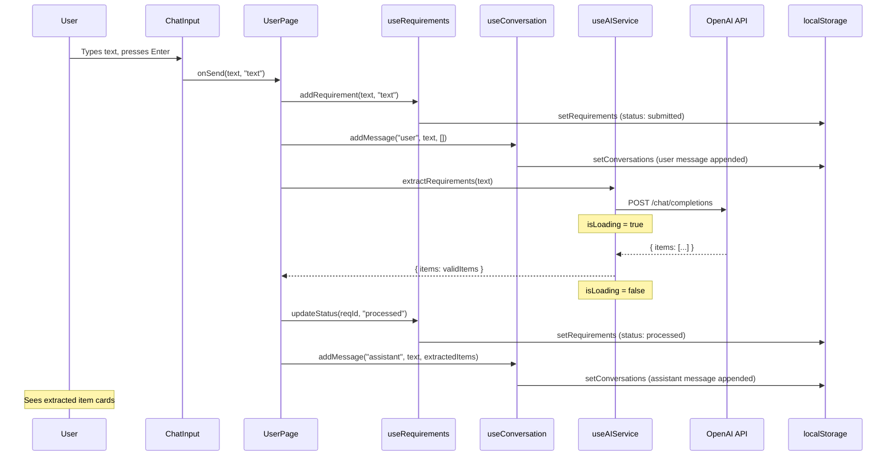
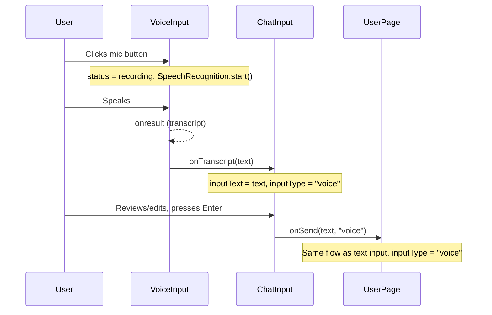
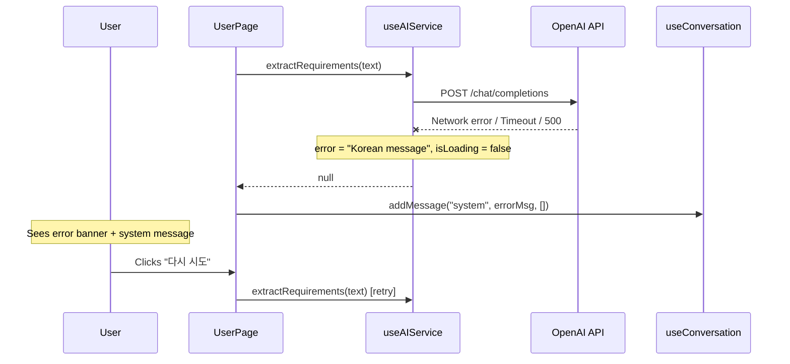

# UNIT-02 Functional Design -- User Input & AI

> Version: v1.0
> Date: 2026-04-22
> Stage: CONSTRUCTION / UNIT-02 / Functional Design
> Source: application-design.md (Sections 3.2, 4, 5, 6, 7), units.md (UNIT-02), user-stories.md (US-001~008, US-012), business-rules.md (BR-003, BR-004, BR-007, BR-008, BR-009), SCR-001-user-page.md, UNIT-01 functional-design.md (established patterns), UNIT-01 source code

---

## Table of Contents

1. [Scope and Approach](#1-scope-and-approach)
2. [Hooks](#2-hooks)
3. [Components](#3-components)
4. [UserPage Orchestration](#4-userpage-orchestration)
5. [Data Flow Sequences](#5-data-flow-sequences)
6. [Error Handling Matrix](#6-error-handling-matrix)
7. [File Checklist](#7-file-checklist)
8. [Definition of Done -- Refined](#8-definition-of-done----refined)

---

## 1. Scope and Approach

### 1.1 What This Unit Delivers

UNIT-02 replaces the UserPage stub with a fully functional ChatGPT-style conversational interface. It delivers:

- Text and voice input for requirements
- AI-powered extraction, theme classification, and user story generation
- Conversation display with message bubbles (user right/blue, AI left/gray)
- Conversation persistence to localStorage
- "New conversation" functionality
- Full error handling for AI API failures

### 1.2 What This Unit Does NOT Deliver

- Verification controls (approve/reject buttons) -- UNIT-03
- Data persistence of approved items to `mhm_requirements`, `mhm_themes`, `mhm_user_stories` -- UNIT-03
- The extracted item cards within AI messages render in UNIT-02 but the approve/reject buttons are added in UNIT-03

### 1.3 Established Patterns (from UNIT-01)

All files follow the patterns defined in UNIT-01 functional-design.md Section 1:

- File naming: PascalCase `.jsx` for components, camelCase `.js` for hooks/utils
- Export conventions: `export default function` for components, named exports for hooks
- Component structure: imports, function definition, JSX return
- Tailwind class ordering: layout, sizing, spacing, typography, colors, borders, effects, transitions, responsive
- Korean-only UI text, no i18n framework
- Accessibility: semantic HTML, `aria-label` on icon-only buttons, keyboard operability, visible focus indicators
- Focus ring standard: `focus:outline-none focus:ring-2 focus:ring-blue-500 focus:ring-offset-2`

### 1.4 Dependencies on UNIT-01

| UNIT-01 artifact | How UNIT-02 uses it |
|-----------------|---------------------|
| `AppContext` / `AppProvider` | Hooks read `conversations` and `setConversations` from context. Other setters (`setRequirements`, `setThemes`, `setUserStories`) are available but not wired by UNIT-02 hooks -- that happens in UNIT-03. |
| `useStorage` | Used internally by data hooks (useRequirements, useThemes, useUserStories, useConversation) for localStorage access |
| `generateId` | Used to create IDs for conversations, messages, requirements |
| `nowISO` | Used for all `created_at` and `updated_at` timestamps |
| `LoadingIndicator` | Rendered in UserPage while AI processes |
| `ConfirmDialog` | Used for "new conversation" confirmation |

---

## 2. Hooks

### 2.1 `frontend/src/hooks/useConversation.js` (NEW)

**Purpose**: Manage conversation lifecycle and message persistence. Reads and writes to `mhm_conversations` in localStorage through AppContext.

**Function signature**:

```js
export function useConversation()
```

**Parameters**: None.

**Return value**:

```js
{
  conversations: Array,
  currentConversation: Object | null,
  currentConversationId: String | null,
  startNewConversation: Function,
  addMessage: Function,
  updateExtractedItemStatus: Function,
  getCurrentMessages: Function,
  setCurrentConversationId: Function,
}
```

| Return Property | Type | Description |
|-----------------|------|-------------|
| `conversations` | `Array` | All conversation records from context |
| `currentConversation` | `Object \| null` | The full current conversation object (derived from `conversations` + `currentConversationId`), or `null` if none |
| `currentConversationId` | `String \| null` | ID of the active conversation |
| `startNewConversation()` | `Function` | Creates a new conversation, sets it as current, returns its `id` |
| `addMessage(role, content, extractedItems)` | `Function` | Appends a message to the current conversation |
| `updateExtractedItemStatus(messageId, itemIndex, newStatus)` | `Function` | Updates `verification_status` of an extracted item within a message of the current conversation |
| `getCurrentMessages()` | `Function` | Returns `currentConversation.messages` or `[]` |
| `setCurrentConversationId(id)` | `Function` | Switches the active conversation to an existing one |

**Internal state**:

```js
// From AppContext
const { conversations, setConversations } = useContext(AppContext);

// Local state: which conversation is currently active
const [currentConversationId, setCurrentConversationId] = useState(() => {
  // Initialize to the last conversation's ID (most recent by created_at)
  // If conversations is empty, return null
  if (conversations.length === 0) return null;
  return conversations[conversations.length - 1].id;
});
```

**Derived value**:

```js
const currentConversation = conversations.find(c => c.id === currentConversationId) || null;
```

**Method specifications**:

#### `startNewConversation()`

1. Generate a new conversation ID: `generateId("conv_")`
2. Get current timestamp: `nowISO()`
3. Create conversation object: `{ id, messages: [], created_at }`
4. Append to conversations array: `setConversations(prev => [...prev, newConversation])`
5. Set `currentConversationId` to the new ID
6. Return the new conversation `id`

#### `addMessage(role, content, extractedItems = [])`

1. If `currentConversationId` is `null`, call `startNewConversation()` first
2. Create message object:
   ```js
   {
     id: generateId("msg_"),
     role: role,           // "user" | "assistant" | "system"
     content: content,     // string
     extracted_items: extractedItems,  // array of extracted item objects
     created_at: nowISO()
   }
   ```
3. Update conversations array:
   ```js
   setConversations(prev => prev.map(conv =>
     conv.id === currentConversationId
       ? { ...conv, messages: [...conv.messages, message] }
       : conv
   ));
   ```
4. Return the message object

**Important**: If `currentConversationId` is `null` when `addMessage` is called, the function must first call an internal helper that creates the conversation and captures the new ID synchronously. Since `setConversations` is async in React batching, the implementation must handle this by building the full conversation object with the first message included:

```js
function addMessage(role, content, extractedItems = []) {
  const message = {
    id: generateId("msg_"),
    role,
    content,
    extracted_items: extractedItems,
    created_at: nowISO(),
  };

  if (!currentConversationId) {
    // Create conversation with the first message already inside
    const convId = generateId("conv_");
    const newConversation = {
      id: convId,
      messages: [message],
      created_at: nowISO(),
    };
    setConversations(prev => [...prev, newConversation]);
    setCurrentConversationId(convId);
  } else {
    setConversations(prev => prev.map(conv =>
      conv.id === currentConversationId
        ? { ...conv, messages: [...conv.messages, message] }
        : conv
    ));
  }

  return message;
}
```

#### `updateExtractedItemStatus(messageId, itemIndex, newStatus)`

1. Find the current conversation
2. Find the message by `messageId` within that conversation
3. Update `extracted_items[itemIndex].verification_status` to `newStatus`
4. Write back via `setConversations`

```js
function updateExtractedItemStatus(messageId, itemIndex, newStatus) {
  setConversations(prev => prev.map(conv => {
    if (conv.id !== currentConversationId) return conv;
    return {
      ...conv,
      messages: conv.messages.map(msg => {
        if (msg.id !== messageId) return msg;
        const updatedItems = msg.extracted_items.map((item, idx) =>
          idx === itemIndex ? { ...item, verification_status: newStatus } : item
        );
        return { ...msg, extracted_items: updatedItems };
      }),
    };
  }));
}
```

#### `getCurrentMessages()`

```js
function getCurrentMessages() {
  return currentConversation ? currentConversation.messages : [];
}
```

**Related stories**: US-001, US-012, BR-007

---

### 2.2 `frontend/src/hooks/useAIService.js` (NEW)

**Purpose**: Encapsulate all AI API calls. Manages loading/error state. Provides `extractRequirements()` for UNIT-02 and `analyzeSystemSupport()` stub for UNIT-04.

**Function signature**:

```js
export function useAIService()
```

**Parameters**: None.

**Return value**:

```js
{
  isLoading: Boolean,
  error: String | null,
  extractRequirements: Function,
  analyzeSystemSupport: Function,
  clearError: Function,
}
```

| Return Property | Type | Description |
|-----------------|------|-------------|
| `isLoading` | `Boolean` | `true` while an API call is in progress |
| `error` | `String \| null` | Korean error message, or `null` |
| `extractRequirements(text)` | `Function` | Sends user text to AI, returns structured extraction result |
| `analyzeSystemSupport(stories, referenceContent)` | `Function` | Placeholder for UNIT-04 system support analysis |
| `clearError()` | `Function` | Resets `error` to `null` |

**Internal state**:

```js
const [isLoading, setIsLoading] = useState(false);
const [error, setError] = useState(null);
```

**Configuration constants** (defined at top of file, outside the hook):

```js
const API_URL = import.meta.env.VITE_AI_API_URL || "https://api.openai.com/v1";
const API_KEY = import.meta.env.VITE_AI_API_KEY || "";
const AI_MODEL = import.meta.env.VITE_AI_MODEL || "gpt-4o-mini";
const REQUEST_TIMEOUT_MS = 30000;
```

**Helper function** (defined inside the file, outside the hook):

```js
async function callChatCompletions(messages, temperature = 0.3) {
  if (!API_KEY) {
    throw new Error("AI API 키가 설정되지 않았습니다. 환경 변수를 확인해주세요.");
  }

  const controller = new AbortController();
  const timeoutId = setTimeout(() => controller.abort(), REQUEST_TIMEOUT_MS);

  try {
    const response = await fetch(`${API_URL}/chat/completions`, {
      method: "POST",
      headers: {
        "Content-Type": "application/json",
        "Authorization": `Bearer ${API_KEY}`,
      },
      body: JSON.stringify({
        model: AI_MODEL,
        messages,
        temperature,
        response_format: { type: "json_object" },
      }),
      signal: controller.signal,
    });

    clearTimeout(timeoutId);

    if (!response.ok) {
      throw new Error(`AI 서비스 오류가 발생했습니다. (상태 코드: ${response.status})`);
    }

    const data = await response.json();
    const content = data.choices?.[0]?.message?.content;

    if (!content) {
      throw new Error("AI 응답을 처리할 수 없습니다. 다시 시도해주세요.");
    }

    return JSON.parse(content);
  } catch (err) {
    clearTimeout(timeoutId);

    if (err.name === "AbortError") {
      throw new Error("AI 응답 시간이 초과되었습니다. 다시 시도해주세요.");
    }
    if (err instanceof TypeError && err.message.includes("fetch")) {
      throw new Error("네트워크 오류가 발생했습니다. 인터넷 연결을 확인해주세요.");
    }
    // Re-throw our own Error messages (Korean) or wrap unknown ones
    if (err.message.startsWith("AI ") || err.message.startsWith("네트워크")) {
      throw err;
    }
    throw new Error("AI 응답을 처리할 수 없습니다. 다시 시도해주세요.");
  }
}
```

#### `extractRequirements(text)` -- Full Specification

**System prompt** (exact string):

```
당신은 요구사항 분석 전문가입니다. 사용자가 입력한 자유 형식의 텍스트에서 구체적인 요구사항을 추출하고, 각 요구사항에 대해 주제 테마를 분류하며, 유저스토리 형식으로 변환해주세요.

반드시 다음 JSON 형식으로 응답하세요:
{"items": [{"summary": "요구사항 요약", "theme": {"name": "테마명", "description": "테마 설명"}, "story": "~로서, ~하고 싶다. 왜냐하면 ~이기 때문이다.", "purpose": "목적 설명", "acceptance_criteria": ["AC1", "AC2", "AC3"]}]}

규칙:
1. 입력 텍스트에서 서로 다른 요구사항이 여러 개 포함되어 있으면 각각 별도의 항목으로 추출하세요.
2. 각 요구사항에는 반드시 summary, theme(name과 description 포함), story, purpose, acceptance_criteria(최소 1개)가 있어야 합니다.
3. 유저스토리는 "~로서, ~하고 싶다. 왜냐하면 ~이기 때문이다." 형식으로 작성하세요.
4. 테마는 요구사항의 주제를 기반으로 분류하세요.
5. 입력이 너무 모호하여 요구사항을 추출할 수 없는 경우, items를 빈 배열로 반환하세요.
```

**Implementation**:

```js
async function extractRequirements(text) {
  setIsLoading(true);
  setError(null);

  try {
    const systemPrompt = `당신은 요구사항 분석 전문가입니다. 사용자가 입력한 자유 형식의 텍스트에서 구체적인 요구사항을 추출하고, 각 요구사항에 대해 주제 테마를 분류하며, 유저스토리 형식으로 변환해주세요.\n\n반드시 다음 JSON 형식으로 응답하세요:\n{"items": [{"summary": "요구사항 요약", "theme": {"name": "테마명", "description": "테마 설명"}, "story": "~로서, ~하고 싶다. 왜냐하면 ~이기 때문이다.", "purpose": "목적 설명", "acceptance_criteria": ["AC1", "AC2", "AC3"]}]}\n\n규칙:\n1. 입력 텍스트에서 서로 다른 요구사항이 여러 개 포함되어 있으면 각각 별도의 항목으로 추출하세요.\n2. 각 요구사항에는 반드시 summary, theme(name과 description 포함), story, purpose, acceptance_criteria(최소 1개)가 있어야 합니다.\n3. 유저스토리는 "~로서, ~하고 싶다. 왜냐하면 ~이기 때문이다." 형식으로 작성하세요.\n4. 테마는 요구사항의 주제를 기반으로 분류하세요.\n5. 입력이 너무 모호하여 요구사항을 추출할 수 없는 경우, items를 빈 배열로 반환하세요.`;

    const messages = [
      { role: "system", content: systemPrompt },
      { role: "user", content: text },
    ];

    const result = await callChatCompletions(messages, 0.3);

    // Validate response structure
    if (!result || !Array.isArray(result.items)) {
      throw new Error("AI 응답을 처리할 수 없습니다. 다시 시도해주세요.");
    }

    // Filter out items missing required fields (BR-008 V-004)
    const validItems = result.items.filter(item =>
      item.summary &&
      item.theme && item.theme.name &&
      item.story &&
      item.purpose &&
      Array.isArray(item.acceptance_criteria) && item.acceptance_criteria.length > 0
    );

    if (validItems.length < result.items.length) {
      console.warn(
        `AI 응답에서 필수 필드가 누락된 항목 ${result.items.length - validItems.length}건을 제외했습니다.`
      );
    }

    return { items: validItems };
  } catch (err) {
    setError(err.message);
    return null;
  } finally {
    setIsLoading(false);
  }
}
```

**Request format sent to the API**:

```json
{
  "model": "gpt-4o-mini",
  "messages": [
    { "role": "system", "content": "[system prompt above]" },
    { "role": "user", "content": "[user input text]" }
  ],
  "temperature": 0.3,
  "response_format": { "type": "json_object" }
}
```

**Expected response JSON** (parsed from `choices[0].message.content`):

```json
{
  "items": [
    {
      "summary": "안전 장비 미착용 자동 알림",
      "theme": {
        "name": "안전 관리",
        "description": "작업 현장 안전 관련 요구사항"
      },
      "story": "안전 담당자로서, 작업자가 안전 장비를 미착용했을 때 자동 알림을 받고 싶다. 왜냐하면 즉시 시정 조치를 할 수 있기 때문이다.",
      "purpose": "안전 장비 미착용으로 인한 사고를 예방하고, 현장 안전 관리 효율성을 높인다.",
      "acceptance_criteria": [
        "작업자가 안전 장비 미착용 시 안전 담당자에게 알림이 전송된다",
        "알림에는 미착용 작업자 이름, 위치, 시간이 포함된다",
        "알림 수신 후 확인 처리가 가능하다"
      ]
    }
  ]
}
```

#### `analyzeSystemSupport(stories, referenceContent)` -- Placeholder

This function is fully implemented in UNIT-04. In UNIT-02, provide a stub that throws:

```js
async function analyzeSystemSupport(stories, referenceContent) {
  throw new Error("analyzeSystemSupport는 UNIT-04에서 구현됩니다.");
}
```

#### `clearError()`

```js
function clearError() {
  setError(null);
}
```

**Error handling summary**:

| Error Condition | Error Message (Korean) | Trigger |
|----------------|----------------------|---------|
| API key not set | "AI API 키가 설정되지 않았습니다. 환경 변수를 확인해주세요." | `VITE_AI_API_KEY` is empty |
| Network failure | "네트워크 오류가 발생했습니다. 인터넷 연결을 확인해주세요." | `fetch` throws TypeError |
| Timeout (30s) | "AI 응답 시간이 초과되었습니다. 다시 시도해주세요." | AbortController fires |
| HTTP non-200 | "AI 서비스 오류가 발생했습니다. (상태 코드: {status})" | `response.ok` is false |
| Invalid JSON / missing content | "AI 응답을 처리할 수 없습니다. 다시 시도해주세요." | Parse failure or missing `choices[0].message.content` |
| Missing `items` array | "AI 응답을 처리할 수 없습니다. 다시 시도해주세요." | Response has no `items` array |

**Related stories**: US-005, US-006, US-007, US-008, BR-003, BR-008

---

### 2.3 `frontend/src/hooks/useRequirements.js` (NEW)

**Purpose**: CRUD operations for requirement records. In UNIT-02, provides `addRequirement` and `updateStatus`. The hook reads and writes `mhm_requirements` through AppContext.

**Function signature**:

```js
export function useRequirements()
```

**Parameters**: None.

**Return value**:

```js
{
  requirements: Array,
  addRequirement: Function,
  updateStatus: Function,
  getRequirementById: Function,
}
```

| Return Property | Type | Description |
|-----------------|------|-------------|
| `requirements` | `Array` | All requirement records from context |
| `addRequirement(rawText, inputType)` | `Function` | Creates and persists a new requirement with status `"submitted"` |
| `updateStatus(id, newStatus)` | `Function` | Updates status and `updated_at` for a requirement |
| `getRequirementById(id)` | `Function` | Finds a requirement by ID |

**Internal**:

```js
const { requirements, setRequirements } = useContext(AppContext);
```

#### `addRequirement(rawText, inputType)`

```js
function addRequirement(rawText, inputType) {
  const now = nowISO();
  const newReq = {
    id: generateId("req_"),
    raw_text: rawText,
    input_type: inputType,     // "text" or "voice"
    status: "submitted",
    created_at: now,
    updated_at: now,
  };
  setRequirements(prev => [...prev, newReq]);
  return newReq;
}
```

**Parameters**:

| Parameter | Type | Required | Values |
|-----------|------|----------|--------|
| `rawText` | `string` | Yes | Original user input text |
| `inputType` | `string` | Yes | `"text"` or `"voice"` |

**Returns**: The newly created requirement object.

#### `updateStatus(id, newStatus)`

```js
function updateStatus(id, newStatus) {
  setRequirements(prev => prev.map(req =>
    req.id === id
      ? { ...req, status: newStatus, updated_at: nowISO() }
      : req
  ));
}
```

**Parameters**:

| Parameter | Type | Required | Values |
|-----------|------|----------|--------|
| `id` | `string` | Yes | Requirement ID (e.g., `"req_a1b2c3d4"`) |
| `newStatus` | `string` | Yes | `"submitted"`, `"processed"`, or `"verified"` |

#### `getRequirementById(id)`

```js
function getRequirementById(id) {
  return requirements.find(req => req.id === id);
}
```

**Returns**: The requirement object, or `undefined` if not found.

**Related stories**: US-002, US-003, US-005, BR-001

---

### 2.4 `frontend/src/hooks/useThemes.js` (NEW)

**Purpose**: Read/write operations for theme records with name-based deduplication. Reads and writes `mhm_themes` through AppContext.

**Function signature**:

```js
export function useThemes()
```

**Parameters**: None.

**Return value**:

```js
{
  themes: Array,
  addTheme: Function,
  getThemeById: Function,
  getThemeByName: Function,
}
```

| Return Property | Type | Description |
|-----------------|------|-------------|
| `themes` | `Array` | All theme records from context |
| `addTheme(name, description)` | `Function` | Creates a new theme if name does not exist; returns existing if it does |
| `getThemeById(id)` | `Function` | Finds a theme by ID |
| `getThemeByName(name)` | `Function` | Finds a theme by exact name match |

**Internal**:

```js
const { themes, setThemes } = useContext(AppContext);
```

#### `addTheme(name, description)`

```js
function addTheme(name, description) {
  // BR-004: Deduplication by exact name match (case-sensitive)
  const existing = themes.find(t => t.name === name);
  if (existing) {
    return existing;
  }

  const newTheme = {
    id: generateId("theme_"),
    name,
    description,
  };
  setThemes(prev => [...prev, newTheme]);
  return newTheme;
}
```

**Important note on deduplication timing**: The `addTheme` function checks against the current `themes` array in React state. If multiple items from the same AI response share a theme name and `addTheme` is called synchronously for each, only the first call will find `existing === undefined`. However, since `setThemes` uses the updater function pattern (`prev => [...prev, newTheme]`), subsequent calls within the same render cycle will NOT see the newly added theme in the `themes` state variable (React state is stale within the current render). To handle this correctly, the function must use a ref-based approach or the UNIT-03 verification flow must handle deduplication at that point. For UNIT-02, `addTheme` is defined but NOT called during AI extraction -- it is only called during the UNIT-03 approval flow. This means the deduplication concern does not apply in UNIT-02 usage.

#### `getThemeById(id)`

```js
function getThemeById(id) {
  return themes.find(t => t.id === id);
}
```

#### `getThemeByName(name)`

```js
function getThemeByName(name) {
  return themes.find(t => t.name === name);
}
```

**Related stories**: US-006, BR-004

---

### 2.5 `frontend/src/hooks/useUserStories.js` (NEW)

**Purpose**: CRUD and filtering for user story records. Reads and writes `mhm_user_stories` through AppContext.

**Function signature**:

```js
export function useUserStories()
```

**Parameters**: None.

**Return value**:

```js
{
  userStories: Array,
  addUserStory: Function,
  updateSystemSupport: Function,
  bulkUpdateSystemSupport: Function,
  getStoriesByTheme: Function,
  getStoryById: Function,
}
```

| Return Property | Type | Description |
|-----------------|------|-------------|
| `userStories` | `Array` | All user story records from context |
| `addUserStory(data)` | `Function` | Creates and persists a new user story |
| `updateSystemSupport(id, supportStatus)` | `Function` | Updates `system_support` field for a single story |
| `bulkUpdateSystemSupport(updates)` | `Function` | Bulk updates `system_support` for multiple stories |
| `getStoriesByTheme(themeId)` | `Function` | Returns stories filtered by `theme_id` |
| `getStoryById(id)` | `Function` | Finds a story by ID |

**Internal**:

```js
const { userStories, setUserStories } = useContext(AppContext);
```

#### `addUserStory(data)`

```js
function addUserStory(data) {
  const now = nowISO();
  const newStory = {
    id: generateId("us_"),
    requirement_id: data.requirement_id,
    theme_id: data.theme_id,
    story: data.story,
    purpose: data.purpose,
    acceptance_criteria: data.acceptance_criteria,
    status: "verified",
    system_support: "not_analyzed",
    created_at: now,
    updated_at: now,
  };
  setUserStories(prev => [...prev, newStory]);
  return newStory;
}
```

**Parameters for `data`**:

| Property | Type | Required | Description |
|----------|------|----------|-------------|
| `requirement_id` | `string` | Yes | FK to requirements.id |
| `theme_id` | `string` | Yes | FK to themes.id |
| `story` | `string` | Yes | User story sentence |
| `purpose` | `string` | Yes | Goal/purpose statement |
| `acceptance_criteria` | `string[]` | Yes | Array of AC strings |

**Note**: `addUserStory` is defined in UNIT-02 but primarily called in UNIT-03 during the approval flow. It is exposed now so the hook API is complete.

#### `updateSystemSupport(id, supportStatus)`

```js
function updateSystemSupport(id, supportStatus) {
  setUserStories(prev => prev.map(story =>
    story.id === id
      ? { ...story, system_support: supportStatus, updated_at: nowISO() }
      : story
  ));
}
```

#### `bulkUpdateSystemSupport(updates)`

```js
function bulkUpdateSystemSupport(updates) {
  const updateMap = new Map(updates.map(u => [u.id, u.system_support]));
  const now = nowISO();
  setUserStories(prev => prev.map(story =>
    updateMap.has(story.id)
      ? { ...story, system_support: updateMap.get(story.id), updated_at: now }
      : story
  ));
}
```

**Parameters**: `updates` is `Array<{ id: string, system_support: string }>`.

#### `getStoriesByTheme(themeId)`

```js
function getStoriesByTheme(themeId) {
  return userStories.filter(story => story.theme_id === themeId);
}
```

#### `getStoryById(id)`

```js
function getStoryById(id) {
  return userStories.find(story => story.id === id);
}
```

**Related stories**: US-007, US-013, US-016

---

## 3. Components

### 3.1 `frontend/src/components/user/WelcomeMessage.jsx` (NEW)

**Purpose**: Empty-state guidance displayed when the current conversation has zero messages. Centered in the conversation area.

**Props Interface**: None.

**Internal state**: None.

**JSX structure**:

```jsx
import React from "react";

export default function WelcomeMessage() {
  return (
    <div className="flex flex-col items-center justify-center h-full px-4 text-center">
      <h2 className="text-2xl font-bold text-gray-800 mb-3">
        말해 뭐해
      </h2>
      <p className="text-base text-gray-600 mb-2">
        요구사항을 자유롭게 입력해주세요
      </p>
      <p className="text-sm text-gray-400 max-w-sm">
        텍스트를 입력하거나 마이크 버튼을 눌러 음성으로 입력할 수 있습니다
      </p>
    </div>
  );
}
```

**Tailwind classes explained**:
- Container: `flex flex-col items-center justify-center h-full px-4 text-center` -- fills the conversation area, centers content both axes
- Title: `text-2xl font-bold text-gray-800 mb-3` -- large, bold, dark gray, 12px bottom margin
- Subtitle: `text-base text-gray-600 mb-2` -- 16px, medium gray
- Helper text: `text-sm text-gray-400 max-w-sm` -- 14px, light gray, max 384px width to wrap nicely

**Accessibility**: No special ARIA needed. Heading provides semantic structure.

**Related stories**: US-001 AC-2

---

### 3.2 `frontend/src/components/user/MessageList.jsx` (NEW)

**Purpose**: Scrollable container for conversation messages. Auto-scrolls to the newest message.

**Props Interface**:

| Prop | Type | Required | Default | Description |
|------|------|----------|---------|-------------|
| `messages` | `Array` | Yes | -- | Array of message objects from the current conversation |
| `isLoading` | `Boolean` | Yes | -- | Whether AI is currently processing (shows LoadingIndicator) |

**Internal state**: None (uses ref for scroll).

**Refs**:

```js
const messagesEndRef = useRef(null);
```

**Effects**:

```js
// Auto-scroll to bottom whenever messages change or loading state changes
useEffect(() => {
  messagesEndRef.current?.scrollIntoView({ behavior: "smooth" });
}, [messages, isLoading]);
```

**JSX structure**:

```jsx
import { useRef, useEffect } from "react";
import MessageBubble from "./MessageBubble";
import LoadingIndicator from "../common/LoadingIndicator";

export default function MessageList({ messages, isLoading }) {
  const messagesEndRef = useRef(null);

  useEffect(() => {
    messagesEndRef.current?.scrollIntoView({ behavior: "smooth" });
  }, [messages, isLoading]);

  return (
    <div
      className="flex-1 overflow-y-auto px-4 py-4"
      role="log"
      aria-live="polite"
      aria-label="대화 내역"
    >
      <div className="mx-auto max-w-3xl">
        {messages.map((message) => (
          <MessageBubble key={message.id} message={message} />
        ))}
        {isLoading && (
          <div className="flex justify-start mb-4">
            <div className="max-w-[85%] px-4 py-3 bg-gray-100 text-gray-900 rounded-2xl rounded-tl-sm">
              <LoadingIndicator message="요구사항을 분석하고 있습니다..." />
            </div>
          </div>
        )}
        <div ref={messagesEndRef} />
      </div>
    </div>
  );
}
```

**Tailwind classes explained**:
- Outer container: `flex-1 overflow-y-auto px-4 py-4` -- takes remaining height in flex column, scrollable vertically, 16px horizontal padding, 16px vertical padding
- Inner container: `mx-auto max-w-3xl` -- centered, max 768px width for desktop
- Loading bubble wrapper: `flex justify-start mb-4` -- left-aligned like AI messages
- Loading bubble: `max-w-[85%] px-4 py-3 bg-gray-100 text-gray-900 rounded-2xl rounded-tl-sm` -- same style as AI message bubble

**Accessibility**:
- `role="log"` -- indicates this is a log area where new content is appended
- `aria-live="polite"` -- screen readers announce new messages when they appear
- `aria-label="대화 내역"` -- labels the region

**Related stories**: US-001 AC-4, US-012

---

### 3.3 `frontend/src/components/user/MessageBubble.jsx` (NEW)

**Purpose**: Renders a single message bubble. User messages are right-aligned/blue; assistant messages are left-aligned/gray with extracted item cards; system messages are center-aligned/yellow.

**Props Interface**:

| Prop | Type | Required | Default | Description |
|------|------|----------|---------|-------------|
| `message` | `Object` | Yes | -- | A message object: `{ id, role, content, extracted_items, created_at }` |

**Internal state**: None.

**JSX structure**:

```jsx
import React from "react";

export default function MessageBubble({ message }) {
  const { role, content, extracted_items } = message;

  // User message: right-aligned, blue
  if (role === "user") {
    return (
      <div className="flex justify-end mb-4">
        <div className="max-w-[75%] px-4 py-3 bg-blue-500 text-white rounded-2xl rounded-tr-sm">
          <p className="text-sm whitespace-pre-wrap">{content}</p>
        </div>
      </div>
    );
  }

  // System message (error): center-aligned, yellow/red
  if (role === "system") {
    return (
      <div className="flex justify-center mb-4">
        <div className="max-w-[90%] px-4 py-3 bg-yellow-50 text-yellow-800 border border-yellow-200 rounded-xl text-center">
          <p className="text-sm">{content}</p>
        </div>
      </div>
    );
  }

  // Assistant message: left-aligned, gray, with optional extracted items
  return (
    <div className="flex justify-start mb-4">
      <div className="max-w-[85%] px-4 py-3 bg-gray-100 text-gray-900 rounded-2xl rounded-tl-sm">
        {content && (
          <p className="text-sm whitespace-pre-wrap mb-3">{content}</p>
        )}
        {extracted_items && extracted_items.length > 0 && (
          <div className="space-y-3">
            {extracted_items.map((item, index) => (
              <ExtractedItemCard
                key={index}
                item={item}
                index={index}
              />
            ))}
          </div>
        )}
      </div>
    </div>
  );
}

function ExtractedItemCard({ item, index }) {
  const statusConfig = {
    pending: {
      borderColor: "border-gray-200",
      bgColor: "bg-white",
      statusText: "대기 중",
      statusColor: "text-gray-500",
    },
    verified: {
      borderColor: "border-green-300",
      bgColor: "bg-green-50",
      statusText: "승인됨",
      statusColor: "text-green-600",
    },
    rejected: {
      borderColor: "border-red-200",
      bgColor: "bg-red-50/50",
      statusText: "거부됨",
      statusColor: "text-red-500",
    },
  };

  const status = item.verification_status || "pending";
  const config = statusConfig[status] || statusConfig.pending;
  const isRejected = status === "rejected";

  return (
    <div
      className={`p-4 rounded-lg border ${config.borderColor} ${config.bgColor} ${isRejected ? "opacity-60" : ""}`}
      data-testid={`extracted-item-${index}`}
    >
      {/* Theme badge */}
      <span className="inline-block px-2.5 py-0.5 text-xs font-medium text-blue-700 bg-blue-100 rounded-full mb-2">
        {item.theme}
      </span>

      {/* Summary */}
      <h4 className="text-sm font-semibold text-gray-800 mb-2">
        {item.summary}
      </h4>

      {/* User Story */}
      <div className="mb-2">
        <p className="text-xs font-medium text-gray-500 mb-0.5">유저스토리</p>
        <p className="text-sm text-gray-700 italic">
          "{item.story}"
        </p>
      </div>

      {/* Purpose */}
      <div className="mb-2">
        <p className="text-xs font-medium text-gray-500 mb-0.5">목적</p>
        <p className="text-sm text-gray-700">{item.purpose}</p>
      </div>

      {/* Acceptance Criteria */}
      <div className="mb-3">
        <p className="text-xs font-medium text-gray-500 mb-1">인수 조건</p>
        <ul className="list-disc list-inside space-y-0.5">
          {item.acceptance_criteria.map((ac, acIdx) => (
            <li key={acIdx} className="text-sm text-gray-700">{ac}</li>
          ))}
        </ul>
      </div>

      {/* Verification controls placeholder -- buttons added by UNIT-03 */}
      <div
        className="flex items-center justify-between pt-2 border-t border-gray-100"
        data-testid={`verification-slot-${index}`}
      >
        <span className={`text-xs font-medium ${config.statusColor}`}>
          {config.statusText}
        </span>
        {/* UNIT-03 will render VerificationControls here */}
      </div>
    </div>
  );
}
```

**Tailwind classes explained**:

**User bubble**:
- Container: `flex justify-end mb-4` -- right-aligned, 16px bottom margin
- Bubble: `max-w-[75%] px-4 py-3 bg-blue-500 text-white rounded-2xl rounded-tr-sm` -- max 75% width, blue background, white text, large rounding with small top-right corner for speech-bubble effect
- Text: `text-sm whitespace-pre-wrap` -- 14px, preserves line breaks

**Assistant bubble**:
- Container: `flex justify-start mb-4` -- left-aligned
- Bubble: `max-w-[85%] px-4 py-3 bg-gray-100 text-gray-900 rounded-2xl rounded-tl-sm` -- max 85% width, light gray background, dark text, small top-left corner

**System bubble**:
- Container: `flex justify-center mb-4` -- center-aligned
- Bubble: `max-w-[90%] px-4 py-3 bg-yellow-50 text-yellow-800 border border-yellow-200 rounded-xl text-center` -- max 90% width, yellow tint for warnings

**Extracted item card**:
- Card: `p-4 rounded-lg border` -- 16px padding, rounded, border color varies by status
- Theme badge: `inline-block px-2.5 py-0.5 text-xs font-medium text-blue-700 bg-blue-100 rounded-full mb-2` -- pill badge, blue tint
- Card sections: labeled with `text-xs font-medium text-gray-500` headers
- Rejected state: `opacity-60` to dim the card

**Note on UNIT-03 integration**: The `ExtractedItemCard` is defined as a private function within `MessageBubble.jsx`. In UNIT-03, `MessageBubble.jsx` will be **enhanced** to import and render `VerificationControls` inside the `verification-slot-{index}` div. The `data-testid` attribute marks the insertion point. The current UNIT-02 implementation renders only the status text label.

**Related stories**: US-001 AC-3, US-001 AC-4, US-005 AC-3, US-009

---

### 3.4 `frontend/src/components/user/ChatInput.jsx` (NEW)

**Purpose**: Fixed-bottom input bar with multi-line textarea, send button, voice input button, and "new conversation" button.

**Props Interface**:

| Prop | Type | Required | Default | Description |
|------|------|----------|---------|-------------|
| `onSend` | `Function` | Yes | -- | Callback when user submits text. Receives `(text: string, inputType: string)` |
| `disabled` | `Boolean` | Yes | -- | Whether input/send is disabled (true while AI is loading) |
| `onNewConversation` | `Function` | Yes | -- | Callback when user clicks "new conversation" button |

**Internal state**:

```js
const [inputText, setInputText] = useState("");
const [inputType, setInputType] = useState("text");
```

**Refs**:

```js
const textareaRef = useRef(null);
```

**Event handlers**:

#### `handleSubmit()`

```js
function handleSubmit() {
  const trimmed = inputText.trim();
  if (!trimmed || disabled) return;
  onSend(trimmed, inputType);
  setInputText("");
  setInputType("text"); // Reset to text after sending
  // Reset textarea height
  if (textareaRef.current) {
    textareaRef.current.style.height = "auto";
  }
}
```

#### `handleKeyDown(e)`

```js
function handleKeyDown(e) {
  if (e.key === "Enter" && !e.shiftKey) {
    e.preventDefault();
    handleSubmit();
  }
  // Shift+Enter: default behavior (newline) -- no action needed
}
```

#### `handleInputChange(e)`

```js
function handleInputChange(e) {
  setInputText(e.target.value);
  setInputType("text");
  // Auto-resize textarea
  const textarea = e.target;
  textarea.style.height = "auto";
  textarea.style.height = `${Math.min(textarea.scrollHeight, 120)}px`;
}
```

The `120px` limit corresponds to approximately 4 lines of text (14px font * 1.5 line-height * 4 + padding).

#### `handleVoiceTranscript(transcript)`

```js
function handleVoiceTranscript(transcript) {
  setInputText(prev => prev ? prev + " " + transcript : transcript);
  setInputType("voice");
  // Focus the textarea after voice input
  textareaRef.current?.focus();
}
```

**JSX structure**:

```jsx
import { useState, useRef } from "react";
import VoiceInput from "./VoiceInput";

export default function ChatInput({ onSend, disabled, onNewConversation }) {
  const [inputText, setInputText] = useState("");
  const [inputType, setInputType] = useState("text");
  const textareaRef = useRef(null);

  // ... event handlers above ...

  const isEmptyInput = !inputText.trim();

  return (
    <div className="shrink-0 border-t border-gray-200 bg-white px-4 py-3">
      <div className="mx-auto max-w-3xl flex items-end gap-2">
        {/* New conversation button */}
        <button
          type="button"
          onClick={onNewConversation}
          className="shrink-0 p-2 text-gray-400 hover:text-gray-600 hover:bg-gray-100 rounded-lg transition-colors focus:outline-none focus:ring-2 focus:ring-blue-500 focus:ring-offset-2"
          aria-label="새 대화"
          title="새 대화"
        >
          <svg className="w-5 h-5" fill="none" stroke="currentColor" viewBox="0 0 24 24" aria-hidden="true">
            <path strokeLinecap="round" strokeLinejoin="round" strokeWidth={2} d="M12 4v16m8-8H4" />
          </svg>
        </button>

        {/* Text input area */}
        <div className="flex-1 flex items-end min-w-0 border border-gray-300 rounded-xl bg-gray-50 focus-within:border-blue-500 focus-within:ring-1 focus-within:ring-blue-500 transition-colors">
          <textarea
            ref={textareaRef}
            value={inputText}
            onChange={handleInputChange}
            onKeyDown={handleKeyDown}
            placeholder="요구사항을 입력해주세요..."
            disabled={disabled}
            rows={1}
            className="flex-1 min-w-0 px-4 py-2.5 text-sm text-gray-900 bg-transparent border-none outline-none resize-none placeholder:text-gray-400 disabled:opacity-50"
            aria-label="요구사항 입력"
          />

          {/* Voice input button */}
          <VoiceInput
            onTranscript={handleVoiceTranscript}
            disabled={disabled}
          />
        </div>

        {/* Send button */}
        <button
          type="button"
          onClick={handleSubmit}
          disabled={disabled || isEmptyInput}
          className="shrink-0 p-2.5 text-white bg-blue-500 rounded-xl hover:bg-blue-600 disabled:opacity-40 disabled:cursor-not-allowed transition-colors focus:outline-none focus:ring-2 focus:ring-blue-500 focus:ring-offset-2"
          aria-label="전송"
        >
          <svg className="w-5 h-5" fill="none" stroke="currentColor" viewBox="0 0 24 24" aria-hidden="true">
            <path strokeLinecap="round" strokeLinejoin="round" strokeWidth={2} d="M5 10l7-7m0 0l7 7m-7-7v18" />
          </svg>
        </button>
      </div>
    </div>
  );
}
```

**Tailwind classes explained**:
- Outer: `shrink-0 border-t border-gray-200 bg-white px-4 py-3` -- does not shrink in flex column, top border separator, white background, padding
- Inner: `mx-auto max-w-3xl flex items-end gap-2` -- centered, 768px max, flex row aligned to bottom (for multi-line textarea), 8px gap
- New conversation button: `shrink-0 p-2 text-gray-400 hover:text-gray-600 hover:bg-gray-100 rounded-lg` -- icon button, gray, hover effect
- Input wrapper: `flex-1 flex items-end min-w-0 border border-gray-300 rounded-xl bg-gray-50 focus-within:border-blue-500 focus-within:ring-1 focus-within:ring-blue-500` -- takes available space, border changes to blue when any child has focus
- Textarea: `flex-1 min-w-0 px-4 py-2.5 text-sm text-gray-900 bg-transparent border-none outline-none resize-none` -- transparent background (input wrapper provides visual border), no native resize handle
- Send button: `shrink-0 p-2.5 text-white bg-blue-500 rounded-xl hover:bg-blue-600 disabled:opacity-40 disabled:cursor-not-allowed` -- blue filled, dimmed when disabled

**Accessibility**:
- Textarea: `aria-label="요구사항 입력"`
- New conversation button: `aria-label="새 대화"`, `title="새 대화"`
- Send button: `aria-label="전송"`
- Keyboard: Enter sends, Shift+Enter adds newline, Tab navigates between buttons
- Disabled state: both `disabled` attribute and `disabled:opacity-40` visual
- Focus ring on all interactive elements

**Related stories**: US-001 AC-3, US-002, US-004, BR-008 V-001 V-002

---

### 3.5 `frontend/src/components/user/VoiceInput.jsx` (NEW)

**Purpose**: Microphone button using Web Speech API (SpeechRecognition / webkitSpeechRecognition). Handles recording lifecycle, transcription, and unsupported browser fallback.

**Props Interface**:

| Prop | Type | Required | Default | Description |
|------|------|----------|---------|-------------|
| `onTranscript` | `Function` | Yes | -- | Callback with transcribed text: `(text: string) => void` |
| `disabled` | `Boolean` | No | `false` | Whether the button is disabled (e.g., while AI is loading) |

**Internal state**:

```js
const [status, setStatus] = useState("idle");    // "idle" | "recording" | "unsupported"
const [errorMessage, setErrorMessage] = useState(null);
```

**Refs**:

```js
const recognitionRef = useRef(null);
```

**State Machine**:

```
idle ──[click mic, supported]──> recording
idle ──[click mic, unsupported]──> (show message, stay idle)
recording ──[click mic]──> idle (stop recording)
recording ──[onresult]──> idle (transcript delivered)
recording ──[onerror]──> idle (show error message)
recording ──[onend]──> idle (automatic stop)
```

**Initialization (useEffect on mount)**:

```js
useEffect(() => {
  const SpeechRecognition = window.SpeechRecognition || window.webkitSpeechRecognition;
  if (!SpeechRecognition) {
    setStatus("unsupported");
    return;
  }

  const recognition = new SpeechRecognition();
  recognition.lang = "ko-KR";
  recognition.continuous = false;
  recognition.interimResults = true;

  recognition.onresult = (event) => {
    const last = event.results[event.results.length - 1];
    if (last.isFinal) {
      const transcript = last[0].transcript;
      onTranscript(transcript);
      setStatus("idle");
    }
  };

  recognition.onerror = (event) => {
    if (event.error === "not-allowed" || event.error === "permission-denied") {
      setErrorMessage("마이크 사용 권한이 필요합니다");
    } else if (event.error === "no-speech") {
      setErrorMessage("음성이 감지되지 않았습니다. 다시 시도해주세요.");
    } else {
      setErrorMessage("음성을 인식할 수 없습니다. 다시 시도해주세요.");
    }
    setStatus("idle");
  };

  recognition.onend = () => {
    setStatus("idle");
  };

  recognitionRef.current = recognition;
}, [onTranscript]);
```

**Important**: The `onTranscript` dependency in the useEffect means the recognition event handlers capture the latest `onTranscript` callback. To prevent stale closures, either use a ref for `onTranscript` or ensure the parent component memoizes the callback. The recommended approach is to use a ref:

```js
const onTranscriptRef = useRef(onTranscript);
useEffect(() => {
  onTranscriptRef.current = onTranscript;
}, [onTranscript]);
```

Then in the recognition setup, use `onTranscriptRef.current(transcript)` instead of `onTranscript(transcript)`. This way the useEffect has no dependency on `onTranscript` and the recognition instance is created only once.

**Click handler**:

```js
function handleClick() {
  setErrorMessage(null);

  if (status === "unsupported") {
    setErrorMessage("이 브라우저에서는 음성 입력이 지원되지 않습니다");
    return;
  }

  if (status === "recording") {
    recognitionRef.current?.stop();
    setStatus("idle");
    return;
  }

  // Start recording
  try {
    recognitionRef.current?.start();
    setStatus("recording");
  } catch (err) {
    setErrorMessage("음성 인식을 시작할 수 없습니다. 다시 시도해주세요.");
  }
}
```

**Auto-clear error message**:

```js
useEffect(() => {
  if (!errorMessage) return;
  const timer = setTimeout(() => setErrorMessage(null), 3000);
  return () => clearTimeout(timer);
}, [errorMessage]);
```

**JSX structure**:

```jsx
import { useState, useRef, useEffect } from "react";

export default function VoiceInput({ onTranscript, disabled = false }) {
  const [status, setStatus] = useState("idle");
  const [errorMessage, setErrorMessage] = useState(null);
  const recognitionRef = useRef(null);
  const onTranscriptRef = useRef(onTranscript);

  useEffect(() => {
    onTranscriptRef.current = onTranscript;
  }, [onTranscript]);

  // ... initialization useEffect (using onTranscriptRef.current) ...
  // ... auto-clear error useEffect ...
  // ... handleClick ...

  const isRecording = status === "recording";
  const isUnsupported = status === "unsupported";

  return (
    <div className="relative shrink-0">
      <button
        type="button"
        onClick={handleClick}
        disabled={disabled}
        className={`p-2 rounded-lg transition-colors focus:outline-none focus:ring-2 focus:ring-blue-500 focus:ring-offset-2 ${
          isRecording
            ? "text-red-500 bg-red-50 animate-pulse"
            : isUnsupported
              ? "text-gray-300 cursor-not-allowed"
              : "text-gray-400 hover:text-gray-600 hover:bg-gray-100"
        } disabled:opacity-50 disabled:cursor-not-allowed`}
        aria-label={isRecording ? "음성 입력 중지" : "음성 입력"}
        aria-pressed={isRecording}
        title={isRecording ? "듣고 있습니다..." : "음성 입력"}
      >
        <svg className="w-5 h-5" fill="none" stroke="currentColor" viewBox="0 0 24 24" aria-hidden="true">
          <path strokeLinecap="round" strokeLinejoin="round" strokeWidth={2}
            d="M19 11a7 7 0 01-7 7m0 0a7 7 0 01-7-7m7 7v4m0 0H8m4 0h4M12 15a3 3 0 003-3V5a3 3 0 00-6 0v7a3 3 0 003 3z" />
        </svg>
      </button>

      {/* Recording indicator */}
      {isRecording && (
        <span className="absolute -top-8 left-1/2 -translate-x-1/2 whitespace-nowrap px-2 py-1 text-xs text-red-600 bg-red-50 rounded border border-red-200">
          듣고 있습니다...
        </span>
      )}

      {/* Error message tooltip */}
      {errorMessage && (
        <span className="absolute -top-8 right-0 whitespace-nowrap px-2 py-1 text-xs text-yellow-800 bg-yellow-50 rounded border border-yellow-200">
          {errorMessage}
        </span>
      )}
    </div>
  );
}
```

**Tailwind classes explained**:
- Button container: `relative shrink-0` -- for absolute-positioned tooltip/indicator
- Default state: `text-gray-400 hover:text-gray-600 hover:bg-gray-100` -- gray microphone icon
- Recording state: `text-red-500 bg-red-50 animate-pulse` -- red icon, light red background, pulsing animation
- Unsupported state: `text-gray-300 cursor-not-allowed` -- very light gray, no pointer
- Recording indicator: `absolute -top-8 left-1/2 -translate-x-1/2` -- tooltip above button, centered
- Error tooltip: `absolute -top-8 right-0` -- tooltip above button, right-aligned

**Accessibility**:
- `aria-label` changes based on state: "음성 입력" (idle) vs "음성 입력 중지" (recording)
- `aria-pressed` reflects recording state
- `title` provides hover tooltip
- Focus ring standard applied
- Error messages are visible text (not only ARIA)

**Related stories**: US-003, BR-009

---

## 4. UserPage Orchestration

### 4.1 `frontend/src/pages/UserPage.jsx` (IMPLEMENT -- replace stub)

**Purpose**: Page container for `/user`. Orchestrates the full conversational flow: input, AI call, display response, conversation persistence. This is the primary controller component for UNIT-02.

**Props Interface**: None (page component, no props).

**Internal state**:

```js
const [showConfirmNewConversation, setShowConfirmNewConversation] = useState(false);
```

**Hooks used**:

```js
const { currentConversation, startNewConversation, addMessage, getCurrentMessages } = useConversation();
const { isLoading, error, extractRequirements, clearError } = useAIService();
const { addRequirement, updateStatus } = useRequirements();
```

**Derived values**:

```js
const messages = getCurrentMessages();
const hasMessages = messages.length > 0;
```

**Event handlers**:

#### `handleSend(text, inputType)`

This is the core orchestration function. It manages the complete flow from user input to AI response display.

```js
async function handleSend(text, inputType) {
  // 1. Create requirement record with status "submitted"
  const requirement = addRequirement(text, inputType);

  // 2. Add user message to conversation
  addMessage("user", text, []);

  // 3. Call AI for extraction
  const result = await extractRequirements(text);

  // 4. Handle error
  if (!result) {
    // error state is already set by useAIService
    addMessage("system", error || "AI 처리 중 오류가 발생했습니다.", []);
    return;
  }

  // 5. Handle empty items (input too vague)
  if (result.items.length === 0) {
    updateStatus(requirement.id, "processed");
    addMessage("assistant", "입력하신 내용에서 구체적인 요구사항을 추출하지 못했습니다. 조금 더 구체적으로 설명해주시면 다시 분석해 드리겠습니다.", []);
    return;
  }

  // 6. Update requirement status to "processed"
  updateStatus(requirement.id, "processed");

  // 7. Build extracted_items for the conversation message
  const extractedItems = result.items.map(item => ({
    requirement_id: requirement.id,
    summary: item.summary,
    theme: item.theme.name,
    theme_description: item.theme.description,
    story: item.story,
    purpose: item.purpose,
    acceptance_criteria: item.acceptance_criteria,
    user_story_id: null,  // Assigned in UNIT-03 when approved
    verification_status: "pending",
  }));

  // 8. Add assistant message with extracted items
  addMessage(
    "assistant",
    "입력하신 내용에서 다음 요구사항을 추출했습니다:",
    extractedItems
  );
}
```

**Important note on error timing**: The `error` state from `useAIService` is set inside `extractRequirements`. Because React state updates are asynchronous, the `error` variable might not reflect the new value immediately after `extractRequirements` returns `null`. To handle this correctly, the system message should use a fallback:

```js
if (!result) {
  // Use a fallback message since error state may not be updated yet in this render
  addMessage("system", "AI 처리 중 오류가 발생했습니다. 다시 시도해주세요.", []);
  return;
}
```

Alternatively, modify `extractRequirements` to return the error message alongside `null`:

```js
// In useAIService:
async function extractRequirements(text) {
  // ...
  catch (err) {
    setError(err.message);
    return { error: err.message, items: null };
  }
}
```

The recommended approach for UNIT-02 is the **fallback message** pattern. The `error` state from `useAIService` is used to display a persistent error indicator in the UI (e.g., a retry bar), while the conversation system message provides immediate feedback.

#### `handleNewConversation()`

```js
function handleNewConversation() {
  setShowConfirmNewConversation(true);
}
```

#### `handleConfirmNewConversation()`

```js
function handleConfirmNewConversation() {
  startNewConversation();
  setShowConfirmNewConversation(false);
  clearError();
}
```

#### `handleCancelNewConversation()`

```js
function handleCancelNewConversation() {
  setShowConfirmNewConversation(false);
}
```

#### `handleRetry()`

When an error is displayed, the user can click "retry". This re-sends the last user message:

```js
function handleRetry() {
  clearError();
  // Find the last user message
  const lastUserMessage = [...messages].reverse().find(m => m.role === "user");
  if (lastUserMessage) {
    // Re-trigger extraction without adding a new user message
    retryExtraction(lastUserMessage.content);
  }
}

async function retryExtraction(text) {
  const result = await extractRequirements(text);

  if (!result) {
    addMessage("system", "AI 처리 중 오류가 발생했습니다. 다시 시도해주세요.", []);
    return;
  }

  if (result.items.length === 0) {
    addMessage("assistant", "입력하신 내용에서 구체적인 요구사항을 추출하지 못했습니다. 조금 더 구체적으로 설명해주시면 다시 분석해 드리겠습니다.", []);
    return;
  }

  // Find the requirement associated with the last user message
  // (The requirement was already created in the original handleSend)
  const extractedItems = result.items.map(item => ({
    requirement_id: null,  // Retry does not create a new requirement
    summary: item.summary,
    theme: item.theme.name,
    theme_description: item.theme.description,
    story: item.story,
    purpose: item.purpose,
    acceptance_criteria: item.acceptance_criteria,
    user_story_id: null,
    verification_status: "pending",
  }));

  addMessage(
    "assistant",
    "입력하신 내용에서 다음 요구사항을 추출했습니다:",
    extractedItems
  );
}
```

**JSX structure**:

```jsx
import { useState } from "react";
import WelcomeMessage from "../components/user/WelcomeMessage";
import MessageList from "../components/user/MessageList";
import ChatInput from "../components/user/ChatInput";
import ConfirmDialog from "../components/common/ConfirmDialog";
import { useConversation } from "../hooks/useConversation";
import { useAIService } from "../hooks/useAIService";
import { useRequirements } from "../hooks/useRequirements";

export default function UserPage() {
  const {
    currentConversation,
    startNewConversation,
    addMessage,
    getCurrentMessages,
  } = useConversation();
  const { isLoading, error, extractRequirements, clearError } = useAIService();
  const { addRequirement, updateStatus } = useRequirements();

  const [showConfirmNewConversation, setShowConfirmNewConversation] = useState(false);

  const messages = getCurrentMessages();
  const hasMessages = messages.length > 0;

  // ... handleSend, handleNewConversation, handleConfirmNewConversation, handleCancelNewConversation, handleRetry, retryExtraction ...

  return (
    <div className="flex flex-col h-full" data-testid="user-page">
      {/* Error banner (persistent, below header) */}
      {error && (
        <div className="shrink-0 px-4 py-2 bg-red-50 border-b border-red-200 text-center">
          <span className="text-sm text-red-700">{error}</span>
          <button
            type="button"
            onClick={handleRetry}
            className="ml-3 text-sm font-medium text-red-600 underline hover:text-red-800 focus:outline-none focus:ring-2 focus:ring-red-500 focus:ring-offset-2"
          >
            다시 시도
          </button>
        </div>
      )}

      {/* Conversation area */}
      {hasMessages ? (
        <MessageList messages={messages} isLoading={isLoading} />
      ) : (
        <div className="flex-1 overflow-hidden">
          <WelcomeMessage />
        </div>
      )}

      {/* Input bar */}
      <ChatInput
        onSend={handleSend}
        disabled={isLoading}
        onNewConversation={handleNewConversation}
      />

      {/* New conversation confirmation dialog */}
      <ConfirmDialog
        isOpen={showConfirmNewConversation}
        title="새 대화"
        message="새 대화를 시작하시겠습니까? 현재 대화는 저장됩니다."
        onConfirm={handleConfirmNewConversation}
        onCancel={handleCancelNewConversation}
      />
    </div>
  );
}
```

**Tailwind classes explained**:
- Root: `flex flex-col h-full` -- vertical flex, fills the main content area from Layout
- Error banner: `shrink-0 px-4 py-2 bg-red-50 border-b border-red-200 text-center` -- fixed-height, light red background, bottom border, centered text
- Retry button: `text-sm font-medium text-red-600 underline hover:text-red-800` -- underlined red link
- WelcomeMessage wrapper: `flex-1 overflow-hidden` -- takes full available height, prevents scroll on welcome

**Accessibility**:
- Error banner is visible and includes actionable retry button
- ConfirmDialog handles its own accessibility (see UNIT-01 spec)
- Focus returns to textarea after message send (ChatInput handles this internally)
- `data-testid="user-page"` preserved from UNIT-01 stub

**Related stories**: US-001, US-002, US-003, US-005, US-008, US-012, BR-007

---

## 5. Data Flow Sequences

### 5.1 Text Input Happy Path



**Text alternative**: User types in ChatInput, which calls UserPage.handleSend. UserPage creates a requirement (submitted), adds a user message to the conversation (both persisted to localStorage), then calls useAIService.extractRequirements. The AI API returns items. UserPage updates the requirement status to "processed" and adds an assistant message with extracted items to the conversation. All state changes are persisted to localStorage.

### 5.2 Voice Input Flow



**Text alternative**: User clicks microphone, VoiceInput starts Web Speech API recording (status becomes "recording"). User speaks, transcript is delivered to ChatInput. Input type is set to "voice". User reviews and submits. ChatInput calls UserPage.onSend with inputType "voice". The rest follows the text input flow.

### 5.3 Error Flow



**Text alternative**: UserPage calls extractRequirements. The API call fails. useAIService sets error state and returns null. UserPage adds a system error message to the conversation and shows an error banner with a retry button. User clicks retry, which re-sends the request.

---

## 6. Error Handling Matrix

| Scenario | Where Handled | User Feedback | Input Preserved? |
|----------|--------------|---------------|-----------------|
| Empty/whitespace input | ChatInput (send button disabled) | Button visually disabled, no action | Yes (input stays) |
| AI API key not configured | useAIService | Error banner + system message in conversation | Yes (input stays in conversation) |
| Network failure | useAIService | Error banner + system message | Yes |
| Request timeout (30s) | useAIService (AbortController) | Error banner + system message | Yes |
| HTTP non-200 response | useAIService | Error banner + system message with status code | Yes |
| Invalid JSON response | useAIService | Error banner + system message | Yes |
| AI returns empty items | UserPage.handleSend | Assistant message asking for more detail | Yes |
| AI returns items with missing fields | useAIService (validation filter) | Valid items shown; invalid items silently excluded with console.warn | Yes |
| Voice input unsupported browser | VoiceInput | Tooltip message "이 브라우저에서는 음성 입력이 지원되지 않습니다" | N/A |
| Microphone permission denied | VoiceInput | Tooltip message "마이크 사용 권한이 필요합니다" | N/A |
| Speech recognition error | VoiceInput | Tooltip message "음성을 인식할 수 없습니다. 다시 시도해주세요." | N/A |

---

## 7. File Checklist

| # | Action | File Path | Spec Section |
|---|--------|-----------|--------------|
| 1 | IMPLEMENT | `frontend/src/pages/UserPage.jsx` | 4.1 |
| 2 | NEW | `frontend/src/components/user/WelcomeMessage.jsx` | 3.1 |
| 3 | NEW | `frontend/src/components/user/MessageList.jsx` | 3.2 |
| 4 | NEW | `frontend/src/components/user/MessageBubble.jsx` | 3.3 |
| 5 | NEW | `frontend/src/components/user/ChatInput.jsx` | 3.4 |
| 6 | NEW | `frontend/src/components/user/VoiceInput.jsx` | 3.5 |
| 7 | NEW | `frontend/src/hooks/useConversation.js` | 2.1 |
| 8 | NEW | `frontend/src/hooks/useAIService.js` | 2.2 |
| 9 | NEW | `frontend/src/hooks/useRequirements.js` | 2.3 |
| 10 | NEW | `frontend/src/hooks/useThemes.js` | 2.4 |
| 11 | NEW | `frontend/src/hooks/useUserStories.js` | 2.5 |

**Total: 11 files (1 implement, 10 new)**

---

## 8. Definition of Done -- Refined

Mapped to specific implementation specifications in this document:

| # | Criterion | Spec Reference | Verification Method |
|---|-----------|---------------|-------------------|
| 1 | User page shows WelcomeMessage when no conversation exists | 3.1, 4.1 | Navigate to `/user` with empty localStorage. WelcomeMessage with "말해 뭐해" title, subtitle, and helper text is centered in the conversation area. |
| 2 | User types text and presses Enter; message appears as right-aligned blue bubble | 3.3, 3.4, 4.1 | Type text in ChatInput, press Enter. User message bubble appears on the right with blue background and white text. |
| 3 | LoadingIndicator (bouncing dots) appears while AI processes | 3.2 | After sending a message, three animated bouncing dots with "요구사항을 분석하고 있습니다..." text appear in a left-aligned gray bubble. |
| 4 | AI response appears as left-aligned gray bubble with extracted item cards (summary, theme, user story, purpose, AC) | 3.3 | After AI responds, a left-aligned gray bubble shows the response text and one or more extracted item cards. Each card displays: theme badge, summary, user story sentence, purpose, and acceptance criteria list. |
| 5 | Voice input: clicking microphone starts recording with visual indicator; transcribed text fills input field | 3.5 | Click the microphone button. Button turns red with pulse animation. "듣고 있습니다..." tooltip appears. Speak; transcribed text appears in the textarea. |
| 6 | Unsupported browser shows Korean fallback message for voice input | 3.5 | In a browser without Web Speech API (or simulated), click the microphone button. Message "이 브라우저에서는 음성 입력이 지원되지 않습니다" appears as a tooltip. |
| 7 | AI API errors display Korean error message with retry button | 4.1, 6 | Trigger an API error (invalid key, no network). Red error banner appears below header with Korean message and "다시 시도" underlined link. System message also appears in conversation area. |
| 8 | Empty/whitespace-only submissions are prevented | 3.4 | With empty input or whitespace-only input, the send button is visually disabled (`opacity-40`) and clicking it does nothing. Enter key press with empty input does nothing. |
| 9 | Conversation persists across page refresh (localStorage) | 2.1, 4.1 | Send a message, see it in the conversation. Refresh the page. The same conversation with the same messages loads and displays. |
| 10 | "새 대화" button starts fresh conversation after ConfirmDialog confirmation | 4.1 | Click the "+" (새 대화) button. ConfirmDialog appears with "새 대화를 시작하시겠습니까? 현재 대화는 저장됩니다." Click "확인". Conversation area resets, WelcomeMessage appears. Previous conversation remains in localStorage. |
| 11 | Responsive layout works on desktop and mobile | 3.2, 3.4 | Desktop: conversation area centered with max-w-3xl (768px). Mobile (< 768px): full-width layout, touch-friendly controls, textarea and buttons remain usable. |
| 12 | useConversation hook manages conversations and messages correctly | 2.1 | Verify via DevTools: `mhm_conversations` key in localStorage contains the conversation with correct structure (id, messages[], created_at). Each message has id, role, content, extracted_items, created_at. |
| 13 | useAIService correctly calls OpenAI-compatible API | 2.2 | With a valid API key in `.env`, sending a message results in an AI response. Network tab shows POST to `{API_URL}/chat/completions` with correct headers, body, and response parsing. |
| 14 | useRequirements creates requirement records with correct status flow | 2.3 | After sending a message, `mhm_requirements` in localStorage contains a new record with `status: "submitted"`. After AI responds, status updates to `"processed"`. |
| 15 | All UI text is in Korean | All sections | All labels, buttons, placeholders, messages, headings, and error messages are in Korean. |
| 16 | Tailwind CSS styles render correctly | All sections | Message bubbles have correct colors (blue for user, gray for AI), proper rounding, correct max-widths. ChatInput has border, background, and focus styles. |

---

## Appendix A: Extended extracted_items Schema for UNIT-02

In UNIT-02, the `extracted_items` array within assistant messages uses an extended schema compared to what is defined in application-design.md. This is because UNIT-02 stores the full AI extraction result in the conversation for display purposes, while the formal entity records (`mhm_requirements`, `mhm_themes`, `mhm_user_stories`) are only created in UNIT-03 upon approval.

**UNIT-02 extracted_item structure** (in conversation messages):

```json
{
  "requirement_id": "req_a1b2c3d4",
  "summary": "안전 장비 미착용 자동 알림",
  "theme": "안전 관리",
  "theme_description": "작업 현장 안전 관련 요구사항",
  "story": "안전 담당자로서, ...",
  "purpose": "안전 사고 예방...",
  "acceptance_criteria": ["AC1", "AC2"],
  "user_story_id": null,
  "verification_status": "pending"
}
```

| Field | Present in app-design schema? | Added for UNIT-02 | Purpose |
|-------|-------------------------------|-------------------|---------|
| `requirement_id` | Yes | -- | Links back to the requirement record |
| `summary` | Yes | -- | Displayed in the card |
| `theme` | Yes | -- | Theme name for display |
| `theme_description` | **No** | Yes | Needed by UNIT-03 when creating theme record on approval |
| `story` | **No** | Yes | User story sentence for display in card |
| `purpose` | **No** | Yes | Purpose for display in card |
| `acceptance_criteria` | **No** | Yes | AC list for display in card |
| `user_story_id` | Yes | -- | `null` until approved in UNIT-03 |
| `verification_status` | Yes | -- | "pending" in UNIT-02, updated in UNIT-03 |

This extended schema ensures that UNIT-03 has all the data it needs when the user approves an item, without re-calling the AI. The `MessageBubble` component reads these extra fields to render the full extracted item card.
