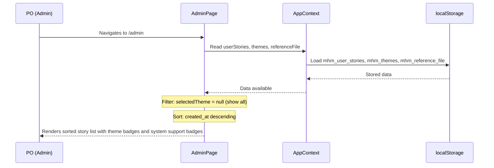
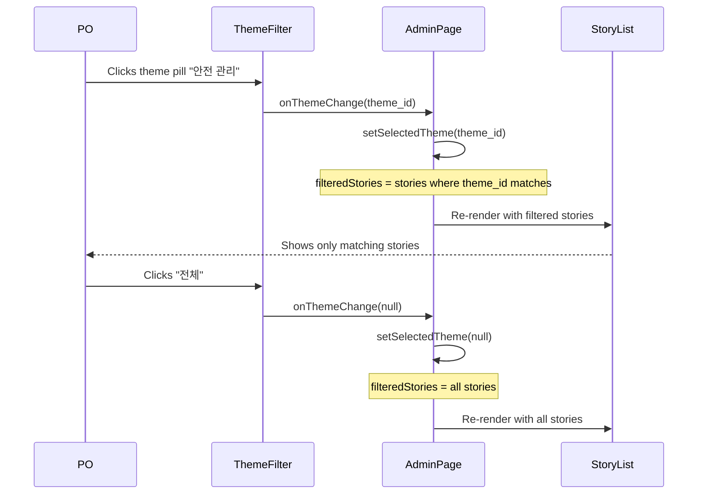
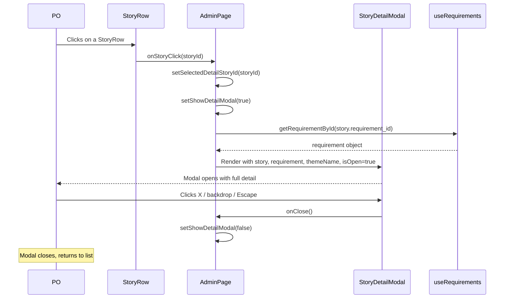
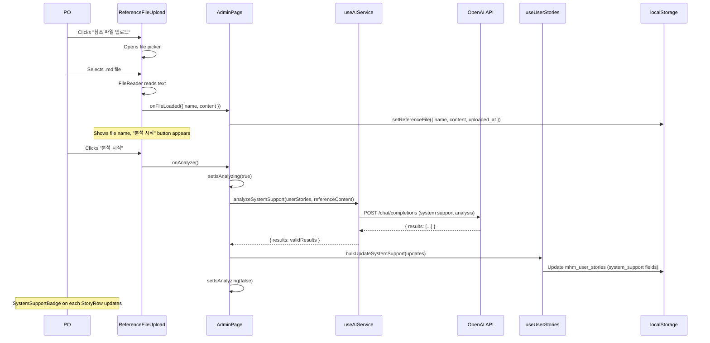

# UNIT-04 Functional Design -- Admin List & Analysis

> Version: v1.0
> Date: 2026-04-22
> Stage: CONSTRUCTION / UNIT-04 / Functional Design
> Source: application-design.md (Sections 3.3, 4, 5, 6.4, 6.6, 7.3), units.md (UNIT-04), user-stories.md (US-013~017), business-rules.md (BR-005, BR-008), SCR-002-admin-page.md, SCR-003-admin-modals.md, schema.md, UNIT-01/02 functional-design.md (established patterns), UNIT-01/02/03 source code

---

## Table of Contents

1. [Scope and Approach](#1-scope-and-approach)
2. [Hook Enhancements](#2-hook-enhancements)
3. [Components](#3-components)
4. [AdminPage Orchestration](#4-adminpage-orchestration)
5. [Data Flow Sequences](#5-data-flow-sequences)
6. [Error Handling Matrix](#6-error-handling-matrix)
7. [File Checklist](#7-file-checklist)
8. [Definition of Done -- Refined](#8-definition-of-done----refined)

---

## 1. Scope and Approach

### 1.1 What This Unit Delivers

UNIT-04 replaces the AdminPage stub with a fully functional admin page. It delivers:

- Verified user story list view sorted newest-first
- Theme-based filtering with dynamic theme population
- Story detail modal with full information (story, purpose, ACs, source requirement, theme, system support, timestamps)
- Reference file upload (.txt, .md, .json) with localStorage persistence
- AI-based system support analysis (analyzeSystemSupport implementation)
- System support badge with 3 visual states
- Empty state when no stories exist
- Responsive layout for desktop/tablet/mobile

### 1.2 What This Unit Does NOT Deliver

- Checkbox multi-select on StoryRow -- UNIT-05
- "Select all" checkbox in StoryList header -- UNIT-05
- ExportControls (selection counter, preview/export buttons) -- UNIT-05
- PreviewModal (full-screen markdown preview) -- UNIT-05
- useExport hook and markdownGenerator utility -- UNIT-05

### 1.3 Established Patterns (from UNIT-01/02)

All files follow the patterns defined in UNIT-01 functional-design.md Section 1:

- File naming: PascalCase `.jsx` for components, camelCase `.js` for hooks
- Export conventions: `export default function` for components, named exports for hooks
- Component structure: imports, function definition, JSX return
- Tailwind class ordering: layout, sizing, spacing, typography, colors, borders, effects, transitions, responsive
- Korean-only UI text, no i18n framework
- Accessibility: semantic HTML, `aria-label` on icon-only buttons, keyboard operability, visible focus indicators
- Focus ring standard: `focus:outline-none focus:ring-2 focus:ring-blue-500 focus:ring-offset-2`
- `data-testid` attributes on key elements

### 1.4 Dependencies on Prior Units

| Artifact | How UNIT-04 uses it |
|----------|---------------------|
| `AppContext` / `AppProvider` | Reads `userStories`, `themes`, `requirements`, `referenceFile` from context. Writes `referenceFile` via `setReferenceFile`. |
| `useUserStories` | All functions already implemented (addUserStory, getStoriesByTheme, updateSystemSupport, bulkUpdateSystemSupport, getStoryById). UNIT-04 uses getStoriesByTheme, bulkUpdateSystemSupport, getStoryById. |
| `useAIService` | `analyzeSystemSupport` has a stub that throws. UNIT-04 replaces the stub with the full implementation. |
| `useRequirements` | `getRequirementById` used by StoryDetailModal to display source requirement text. |
| `useThemes` | `themes` array and `getThemeById` used by ThemeFilter and StoryDetailModal. |
| `EmptyState` | Reused for empty admin page. |
| `LoadingIndicator` | Not directly used. Analysis loading is shown via button spinner. |
| `ConfirmDialog` | Not used in UNIT-04. |
| `formatDate`, `formatDateTime`, `nowISO` | Used for date display in StoryRow and StoryDetailModal. |

---

## 2. Hook Enhancements

### 2.1 `frontend/src/hooks/useUserStories.js` -- VERIFY (no changes needed)

**Status**: All functions required by UNIT-04 already exist and are correctly implemented.

**Verification checklist**:

| Function | Exists? | Correct? | Notes |
|----------|---------|----------|-------|
| `addUserStory(data)` | Yes | Yes | Creates story with `system_support: "not_analyzed"`. Used by UNIT-03. |
| `getStoriesByTheme(themeId)` | Yes | Yes | Filters by `theme_id`. Returns array. |
| `updateSystemSupport(id, supportStatus)` | Yes | Yes | Updates single story's `system_support` and `updated_at`. |
| `bulkUpdateSystemSupport(updates)` | Yes | Yes | Uses `Map` for O(1) lookup. Updates multiple stories in one pass. |
| `getStoryById(id)` | Yes | Yes | Returns single story or `undefined`. |

**No code changes needed.** The existing implementation at `/workshop/AI-DLC-Workshop3/frontend/src/hooks/useUserStories.js` (65 lines) fully satisfies UNIT-04 requirements.

---

### 2.2 `frontend/src/hooks/useAIService.js` -- ENHANCE (replace analyzeSystemSupport stub)

**Purpose**: Replace the placeholder `analyzeSystemSupport` function with a full implementation that sends user stories and reference file content to the AI for system support analysis.

**Current stub** (lines 119-121):

```js
async function analyzeSystemSupport(stories, referenceContent) {
  throw new Error("analyzeSystemSupport는 UNIT-04에서 구현됩니다.");
}
```

**Replacement implementation**:

```js
async function analyzeSystemSupport(stories, referenceContent) {
  setIsLoading(true);
  setError(null);

  try {
    const systemPrompt = `당신은 시스템 분석 전문가입니다. 아래 참조 문서는 기존 시스템의 기능 목록입니다. 각 유저스토리를 참조 문서와 비교하여, 기존 시스템에서 이미 지원하는 기능인지(supported) 새로 개발이 필요한 기능인지(needs_development) 판단해주세요.\n\n반드시 다음 JSON 형식으로 응답하세요:\n{"results": [{"user_story_id": "ID", "system_support": "supported 또는 needs_development", "reason": "판단 근거"}]}\n\n규칙:\n1. 각 유저스토리에 대해 반드시 user_story_id, system_support, reason을 포함해야 합니다.\n2. system_support는 반드시 "supported" 또는 "needs_development" 중 하나여야 합니다.\n3. reason은 판단 근거를 한국어로 간결하게 설명해주세요.\n4. 참조 문서에 명시적으로 해당 기능이 언급되어 있으면 "supported", 없으면 "needs_development"로 판단하세요.`;

    // Build stories text for the user message
    const storiesText = stories
      .map(
        (s) =>
          `- ID: ${s.id}\n  유저스토리: ${s.story}\n  목적: ${s.purpose}`
      )
      .join("\n\n");

    const userContent = `## 참조 문서\n${referenceContent}\n\n## 분석 대상 유저스토리\n${storiesText}`;

    const messages = [
      { role: "system", content: systemPrompt },
      { role: "user", content: userContent },
    ];

    const result = await callChatCompletions(messages, 0.2);

    // Validate response structure
    if (!result || !Array.isArray(result.results)) {
      throw new Error("AI 응답을 처리할 수 없습니다. 다시 시도해주세요.");
    }

    // Validate each result item
    const validResults = result.results.filter(
      (item) =>
        item.user_story_id &&
        (item.system_support === "supported" ||
          item.system_support === "needs_development") &&
        item.reason
    );

    if (validResults.length < result.results.length) {
      console.warn(
        `AI 응답에서 유효하지 않은 분석 결과 ${result.results.length - validResults.length}건을 제외했습니다.`
      );
    }

    return { results: validResults };
  } catch (err) {
    setError(err.message);
    return null;
  } finally {
    setIsLoading(false);
  }
}
```

**System prompt** (exact Korean string):

```
당신은 시스템 분석 전문가입니다. 아래 참조 문서는 기존 시스템의 기능 목록입니다. 각 유저스토리를 참조 문서와 비교하여, 기존 시스템에서 이미 지원하는 기능인지(supported) 새로 개발이 필요한 기능인지(needs_development) 판단해주세요.

반드시 다음 JSON 형식으로 응답하세요:
{"results": [{"user_story_id": "ID", "system_support": "supported 또는 needs_development", "reason": "판단 근거"}]}

규칙:
1. 각 유저스토리에 대해 반드시 user_story_id, system_support, reason을 포함해야 합니다.
2. system_support는 반드시 "supported" 또는 "needs_development" 중 하나여야 합니다.
3. reason은 판단 근거를 한국어로 간결하게 설명해주세요.
4. 참조 문서에 명시적으로 해당 기능이 언급되어 있으면 "supported", 없으면 "needs_development"로 판단하세요.
```

**Request format sent to the API**:

```json
{
  "model": "gpt-4o-mini",
  "messages": [
    { "role": "system", "content": "[system prompt above]" },
    { "role": "user", "content": "## 참조 문서\n{referenceContent}\n\n## 분석 대상 유저스토리\n{storiesText}" }
  ],
  "temperature": 0.2,
  "response_format": { "type": "json_object" }
}
```

**Expected response JSON** (parsed from `choices[0].message.content`):

```json
{
  "results": [
    {
      "user_story_id": "us_c9d0e1f2",
      "system_support": "needs_development",
      "reason": "참조 문서에 안전 장비 알림 관련 기능이 명시되어 있지 않음"
    },
    {
      "user_story_id": "us_a1b2c3d4",
      "system_support": "supported",
      "reason": "참조 문서의 '정비 이력 관리' 섹션에서 해당 기능을 확인함"
    }
  ]
}
```

**Parameters**:

| Parameter | Type | Required | Description |
|-----------|------|----------|-------------|
| `stories` | `Array<Object>` | Yes | Array of user story objects. Must have `id`, `story`, `purpose` fields. |
| `referenceContent` | `string` | Yes | Full text content of the uploaded reference file. |

**Return value**:

| Success | Returns `{ results: Array<{ user_story_id, system_support, reason }> }` |
|---------|---------|
| Failure | Returns `null` and sets `error` state with Korean message |

**Error conditions**: Same error handling as `extractRequirements` -- all errors are caught, set to `error` state, and the function returns `null`.

**Key differences from extractRequirements**:
- Temperature: `0.2` (lower for more deterministic analysis)
- Different system prompt focused on comparison analysis
- Response schema uses `results` array (not `items`)
- Validation checks for `system_support` being exactly `"supported"` or `"needs_development"`

**Related stories**: US-016, BR-005

---

## 3. Components

### 3.1 `frontend/src/components/admin/ThemeFilter.jsx` (NEW)

**Purpose**: Dropdown or pill-style button group listing all available themes plus "All" option. Filters the story list by selected theme.

**Props Interface**:

| Prop | Type | Required | Default | Description |
|------|------|----------|---------|-------------|
| `themes` | `Array<Object>` | Yes | -- | Array of theme objects from context: `[{ id, name, description }]` |
| `selectedTheme` | `string \| null` | Yes | -- | Currently selected theme ID, or `null` for "All" |
| `onThemeChange` | `Function` | Yes | -- | Callback when theme selection changes: `(themeId: string \| null) => void` |

**Internal state**: None.

**Component behavior**:
1. Renders a horizontal scrollable row of pill buttons
2. First pill is always "All" (`null` theme ID)
3. Remaining pills are one per theme in `themes` array
4. Active pill has filled background; inactive pills have outlined style
5. Clicking a pill calls `onThemeChange` with the theme's `id` (or `null` for "All")
6. On mobile, the row scrolls horizontally with overflow

**JSX structure**:

```jsx
import React from "react";

export default function ThemeFilter({ themes, selectedTheme, onThemeChange }) {
  return (
    <div
      className="flex items-center gap-2 overflow-x-auto pb-1 scrollbar-hide"
      role="group"
      aria-label="테마 필터"
      data-testid="theme-filter"
    >
      {/* "전체" (All) pill */}
      <button
        type="button"
        onClick={() => onThemeChange(null)}
        className={`shrink-0 px-3 py-1.5 text-sm font-medium rounded-full transition-colors focus:outline-none focus:ring-2 focus:ring-blue-500 focus:ring-offset-2 ${
          selectedTheme === null
            ? "bg-blue-600 text-white"
            : "bg-white text-gray-600 border border-gray-300 hover:bg-gray-50"
        }`}
        aria-pressed={selectedTheme === null}
        data-testid="theme-filter-all"
      >
        전체
      </button>

      {/* Theme pills */}
      {themes.map((theme) => (
        <button
          key={theme.id}
          type="button"
          onClick={() => onThemeChange(theme.id)}
          className={`shrink-0 px-3 py-1.5 text-sm font-medium rounded-full transition-colors focus:outline-none focus:ring-2 focus:ring-blue-500 focus:ring-offset-2 ${
            selectedTheme === theme.id
              ? "bg-blue-600 text-white"
              : "bg-white text-gray-600 border border-gray-300 hover:bg-gray-50"
          }`}
          aria-pressed={selectedTheme === theme.id}
          data-testid={`theme-filter-${theme.id}`}
        >
          {theme.name}
        </button>
      ))}
    </div>
  );
}
```

**Tailwind classes explained**:
- Container: `flex items-center gap-2 overflow-x-auto pb-1` -- horizontal flex, 8px gap, horizontal scroll when pills overflow, 4px bottom padding to prevent focus ring clip
- `scrollbar-hide` -- If this utility is not available, use `[&::-webkit-scrollbar]:hidden [-ms-overflow-style:none] [scrollbar-width:none]` to hide scrollbar on mobile while keeping scroll functional
- Active pill: `bg-blue-600 text-white` -- filled blue background, white text
- Inactive pill: `bg-white text-gray-600 border border-gray-300 hover:bg-gray-50` -- white background, gray border, subtle hover
- Both pills: `shrink-0 px-3 py-1.5 text-sm font-medium rounded-full transition-colors` -- no shrink, pill shape, 14px font, medium weight

**Accessibility**:
- Container: `role="group"` with `aria-label="테마 필터"` for grouped radio-like behavior
- Each button: `aria-pressed` reflects active state (true for the selected theme)
- Focus ring standard applied

**Related stories**: US-014

---

### 3.2 `frontend/src/components/admin/StoryList.jsx` (NEW)

**Purpose**: Container rendering a list of StoryRow components. Includes column headers. In UNIT-04, there are no checkboxes (added in UNIT-05).

**Props Interface**:

| Prop | Type | Required | Default | Description |
|------|------|----------|---------|-------------|
| `stories` | `Array<Object>` | Yes | -- | Array of user story objects to display, already filtered and sorted by the parent |
| `onStoryClick` | `Function` | Yes | -- | Callback when a story row is clicked: `(storyId: string) => void` |

**Internal state**: None.

**Component behavior**:
1. Renders a desktop table header row with column labels
2. Renders one `StoryRow` per story
3. On mobile (< 768px), switches to card layout (header row hidden)
4. UNIT-05 will add a checkbox column and "select all" checkbox

**JSX structure**:

```jsx
import React from "react";
import StoryRow from "./StoryRow";

export default function StoryList({ stories, onStoryClick }) {
  return (
    <div data-testid="story-list">
      {/* Desktop header row */}
      <div
        className="hidden md:grid md:grid-cols-[1fr_120px_120px_100px] gap-4 px-4 py-2 text-xs font-semibold text-gray-500 uppercase tracking-wider border-b border-gray-200"
        role="row"
        aria-hidden="true"
      >
        <span>유저스토리</span>
        <span>테마</span>
        <span>시스템 지원</span>
        <span>날짜</span>
      </div>

      {/* Story rows */}
      <div role="list" aria-label="유저스토리 목록">
        {stories.map((story) => (
          <StoryRow
            key={story.id}
            story={story}
            onRowClick={() => onStoryClick(story.id)}
          />
        ))}
      </div>
    </div>
  );
}
```

**Tailwind classes explained**:
- Header: `hidden md:grid md:grid-cols-[1fr_120px_120px_100px]` -- hidden on mobile, grid layout on desktop with explicit column widths matching StoryRow
- Header text: `text-xs font-semibold text-gray-500 uppercase tracking-wider` -- small, bold, gray, uppercase, letter-spaced column labels
- Header border: `border-b border-gray-200` -- bottom separator line
- Header padding: `gap-4 px-4 py-2` -- 16px column gap, horizontal padding, 8px vertical padding

**Accessibility**:
- Header row: `role="row"` with `aria-hidden="true"` (decorative; actual content semantics come from StoryRow)
- Story rows container: `role="list"` with `aria-label="유저스토리 목록"`

**UNIT-05 enhancement note**: UNIT-05 will modify the grid template to add a checkbox column: `md:grid-cols-[40px_1fr_120px_120px_100px]`. A "Select all" checkbox will be added to the header. The `stories` prop structure and `onStoryClick` remain unchanged.

**Related stories**: US-013

---

### 3.3 `frontend/src/components/admin/StoryRow.jsx` (NEW)

**Purpose**: Single row in the story list. Shows story summary (truncated), theme badge, SystemSupportBadge, and date. Clicking the row opens the detail modal.

**Props Interface**:

| Prop | Type | Required | Default | Description |
|------|------|----------|---------|-------------|
| `story` | `Object` | Yes | -- | User story object: `{ id, story, theme_id, system_support, created_at, ... }` |
| `onRowClick` | `Function` | Yes | -- | Called when the row is clicked (opens detail modal) |

**Internal state**: None.

**Derived values**:

```js
const { themes } = useContext(AppContext);
// OR receive theme name as a prop; however, to keep StoryRow self-contained:
const { getThemeById } = useThemes();
const theme = getThemeById(story.theme_id);
const themeName = theme ? theme.name : "";
```

**Note on hook usage in StoryRow**: StoryRow needs the theme name for display. Two approaches:
1. **Pass as prop from AdminPage** (preferred for performance -- avoids calling useThemes in each row)
2. **Use hook inside StoryRow** (simpler code, acceptable for workshop scale)

**Decision**: AdminPage will pre-compute a `themeMap` (Map<themeId, themeName>) and pass the theme name via a separate prop. This avoids calling `useThemes()` inside every StoryRow render.

**Updated Props Interface**:

| Prop | Type | Required | Default | Description |
|------|------|----------|---------|-------------|
| `story` | `Object` | Yes | -- | User story object |
| `themeName` | `string` | Yes | -- | Display name of the story's theme |
| `onRowClick` | `Function` | Yes | -- | Called when row is clicked |

**Helper function (truncation)**:

```js
function truncateText(text, maxLength = 60) {
  if (!text) return "";
  if (text.length <= maxLength) return text;
  return text.substring(0, maxLength) + "...";
}
```

**JSX structure**:

```jsx
import React from "react";
import SystemSupportBadge from "./SystemSupportBadge";
import { formatDate } from "../../utils/dateFormatter";

function truncateText(text, maxLength = 60) {
  if (!text) return "";
  if (text.length <= maxLength) return text;
  return text.substring(0, maxLength) + "...";
}

export default function StoryRow({ story, themeName, onRowClick }) {
  return (
    <div
      className="grid grid-cols-1 md:grid-cols-[1fr_120px_120px_100px] gap-2 md:gap-4 px-4 py-3 border-b border-gray-100 cursor-pointer hover:bg-gray-50 transition-colors"
      role="listitem"
      onClick={onRowClick}
      onKeyDown={(e) => {
        if (e.key === "Enter" || e.key === " ") {
          e.preventDefault();
          onRowClick();
        }
      }}
      tabIndex={0}
      aria-label={`유저스토리: ${truncateText(story.story, 40)}`}
      data-testid={`story-row-${story.id}`}
    >
      {/* Story summary */}
      <div className="flex flex-col gap-1 min-w-0">
        <p className="text-sm text-gray-900 truncate md:overflow-visible md:whitespace-normal md:line-clamp-1">
          {truncateText(story.story)}
        </p>
        {/* Mobile-only: show theme and badge inline */}
        <div className="flex items-center gap-2 md:hidden">
          {themeName && (
            <span className="inline-block px-2 py-0.5 text-xs font-medium text-blue-700 bg-blue-100 rounded-full">
              {themeName}
            </span>
          )}
          <SystemSupportBadge status={story.system_support} />
          <span className="text-xs text-gray-400">
            {formatDate(story.created_at)}
          </span>
        </div>
      </div>

      {/* Theme badge (desktop only) */}
      <div className="hidden md:flex md:items-center">
        {themeName && (
          <span className="inline-block px-2 py-0.5 text-xs font-medium text-blue-700 bg-blue-100 rounded-full truncate max-w-full">
            {themeName}
          </span>
        )}
      </div>

      {/* System support badge (desktop only) */}
      <div className="hidden md:flex md:items-center">
        <SystemSupportBadge status={story.system_support} />
      </div>

      {/* Date (desktop only) */}
      <div className="hidden md:flex md:items-center">
        <span className="text-sm text-gray-500">
          {formatDate(story.created_at)}
        </span>
      </div>
    </div>
  );
}
```

**Tailwind classes explained**:
- Row container: `grid grid-cols-1 md:grid-cols-[1fr_120px_120px_100px]` -- single column on mobile (card style), 4-column grid on desktop matching StoryList header
- Row interaction: `cursor-pointer hover:bg-gray-50 transition-colors` -- clickable visual feedback
- Row spacing: `gap-2 md:gap-4 px-4 py-3 border-b border-gray-100` -- tighter gap on mobile, horizontal padding, bottom border
- Story text: `text-sm text-gray-900 truncate` on mobile, `md:line-clamp-1` on desktop
- Theme badge: `px-2 py-0.5 text-xs font-medium text-blue-700 bg-blue-100 rounded-full` -- blue pill, same style as UNIT-02 theme badges
- Mobile layout: Theme, badge, and date shown inline below story text (`md:hidden`)
- Desktop columns: Individual columns shown with `hidden md:flex md:items-center`

**Accessibility**:
- `role="listitem"` for list semantics
- `tabIndex={0}` makes the row keyboard-focusable
- `onKeyDown` handles Enter and Space for keyboard activation
- `aria-label` provides a descriptive accessible name

**UNIT-05 enhancement note**: UNIT-05 will add a checkbox column. The grid template will become `md:grid-cols-[40px_1fr_120px_120px_100px]`. A checkbox element will be prepended to each row with `onClick` that stops propagation (so clicking the checkbox does not trigger `onRowClick`). New props: `isSelected: Boolean`, `onToggle: Function`.

**Related stories**: US-013 AC-2, US-015 AC-1

---

### 3.4 `frontend/src/components/admin/SystemSupportBadge.jsx` (NEW)

**Purpose**: Visual badge showing system support analysis status. Three states with distinct colors.

**Props Interface**:

| Prop | Type | Required | Default | Description |
|------|------|----------|---------|-------------|
| `status` | `string` | Yes | -- | One of: `"supported"`, `"needs_development"`, `"not_analyzed"` |

**Internal state**: None.

**Status configuration**:

```js
const STATUS_CONFIG = {
  supported: {
    label: "시스템 지원",
    className: "bg-green-100 text-green-800",
    ariaLabel: "시스템 지원 상태: 시스템 지원",
  },
  needs_development: {
    label: "개발 필요",
    className: "bg-orange-100 text-orange-800",
    ariaLabel: "시스템 지원 상태: 개발 필요",
  },
  not_analyzed: {
    label: "미분석",
    className: "bg-gray-100 text-gray-500",
    ariaLabel: "시스템 지원 상태: 미분석",
  },
};
```

**JSX structure**:

```jsx
import React from "react";

const STATUS_CONFIG = {
  supported: {
    label: "시스템 지원",
    className: "bg-green-100 text-green-800",
    ariaLabel: "시스템 지원 상태: 시스템 지원",
  },
  needs_development: {
    label: "개발 필요",
    className: "bg-orange-100 text-orange-800",
    ariaLabel: "시스템 지원 상태: 개발 필요",
  },
  not_analyzed: {
    label: "미분석",
    className: "bg-gray-100 text-gray-500",
    ariaLabel: "시스템 지원 상태: 미분석",
  },
};

export default function SystemSupportBadge({ status }) {
  const config = STATUS_CONFIG[status] || STATUS_CONFIG.not_analyzed;

  return (
    <span
      className={`inline-block px-2 py-0.5 text-xs font-medium rounded-full whitespace-nowrap ${config.className}`}
      aria-label={config.ariaLabel}
      data-testid={`system-support-badge-${status}`}
    >
      {config.label}
    </span>
  );
}
```

**Tailwind classes explained**:
- Shared: `inline-block px-2 py-0.5 text-xs font-medium rounded-full whitespace-nowrap` -- pill badge, 12px font, medium weight, no line break
- `supported`: `bg-green-100 text-green-800` -- light green background, dark green text
- `needs_development`: `bg-orange-100 text-orange-800` -- light orange background, dark orange text
- `not_analyzed`: `bg-gray-100 text-gray-500` -- light gray background, muted gray text

**Accessibility**:
- `aria-label` provides full text description including "시스템 지원 상태:" prefix for clarity in screen readers

**Related stories**: US-016 AC-3

---

### 3.5 `frontend/src/components/admin/StoryDetailModal.jsx` (NEW)

**Purpose**: Modal overlay showing full story detail. Triggered by clicking a row in StoryList. Shows story sentence, purpose, acceptance criteria, source requirement text, theme, system support status, and timestamps.

**Props Interface**:

| Prop | Type | Required | Default | Description |
|------|------|----------|---------|-------------|
| `story` | `Object \| null` | Yes | -- | The user story object to display, or `null` when closed |
| `requirement` | `Object \| null` | Yes | -- | The source requirement object (from `useRequirements.getRequirementById`), or `null` if not found |
| `themeName` | `string` | Yes | -- | Display name of the story's theme |
| `isOpen` | `boolean` | Yes | -- | Whether the modal is visible |
| `onClose` | `Function` | Yes | -- | Called when the modal should close |

**Internal state**: None.

**Refs**:

```js
const closeButtonRef = useRef(null);
const modalRef = useRef(null);
const previousFocusRef = useRef(null);
```

**Effects**:

```js
// Capture previous focus and auto-focus close button on open
useEffect(() => {
  if (isOpen) {
    previousFocusRef.current = document.activeElement;
    closeButtonRef.current?.focus();
    document.body.style.overflow = "hidden";
  } else {
    document.body.style.overflow = "";
    previousFocusRef.current?.focus();
  }
  return () => {
    document.body.style.overflow = "";
  };
}, [isOpen]);

// Escape key handler
useEffect(() => {
  if (!isOpen) return;
  const handleKeyDown = (e) => {
    if (e.key === "Escape") onClose();
  };
  document.addEventListener("keydown", handleKeyDown);
  return () => document.removeEventListener("keydown", handleKeyDown);
}, [isOpen, onClose]);

// Focus trap
useEffect(() => {
  if (!isOpen || !modalRef.current) return;
  const modal = modalRef.current;
  const focusableElements = modal.querySelectorAll(
    'button, [href], input, select, textarea, [tabindex]:not([tabindex="-1"])'
  );
  const firstFocusable = focusableElements[0];
  const lastFocusable = focusableElements[focusableElements.length - 1];

  const handleTab = (e) => {
    if (e.key !== "Tab") return;
    if (e.shiftKey) {
      if (document.activeElement === firstFocusable) {
        e.preventDefault();
        lastFocusable?.focus();
      }
    } else {
      if (document.activeElement === lastFocusable) {
        e.preventDefault();
        firstFocusable?.focus();
      }
    }
  };

  modal.addEventListener("keydown", handleTab);
  return () => modal.removeEventListener("keydown", handleTab);
}, [isOpen]);
```

**JSX structure**:

```jsx
import { useRef, useEffect } from "react";
import { createPortal } from "react-dom";
import SystemSupportBadge from "./SystemSupportBadge";
import { formatDateTime } from "../../utils/dateFormatter";

export default function StoryDetailModal({
  story,
  requirement,
  themeName,
  isOpen,
  onClose,
}) {
  const closeButtonRef = useRef(null);
  const modalRef = useRef(null);
  const previousFocusRef = useRef(null);

  // ... effects above ...

  if (!isOpen || !story) return null;

  return createPortal(
    <div
      className="fixed inset-0 z-50 flex items-center justify-center bg-black/50"
      onClick={onClose}
      role="presentation"
      data-testid="story-detail-backdrop"
    >
      <div
        ref={modalRef}
        className="w-full max-w-2xl mx-4 max-h-[90vh] flex flex-col bg-white rounded-xl shadow-xl"
        role="dialog"
        aria-modal="true"
        aria-labelledby="story-detail-title"
        onClick={(e) => e.stopPropagation()}
        data-testid="story-detail-modal"
      >
        {/* Modal header */}
        <div className="flex items-center justify-between px-6 py-4 border-b border-gray-200 shrink-0">
          <h3
            id="story-detail-title"
            className="text-lg font-semibold text-gray-900"
          >
            유저스토리 상세
          </h3>
          <button
            ref={closeButtonRef}
            type="button"
            onClick={onClose}
            className="p-1 text-gray-400 hover:text-gray-600 rounded-lg hover:bg-gray-100 transition-colors focus:outline-none focus:ring-2 focus:ring-blue-500 focus:ring-offset-2"
            aria-label="모달 닫기"
            data-testid="story-detail-close"
          >
            <svg
              className="w-5 h-5"
              fill="none"
              stroke="currentColor"
              viewBox="0 0 24 24"
              aria-hidden="true"
            >
              <path
                strokeLinecap="round"
                strokeLinejoin="round"
                strokeWidth={2}
                d="M6 18L18 6M6 6l12 12"
              />
            </svg>
          </button>
        </div>

        {/* Modal body (scrollable) */}
        <div className="flex-1 overflow-y-auto px-6 py-4 space-y-5">
          {/* Theme and System Support */}
          <div className="flex items-center gap-3 flex-wrap">
            {themeName && (
              <span className="inline-block px-2.5 py-0.5 text-xs font-medium text-blue-700 bg-blue-100 rounded-full">
                {themeName}
              </span>
            )}
            <SystemSupportBadge status={story.system_support} />
          </div>

          {/* Divider */}
          <hr className="border-gray-200" />

          {/* User Story */}
          <div>
            <h4 className="text-sm font-semibold text-gray-500 mb-2">
              유저스토리
            </h4>
            <p className="text-sm text-gray-900 leading-relaxed italic bg-gray-50 p-3 rounded-lg">
              &ldquo;{story.story}&rdquo;
            </p>
          </div>

          {/* Divider */}
          <hr className="border-gray-200" />

          {/* Purpose */}
          <div>
            <h4 className="text-sm font-semibold text-gray-500 mb-2">
              목적
            </h4>
            <p className="text-sm text-gray-900 leading-relaxed">
              {story.purpose}
            </p>
          </div>

          {/* Divider */}
          <hr className="border-gray-200" />

          {/* Acceptance Criteria */}
          <div>
            <h4 className="text-sm font-semibold text-gray-500 mb-2">
              인수 조건
            </h4>
            <ol className="list-decimal list-inside space-y-1">
              {story.acceptance_criteria.map((ac, index) => (
                <li key={index} className="text-sm text-gray-900">
                  {ac}
                </li>
              ))}
            </ol>
          </div>

          {/* Divider */}
          <hr className="border-gray-200" />

          {/* Source Requirement */}
          <div>
            <h4 className="text-sm font-semibold text-gray-500 mb-2">
              원본 요구사항
            </h4>
            {requirement ? (
              <blockquote className="text-sm text-gray-600 italic border-l-4 border-gray-300 pl-3 py-1">
                &ldquo;{requirement.raw_text}&rdquo;
              </blockquote>
            ) : (
              <p className="text-sm text-gray-400 italic">
                원본 요구사항을 찾을 수 없습니다
              </p>
            )}
          </div>

          {/* Divider */}
          <hr className="border-gray-200" />

          {/* Timestamps */}
          <div className="flex flex-col gap-1">
            <div className="flex items-center gap-2">
              <span className="text-xs font-medium text-gray-400">생성일</span>
              <span className="text-xs text-gray-600">
                {formatDateTime(story.created_at)}
              </span>
            </div>
            <div className="flex items-center gap-2">
              <span className="text-xs font-medium text-gray-400">수정일</span>
              <span className="text-xs text-gray-600">
                {formatDateTime(story.updated_at)}
              </span>
            </div>
          </div>
        </div>
      </div>
    </div>,
    document.body
  );
}
```

**Tailwind classes explained**:
- Backdrop: `fixed inset-0 z-50 flex items-center justify-center bg-black/50` -- full viewport, centered content, semi-transparent black overlay
- Modal container: `w-full max-w-2xl mx-4 max-h-[90vh] flex flex-col bg-white rounded-xl shadow-xl` -- max 672px width, 16px margin on sides, max 90% viewport height, white card with large shadow
- Modal header: `flex items-center justify-between px-6 py-4 border-b border-gray-200 shrink-0` -- title left, close button right, bottom border, does not shrink
- Modal body: `flex-1 overflow-y-auto px-6 py-4 space-y-5` -- scrollable, 24px horizontal padding, 20px vertical spacing between sections
- Section headers: `text-sm font-semibold text-gray-500 mb-2` -- small, bold, gray label
- User story text: `text-sm text-gray-900 leading-relaxed italic bg-gray-50 p-3 rounded-lg` -- italic quote in a light gray box
- Blockquote: `border-l-4 border-gray-300 pl-3 py-1` -- left border quote style
- Timestamps: `text-xs font-medium text-gray-400` for label, `text-xs text-gray-600` for value
- Close button: `p-1 text-gray-400 hover:text-gray-600 rounded-lg hover:bg-gray-100` -- icon button with hover effect

**Accessibility**:
- `role="dialog"` on modal container
- `aria-modal="true"` indicates modality
- `aria-labelledby="story-detail-title"` links to the heading
- Close button: `aria-label="모달 닫기"`
- Focus trap: Tab cycles within modal
- Escape key closes modal
- Backdrop click closes modal
- `createPortal` to `document.body` for correct stacking context
- Body scroll lock when open
- Focus returns to trigger element on close

**Related stories**: US-015

---

### 3.6 `frontend/src/components/admin/ReferenceFileUpload.jsx` (NEW)

**Purpose**: File upload control for PO to upload a reference file (text/markdown/JSON). Reads file content as text. Shows uploaded file name. Provides "change" and "start analysis" controls.

**Props Interface**:

| Prop | Type | Required | Default | Description |
|------|------|----------|---------|-------------|
| `onFileLoaded` | `Function` | Yes | -- | Called when a file is successfully read: `(file: { name, content }) => void` |
| `currentFileName` | `string \| null` | Yes | -- | Name of the currently uploaded file, or `null` if none |
| `onAnalyze` | `Function` | Yes | -- | Called when "분석 시작" button is clicked |
| `isAnalyzing` | `boolean` | Yes | -- | Whether analysis is currently in progress |
| `hasStories` | `boolean` | Yes | -- | Whether any verified stories exist (analysis requires at least one) |

**Internal state**:

```js
const [error, setError] = useState(null);
```

**Refs**:

```js
const fileInputRef = useRef(null);
```

**Accepted file types**: `.txt`, `.md`, `.json`

**Event handlers**:

#### `handleFileChange(e)`

```js
function handleFileChange(e) {
  setError(null);
  const file = e.target.files?.[0];
  if (!file) return;

  // Validate file type (BR-008 V-005)
  const validExtensions = [".txt", ".md", ".json"];
  const fileExtension = "." + file.name.split(".").pop().toLowerCase();
  if (!validExtensions.includes(fileExtension)) {
    setError("지원하지 않는 파일 형식입니다. .txt, .md, .json 파일만 업로드할 수 있습니다.");
    // Reset input
    e.target.value = "";
    return;
  }

  // Read file as text
  const reader = new FileReader();
  reader.onload = (event) => {
    const content = event.target?.result;
    // Validate non-empty content (BR-008 V-006)
    if (!content || !content.trim()) {
      setError("파일이 비어 있습니다.");
      return;
    }
    onFileLoaded({ name: file.name, content });
  };
  reader.onerror = () => {
    setError("파일을 읽을 수 없습니다. 다시 시도해주세요.");
  };
  reader.readAsText(file);

  // Reset input so re-uploading the same file triggers change event
  e.target.value = "";
}
```

#### `handleUploadClick()`

```js
function handleUploadClick() {
  setError(null);
  fileInputRef.current?.click();
}
```

**Auto-clear error**:

```js
useEffect(() => {
  if (!error) return;
  const timer = setTimeout(() => setError(null), 5000);
  return () => clearTimeout(timer);
}, [error]);
```

**JSX structure**:

```jsx
import { useState, useRef, useEffect } from "react";

export default function ReferenceFileUpload({
  onFileLoaded,
  currentFileName,
  onAnalyze,
  isAnalyzing,
  hasStories,
}) {
  const [error, setError] = useState(null);
  const fileInputRef = useRef(null);

  // ... auto-clear error effect ...
  // ... event handlers above ...

  const canAnalyze = currentFileName && hasStories && !isAnalyzing;

  return (
    <div className="flex flex-col gap-2" data-testid="reference-file-upload">
      <div className="flex items-center gap-2 flex-wrap">
        {/* Hidden file input */}
        <input
          ref={fileInputRef}
          type="file"
          accept=".txt,.md,.json"
          onChange={handleFileChange}
          className="hidden"
          aria-label="참조 파일 업로드"
          data-testid="reference-file-input"
        />

        {/* Upload / Change button */}
        <button
          type="button"
          onClick={handleUploadClick}
          className="shrink-0 inline-flex items-center gap-1.5 px-3 py-1.5 text-sm font-medium text-gray-700 bg-white border border-gray-300 rounded-lg hover:bg-gray-50 transition-colors focus:outline-none focus:ring-2 focus:ring-blue-500 focus:ring-offset-2"
          data-testid="reference-file-button"
        >
          <svg
            className="w-4 h-4"
            fill="none"
            stroke="currentColor"
            viewBox="0 0 24 24"
            aria-hidden="true"
          >
            <path
              strokeLinecap="round"
              strokeLinejoin="round"
              strokeWidth={2}
              d="M7 16a4 4 0 01-.88-7.903A5 5 0 1115.9 6L16 6a5 5 0 011 9.9M15 13l-3-3m0 0l-3 3m3-3v12"
            />
          </svg>
          {currentFileName ? "파일 변경" : "참조 파일 업로드"}
        </button>

        {/* Current file name */}
        {currentFileName && (
          <span className="text-sm text-gray-500 truncate max-w-[200px]" title={currentFileName}>
            {currentFileName}
          </span>
        )}

        {/* Analysis button */}
        {currentFileName && (
          <button
            type="button"
            onClick={onAnalyze}
            disabled={!canAnalyze}
            className="shrink-0 inline-flex items-center gap-1.5 px-3 py-1.5 text-sm font-medium text-white bg-blue-600 rounded-lg hover:bg-blue-700 disabled:opacity-40 disabled:cursor-not-allowed transition-colors focus:outline-none focus:ring-2 focus:ring-blue-500 focus:ring-offset-2"
            data-testid="analyze-button"
          >
            {isAnalyzing ? (
              <>
                <svg
                  className="w-4 h-4 animate-spin"
                  fill="none"
                  viewBox="0 0 24 24"
                  aria-hidden="true"
                >
                  <circle
                    className="opacity-25"
                    cx="12"
                    cy="12"
                    r="10"
                    stroke="currentColor"
                    strokeWidth="4"
                  />
                  <path
                    className="opacity-75"
                    fill="currentColor"
                    d="M4 12a8 8 0 018-8V0C5.373 0 0 5.373 0 12h4zm2 5.291A7.962 7.962 0 014 12H0c0 3.042 1.135 5.824 3 7.938l3-2.647z"
                  />
                </svg>
                분석 중...
              </>
            ) : (
              "분석 시작"
            )}
          </button>
        )}
      </div>

      {/* Error message */}
      {error && (
        <p className="text-xs text-red-600" role="alert" data-testid="reference-file-error">
          {error}
        </p>
      )}
    </div>
  );
}
```

**Tailwind classes explained**:
- Container: `flex flex-col gap-2` -- vertical layout with 8px gap between row and error
- Inner row: `flex items-center gap-2 flex-wrap` -- horizontal layout, wraps on small screens
- Upload button: `inline-flex items-center gap-1.5 px-3 py-1.5 text-sm font-medium text-gray-700 bg-white border border-gray-300 rounded-lg hover:bg-gray-50` -- outlined button with icon
- File name: `text-sm text-gray-500 truncate max-w-[200px]` -- muted text, truncated if too long
- Analyze button: `text-white bg-blue-600 rounded-lg hover:bg-blue-700 disabled:opacity-40` -- blue filled button, dimmed when disabled
- Spinner: `w-4 h-4 animate-spin` -- 16px spinning animation
- Error: `text-xs text-red-600` -- small red error text

**Accessibility**:
- Hidden file input: `aria-label="참조 파일 업로드"`
- Error message: `role="alert"` for screen reader announcement
- Disabled state on analyze button: `disabled` attribute + visual dimming
- Focus ring standard on all buttons

**Related stories**: US-016, BR-005, BR-008 V-005 V-006

---

## 4. AdminPage Orchestration

### 4.1 `frontend/src/pages/AdminPage.jsx` (IMPLEMENT -- replace stub)

**Purpose**: Page container for `/admin`. Orchestrates the full admin experience: story list, theme filtering, detail modal, reference file upload, and system support analysis.

**Props Interface**: None (page component, no props).

**Hooks used**:

```js
import { useUserStories } from "../hooks/useUserStories";
import { useThemes } from "../hooks/useThemes";
import { useRequirements } from "../hooks/useRequirements";
import { useAIService } from "../hooks/useAIService";
import { useContext } from "react";
import { AppContext } from "../context/AppContext";
import { useNavigate } from "react-router-dom";
```

**Internal state**:

| State Variable | Type | Initial Value | Description |
|----------------|------|---------------|-------------|
| `selectedTheme` | `string \| null` | `null` | Currently selected theme ID for filtering, `null` for "All" |
| `selectedDetailStoryId` | `string \| null` | `null` | ID of the story being viewed in detail modal |
| `showDetailModal` | `boolean` | `false` | Whether StoryDetailModal is visible |
| `isAnalyzing` | `boolean` | `false` | Whether system support analysis is in progress (local flag, not useAIService.isLoading) |
| `analysisError` | `string \| null` | `null` | Error message from analysis, separate from useAIService.error |

```js
const [selectedTheme, setSelectedTheme] = useState(null);
const [selectedDetailStoryId, setSelectedDetailStoryId] = useState(null);
const [showDetailModal, setShowDetailModal] = useState(false);
const [isAnalyzing, setIsAnalyzing] = useState(false);
const [analysisError, setAnalysisError] = useState(null);
```

**Note on isAnalyzing vs useAIService.isLoading**: We use a local `isAnalyzing` state instead of `useAIService().isLoading` because the admin page may be opened while the user page also has an AI call in flight. Using a shared `isLoading` could cause false UI state conflicts. The local flag provides isolated loading state for the admin page's analysis feature.

**Hooks and derived values**:

```js
const { userStories, bulkUpdateSystemSupport } = useUserStories();
const { themes } = useThemes();
const { getRequirementById } = useRequirements();
const { analyzeSystemSupport } = useAIService();
const { referenceFile, setReferenceFile } = useContext(AppContext);
const navigate = useNavigate();

// Filter stories by selected theme
const filteredStories = selectedTheme
  ? userStories.filter((s) => s.theme_id === selectedTheme)
  : userStories;

// Sort stories newest-first (created_at descending)
const sortedStories = [...filteredStories].sort(
  (a, b) => new Date(b.created_at) - new Date(a.created_at)
);

// Build theme name lookup map for StoryRow props
const themeMap = new Map(themes.map((t) => [t.id, t.name]));

// Get the selected story and its requirement for the detail modal
const selectedStory = selectedDetailStoryId
  ? userStories.find((s) => s.id === selectedDetailStoryId)
  : null;
const selectedRequirement = selectedStory
  ? getRequirementById(selectedStory.requirement_id)
  : null;
const selectedThemeName = selectedStory
  ? themeMap.get(selectedStory.theme_id) || ""
  : "";

// Reference file name
const currentFileName = referenceFile ? referenceFile.name : null;

// Whether any verified stories exist
const hasStories = userStories.length > 0;
```

**Event handlers**:

#### `handleThemeChange(themeId)`

```js
function handleThemeChange(themeId) {
  setSelectedTheme(themeId);
}
```

#### `handleStoryClick(storyId)`

```js
function handleStoryClick(storyId) {
  setSelectedDetailStoryId(storyId);
  setShowDetailModal(true);
}
```

#### `handleCloseDetailModal()`

```js
function handleCloseDetailModal() {
  setShowDetailModal(false);
  setSelectedDetailStoryId(null);
}
```

#### `handleFileLoaded(file)`

```js
function handleFileLoaded(file) {
  setReferenceFile({
    name: file.name,
    content: file.content,
    uploaded_at: new Date().toISOString(),
  });
  setAnalysisError(null);
}
```

#### `handleAnalyze()`

```js
async function handleAnalyze() {
  if (!referenceFile || !hasStories) return;

  setIsAnalyzing(true);
  setAnalysisError(null);

  const result = await analyzeSystemSupport(userStories, referenceFile.content);

  if (!result) {
    setAnalysisError("시스템 지원 분석 중 오류가 발생했습니다. 다시 시도해주세요.");
    setIsAnalyzing(false);
    return;
  }

  // Map AI results to bulkUpdateSystemSupport format
  const updates = result.results.map((r) => ({
    id: r.user_story_id,
    system_support: r.system_support,
  }));

  // Only update stories that have matching IDs in our data
  const validUpdates = updates.filter((u) =>
    userStories.some((s) => s.id === u.id)
  );

  if (validUpdates.length > 0) {
    bulkUpdateSystemSupport(validUpdates);
  }

  setIsAnalyzing(false);
}
```

#### `handleNavigateToUser()`

```js
function handleNavigateToUser() {
  navigate("/user");
}
```

**Auto-clear analysis error**:

```js
useEffect(() => {
  if (!analysisError) return;
  const timer = setTimeout(() => setAnalysisError(null), 5000);
  return () => clearTimeout(timer);
}, [analysisError]);
```

**JSX structure**:

```jsx
import { useState, useContext, useEffect } from "react";
import { useNavigate } from "react-router-dom";
import { AppContext } from "../context/AppContext";
import { useUserStories } from "../hooks/useUserStories";
import { useThemes } from "../hooks/useThemes";
import { useRequirements } from "../hooks/useRequirements";
import { useAIService } from "../hooks/useAIService";
import ThemeFilter from "../components/admin/ThemeFilter";
import StoryList from "../components/admin/StoryList";
import StoryDetailModal from "../components/admin/StoryDetailModal";
import ReferenceFileUpload from "../components/admin/ReferenceFileUpload";
import EmptyState from "../components/common/EmptyState";

export default function AdminPage() {
  // ... hooks, state, derived values, handlers above ...

  return (
    <div className="flex flex-col h-full overflow-hidden" data-testid="admin-page">
      {/* Toolbar area */}
      <div className="shrink-0 px-4 py-3 bg-white border-b border-gray-200 space-y-3">
        <div className="mx-auto max-w-5xl">
          {/* Row 1: Filter + Reference File */}
          <div className="flex flex-col sm:flex-row sm:items-center sm:justify-between gap-3">
            {/* Theme Filter */}
            <div className="flex-1 min-w-0">
              <ThemeFilter
                themes={themes}
                selectedTheme={selectedTheme}
                onThemeChange={handleThemeChange}
              />
            </div>

            {/* Reference File Upload */}
            <div className="shrink-0">
              <ReferenceFileUpload
                onFileLoaded={handleFileLoaded}
                currentFileName={currentFileName}
                onAnalyze={handleAnalyze}
                isAnalyzing={isAnalyzing}
                hasStories={hasStories}
              />
            </div>
          </div>

          {/* Analysis error */}
          {analysisError && (
            <div
              className="px-3 py-2 text-sm text-red-700 bg-red-50 rounded-lg border border-red-200"
              role="alert"
              data-testid="analysis-error"
            >
              {analysisError}
            </div>
          )}
        </div>
      </div>

      {/* Main content area */}
      <div className="flex-1 overflow-y-auto">
        <div className="mx-auto max-w-5xl">
          {hasStories ? (
            <StoryList
              stories={sortedStories}
              onStoryClick={handleStoryClick}
            />
          ) : (
            <EmptyState
              message="등록된 유저스토리가 없습니다"
              submessage="사용자 페이지에서 요구사항을 입력하고 승인하면 여기에 표시됩니다"
              actionLabel="사용자 페이지로 이동"
              onAction={handleNavigateToUser}
            />
          )}
        </div>
      </div>

      {/* Story Detail Modal */}
      <StoryDetailModal
        story={selectedStory}
        requirement={selectedRequirement}
        themeName={selectedThemeName}
        isOpen={showDetailModal}
        onClose={handleCloseDetailModal}
      />
    </div>
  );
}
```

**Important note on passing `themeName` to StoryRow**: The `StoryList` component renders `StoryRow` components. Each `StoryRow` needs a `themeName` prop. Since `StoryList` does not have access to the theme data, we have two options:

1. **Pass themeMap to StoryList** -- StoryList passes each StoryRow its theme name
2. **Compute themeName inside StoryRow** using `useThemes` hook

**Decision**: Modify `StoryList` to accept a `themeMap` prop, and let it pass the theme name to each `StoryRow`.

**Updated StoryList props** (adding `themeMap`):

| Prop | Type | Required | Default | Description |
|------|------|----------|---------|-------------|
| `stories` | `Array<Object>` | Yes | -- | Sorted/filtered story array |
| `onStoryClick` | `Function` | Yes | -- | Callback when a row is clicked |
| `themeMap` | `Map<string, string>` | Yes | -- | Map from theme_id to theme name |

**Updated StoryList JSX** (the relevant part):

```jsx
{stories.map((story) => (
  <StoryRow
    key={story.id}
    story={story}
    themeName={themeMap.get(story.theme_id) || ""}
    onRowClick={() => onStoryClick(story.id)}
  />
))}
```

**Updated AdminPage JSX** (the relevant part):

```jsx
<StoryList
  stories={sortedStories}
  onStoryClick={handleStoryClick}
  themeMap={themeMap}
/>
```

**Tailwind classes explained**:
- Root: `flex flex-col h-full overflow-hidden` -- fills main area, prevents page-level double scroll
- Toolbar: `shrink-0 px-4 py-3 bg-white border-b border-gray-200 space-y-3` -- fixed top section, white background, bottom border, 12px vertical spacing between rows
- Content container: `mx-auto max-w-5xl` -- centered, max 1024px width
- Row 1: `flex flex-col sm:flex-row sm:items-center sm:justify-between gap-3` -- stacked on mobile, side-by-side on sm+
- Main area: `flex-1 overflow-y-auto` -- takes remaining height, scrollable
- Analysis error: `px-3 py-2 text-sm text-red-700 bg-red-50 rounded-lg border border-red-200` -- red alert box

**Responsive behavior**:
- Desktop (>= 1024px): Toolbar is a single row. Story list is table layout. Max content width 1024px centered.
- Tablet (768px - 1023px): Toolbar may wrap. Story list is still table layout.
- Mobile (< 768px): Toolbar stacks vertically. Story list switches to card layout (handled by StoryRow responsive grid).

**Related stories**: US-013, US-014, US-015, US-016, US-017

---

## 5. Data Flow Sequences

### 5.1 Admin Page Load (Happy Path)



**Text alternative**: PO navigates to /admin. AdminPage reads userStories, themes, and referenceFile from AppContext, which loads from localStorage. With no filter active (selectedTheme = null), all stories are displayed sorted newest-first.

### 5.2 Theme Filtering



**Text alternative**: PO clicks a theme pill, triggering onThemeChange with the theme ID. AdminPage filters stories by theme_id and re-renders StoryList. Clicking "All" clears the filter, showing all stories again.

### 5.3 Story Detail View



**Text alternative**: PO clicks a StoryRow. AdminPage sets the selected story ID and opens the modal. It looks up the source requirement for the story. StoryDetailModal renders with full detail. PO closes the modal via X button, backdrop click, or Escape key.

### 5.4 System Support Analysis



**Text alternative**: PO uploads a reference file via file picker. FileReader reads the file as text. AdminPage stores it in localStorage via setReferenceFile. PO clicks "Start Analysis". AdminPage sends all user stories and reference content to the AI via analyzeSystemSupport. The AI returns results with supported/needs_development for each story. AdminPage calls bulkUpdateSystemSupport to persist the results. SystemSupportBadge on each row updates to reflect the analysis.

---

## 6. Error Handling Matrix

| Scenario | Where Handled | User Feedback | Data Impact |
|----------|--------------|---------------|-------------|
| No verified stories exist | AdminPage (empty state) | EmptyState component with "등록된 유저스토리가 없습니다" message and "사용자 페이지로 이동" button | None |
| Invalid file type uploaded | ReferenceFileUpload | "지원하지 않는 파일 형식입니다. .txt, .md, .json 파일만 업로드할 수 있습니다." (red text below upload area) | File not stored |
| Empty file uploaded | ReferenceFileUpload | "파일이 비어 있습니다." (red text below upload area) | File not stored |
| File read error | ReferenceFileUpload | "파일을 읽을 수 없습니다. 다시 시도해주세요." | File not stored |
| Analysis without file | AdminPage (button not shown) | "분석 시작" button only appears when a file is uploaded (BR-005) | None |
| Analysis without stories | AdminPage (button disabled) | "분석 시작" button disabled when no stories exist | None |
| AI API error during analysis | AdminPage | "시스템 지원 분석 중 오류가 발생했습니다. 다시 시도해주세요." (red alert box below toolbar) | Existing system_support values unchanged (BR-005) |
| AI returns partial results | useAIService.analyzeSystemSupport | Valid results applied, invalid items excluded with console.warn | Only valid stories updated |
| AI returns IDs not in our data | AdminPage.handleAnalyze | Silently filtered out (validUpdates check) | No changes to unmatched stories |
| Source requirement not found | StoryDetailModal | "원본 요구사항을 찾을 수 없습니다" (gray italic text in modal) | None |
| Theme not found for story | StoryRow / StoryDetailModal | Theme badge not rendered (empty themeName) | None |

---

## 7. File Checklist

| # | Action | File Path | Spec Section |
|---|--------|-----------|--------------|
| 1 | IMPLEMENT | `frontend/src/pages/AdminPage.jsx` | 4.1 |
| 2 | NEW | `frontend/src/components/admin/ThemeFilter.jsx` | 3.1 |
| 3 | NEW | `frontend/src/components/admin/StoryList.jsx` | 3.2 |
| 4 | NEW | `frontend/src/components/admin/StoryRow.jsx` | 3.3 |
| 5 | NEW | `frontend/src/components/admin/SystemSupportBadge.jsx` | 3.4 |
| 6 | NEW | `frontend/src/components/admin/StoryDetailModal.jsx` | 3.5 |
| 7 | NEW | `frontend/src/components/admin/ReferenceFileUpload.jsx` | 3.6 |
| 8 | VERIFY | `frontend/src/hooks/useUserStories.js` | 2.1 |
| 9 | ENHANCE | `frontend/src/hooks/useAIService.js` | 2.2 |

**Total: 9 files (1 implement, 6 new, 1 verify/no-change, 1 enhance)**

---

## 8. Definition of Done -- Refined

Mapped to specific implementation specifications in this document:

| # | Criterion | Spec Reference | Verification Method |
|---|-----------|---------------|-------------------|
| 1 | `/admin` shows list of all verified user stories sorted newest-first | 4.1 | Navigate to `/admin` with verified stories in localStorage. Stories display sorted by `created_at` descending. |
| 2 | EmptyState shown when no stories exist with Korean message | 4.1 | Navigate to `/admin` with no stories in `mhm_user_stories`. EmptyState shows "등록된 유저스토리가 없습니다" with "사용자 페이지로 이동" button. |
| 3 | Each StoryRow shows: story summary (truncated), theme badge, SystemSupportBadge, date | 3.3 | Each row displays truncated story text (max 60 chars), blue theme pill badge, system support badge (green/orange/gray), and formatted date (YYYY-MM-DD). |
| 4 | ThemeFilter populated dynamically from stored themes; selecting filters the list; "All" clears filter | 3.1, 4.1 | Theme pills match stored themes. Clicking a theme shows only matching stories. Clicking "All" shows all stories. Active pill is filled blue. |
| 5 | Clicking a row opens StoryDetailModal with full detail (story, purpose, ACs, source requirement, theme, system support, timestamps) | 3.5, 4.1 | Click a StoryRow. Modal opens with: theme badge, system support badge, full story sentence, purpose, numbered acceptance criteria, source requirement in blockquote, created_at and updated_at formatted as "YYYY-MM-DD HH:mm". |
| 6 | Modal closes on X button, backdrop click, or Escape key | 3.5 | Click X: modal closes. Click backdrop: modal closes. Press Escape: modal closes. Focus returns to trigger element. |
| 7 | Reference file upload: accepts .txt/.md/.json; shows file name after upload | 3.6 | Click upload button. Select a .txt file. File name appears next to button. "분석 시작" button appears. Selecting a .py file shows error message. |
| 8 | "분석 시작" triggers AI analysis; after completion SystemSupportBadge updates | 2.2, 3.6, 4.1 | Upload reference file. Click "분석 시작". Button shows spinner "분석 중...". After completion, SystemSupportBadge on each StoryRow changes from "미분석" to "시스템 지원" or "개발 필요". |
| 9 | Responsive layout adapts to desktop/tablet/mobile | 3.2, 3.3, 4.1 | Desktop: table layout with column headers. Mobile: card layout without table headers. Toolbar stacks on narrow screens. |
| 10 | Data reads from same localStorage keys that user page writes to | 4.1 | On user page: approve items. Navigate to admin page. Same stories appear immediately. Check `mhm_user_stories` key in DevTools matches both pages. |
