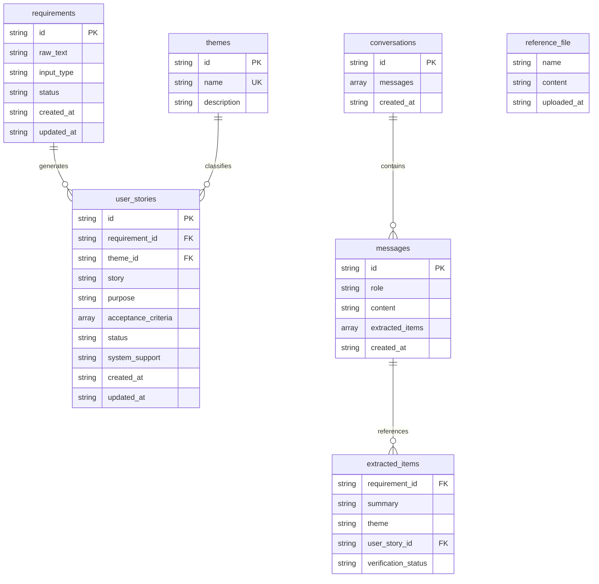

# 용어 사전 & 데이터 모델

> Version: v1.0
> Date: 2026-04-22
> Source: application-design.md Section 5

---

## 용어 매핑

| 엔티티/필드 | 한글 표기 | 영문 표기 | 비고 |
|------------|----------|-----------|------|
| requirements | 요구사항 | requirements | localStorage 키: `mhm_requirements` |
| requirements.id | 요구사항 ID | requirement ID | 접두사: `req_` |
| requirements.raw_text | 원문 | raw text | 사용자가 입력한 원본 텍스트 |
| requirements.input_type | 입력 방식 | input type | `"text"` 또는 `"voice"` |
| requirements.status | 상태 | status | `"submitted"` / `"processed"` / `"verified"` |
| requirements.created_at | 생성일 | created at | ISO 8601 |
| requirements.updated_at | 수정일 | updated at | ISO 8601 |
| themes | 테마 | themes | localStorage 키: `mhm_themes` |
| themes.id | 테마 ID | theme ID | 접두사: `theme_` |
| themes.name | 테마명 | theme name | AI가 생성, 중복 불가 |
| themes.description | 테마 설명 | theme description | AI가 생성 |
| user_stories | 유저스토리 | user stories | localStorage 키: `mhm_user_stories` |
| user_stories.id | 유저스토리 ID | user story ID | 접두사: `us_` |
| user_stories.requirement_id | 요구사항 ID | requirement ID | FK: requirements.id |
| user_stories.theme_id | 테마 ID | theme ID | FK: themes.id |
| user_stories.story | 유저스토리 문장 | story sentence | "~로서, ~하고 싶다. 왜냐하면 ~이기 때문이다." |
| user_stories.purpose | 목적 | purpose | 목적/목표 설명 |
| user_stories.acceptance_criteria | 인수 조건 | acceptance criteria | 문자열 배열 |
| user_stories.status | 상태 | status | 항상 `"verified"` (승인된 항목만 저장) |
| user_stories.system_support | 시스템 지원 여부 | system support | `"supported"` / `"needs_development"` / `"not_analyzed"` |
| user_stories.created_at | 생성일 | created at | ISO 8601 |
| user_stories.updated_at | 수정일 | updated at | ISO 8601 |
| conversations | 대화 | conversations | localStorage 키: `mhm_conversations` |
| conversations.id | 대화 ID | conversation ID | 접두사: `conv_` |
| conversations.messages | 메시지 목록 | messages | 메시지 객체 배열 |
| conversations.created_at | 생성일 | created at | ISO 8601 |
| messages (embedded) | 메시지 | message | conversations.messages 내부 객체 |
| messages.id | 메시지 ID | message ID | 접두사: `msg_` |
| messages.role | 역할 | role | `"user"` / `"assistant"` / `"system"` |
| messages.content | 내용 | content | 메시지 텍스트 |
| messages.extracted_items | 추출 항목 | extracted items | AI가 추출한 항목 배열 |
| messages.created_at | 생성일 | created at | ISO 8601 |
| extracted_items (embedded) | 추출 항목 | extracted item | messages.extracted_items 내부 객체 |
| extracted_items.requirement_id | 요구사항 ID | requirement ID | 연결된 requirement 레코드 |
| extracted_items.summary | 요약 | summary | 추출된 요구사항 요약 |
| extracted_items.theme | 테마명 | theme name | AI가 분류한 테마명 |
| extracted_items.user_story_id | 유저스토리 ID | user story ID | 연결된 user_story 레코드 |
| extracted_items.verification_status | 검증 상태 | verification status | `"pending"` / `"verified"` / `"rejected"` |
| reference_file | 참조 파일 | reference file | localStorage 키: `mhm_reference_file`, 단일 객체 |
| reference_file.name | 파일명 | file name | 업로드한 파일의 원본 이름 |
| reference_file.content | 파일 내용 | file content | 텍스트로 읽은 파일 전체 내용 |
| reference_file.uploaded_at | 업로드일 | uploaded at | ISO 8601 |

---

## 엔티티 관계도

**텍스트 대안**: requirements(요구사항)는 user_stories(유저스토리)와 1:N 관계. themes(테마)는 user_stories와 1:N 관계. conversations(대화)는 messages(메시지)를 포함하며 1:N 관계. messages는 extracted_items(추출 항목)를 포함하며 1:N 관계. extracted_items는 requirements와 user_stories를 참조. reference_file(참조 파일)은 단일 객체로 독립 엔티티.

---

## 엔티티 정의

### requirements (요구사항)

localStorage 키: `mhm_requirements`

현업 담당자가 텍스트 또는 음성으로 입력한 원본 요구사항 기록.

| 필드 | 타입 | 필수 | 설명 | 예시 |
|------|------|------|------|------|
| id | string | Y | `req_` + 8자리 hex | `"req_a1b2c3d4"` |
| raw_text | string | Y | 사용자 원문 입력 | `"안전 장비 착용 알림이 있으면 좋겠어요"` |
| input_type | string | Y | `"text"` 또는 `"voice"` | `"text"` |
| status | string | Y | `"submitted"` / `"processed"` / `"verified"` | `"verified"` |
| created_at | string | Y | ISO 8601 | `"2026-04-22T09:00:00.000Z"` |
| updated_at | string | Y | ISO 8601 | `"2026-04-22T09:05:00.000Z"` |

### themes (테마)

localStorage 키: `mhm_themes`

AI가 자동 분류한 주제 카테고리.

| 필드 | 타입 | 필수 | 설명 | 예시 |
|------|------|------|------|------|
| id | string | Y | `theme_` + 8자리 hex | `"theme_e5f6a7b8"` |
| name | string | Y | 테마 표시명 (유일) | `"안전 관리"` |
| description | string | Y | 테마 설명 | `"작업 현장 안전 관련 요구사항"` |

### user_stories (유저스토리)

localStorage 키: `mhm_user_stories`

AI가 생성하고 현업 담당자가 승인한 구조화된 유저스토리.

| 필드 | 타입 | 필수 | 설명 | 예시 |
|------|------|------|------|------|
| id | string | Y | `us_` + 8자리 hex | `"us_c9d0e1f2"` |
| requirement_id | string | Y | requirements.id 참조 | `"req_a1b2c3d4"` |
| theme_id | string | Y | themes.id 참조 | `"theme_e5f6a7b8"` |
| story | string | Y | 유저스토리 문장 | `"~로서, ~하고 싶다..."` |
| purpose | string | Y | 목적 설명 | `"안전 사고 예방..."` |
| acceptance_criteria | string[] | Y | 인수 조건 목록 (최소 1개) | `["AC1", "AC2"]` |
| status | string | Y | 항상 `"verified"` | `"verified"` |
| system_support | string | Y | `"supported"` / `"needs_development"` / `"not_analyzed"` | `"not_analyzed"` |
| created_at | string | Y | ISO 8601 | `"2026-04-22T09:01:00.000Z"` |
| updated_at | string | Y | ISO 8601 | `"2026-04-22T09:05:00.000Z"` |

### conversations (대화)

localStorage 키: `mhm_conversations`

사용자 페이지의 대화 기록.

| 필드 | 타입 | 필수 | 설명 | 예시 |
|------|------|------|------|------|
| id | string | Y | `conv_` + 8자리 hex | `"conv_g3h4i5j6"` |
| messages | object[] | Y | 메시지 배열 | (아래 참조) |
| created_at | string | Y | ISO 8601 | `"2026-04-22T09:00:00.000Z"` |

### messages (메시지, conversations.messages 내부)

| 필드 | 타입 | 필수 | 설명 |
|------|------|------|------|
| id | string | Y | `msg_` + 8자리 hex |
| role | string | Y | `"user"` / `"assistant"` / `"system"` |
| content | string | Y | 메시지 텍스트 |
| extracted_items | object[] | Y | 추출 항목 배열 (user 메시지는 빈 배열) |
| created_at | string | Y | ISO 8601 |

### extracted_items (추출 항목, messages.extracted_items 내부)

| 필드 | 타입 | 필수 | 설명 |
|------|------|------|------|
| requirement_id | string | Y | 연결된 requirement ID |
| summary | string | Y | 추출된 요구사항 요약 |
| theme | string | Y | AI가 분류한 테마명 |
| user_story_id | string | Y | 연결된 user_story ID |
| verification_status | string | Y | `"pending"` / `"verified"` / `"rejected"` |

### reference_file (참조 파일)

localStorage 키: `mhm_reference_file`

단일 객체 (배열 아님). 업로드된 파일이 없으면 `null`.

| 필드 | 타입 | 필수 | 설명 | 예시 |
|------|------|------|------|------|
| name | string | Y | 파일 원본 이름 | `"기존시스템기능목록.md"` |
| content | string | Y | 파일 텍스트 내용 | `"# 기능 목록\n..."` |
| uploaded_at | string | Y | ISO 8601 | `"2026-04-22T10:00:00.000Z"` |

---

## localStorage 키 요약

| 키 | 타입 | 기본값 | 설명 |
|----|------|--------|------|
| `mhm_requirements` | JSON Array | `[]` | 요구사항 목록 |
| `mhm_themes` | JSON Array | `[]` | 테마 목록 |
| `mhm_user_stories` | JSON Array | `[]` | 유저스토리 목록 |
| `mhm_conversations` | JSON Array | `[]` | 대화 기록 |
| `mhm_reference_file` | JSON Object | `null` | 참조 파일 |

---

## ID 생성 규칙

| 접두사 | 엔티티 | 형식 | 예시 |
|--------|--------|------|------|
| `req_` | requirements | `req_` + 8자리 random hex | `req_a1b2c3d4` |
| `theme_` | themes | `theme_` + 8자리 random hex | `theme_e5f6a7b8` |
| `us_` | user_stories | `us_` + 8자리 random hex | `us_c9d0e1f2` |
| `conv_` | conversations | `conv_` + 8자리 random hex | `conv_g3h4i5j6` |
| `msg_` | messages | `msg_` + 8자리 random hex | `msg_k7l8m9n0` |

생성 함수: `src/utils/idGenerator.js`
