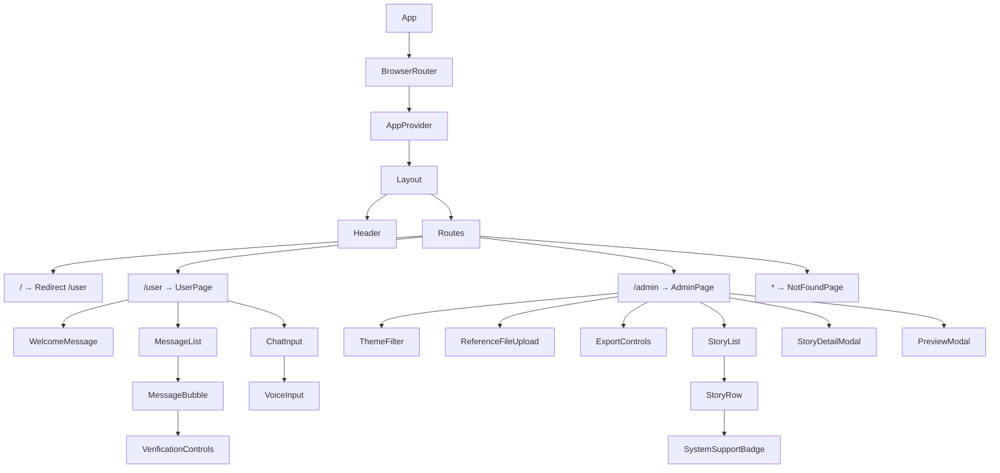
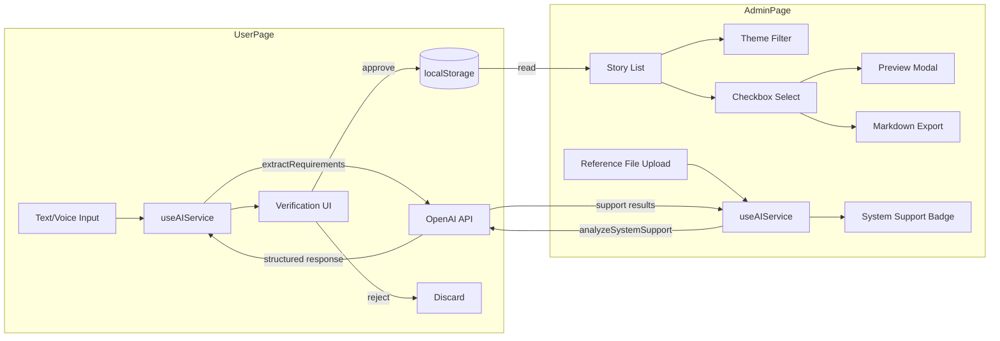
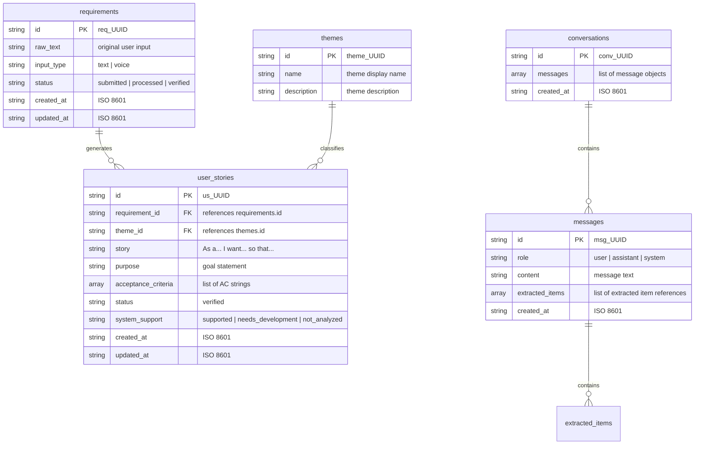

# Application Design -- "말해 뭐해"

> Version: v1.0
> Date: 2026-04-22
> Stage: INCEPTION / Application Design
> Source: user-stories.md (27 stories, 6 epics), application-design-questions.md (7 answered questions)

---

## 1. Architecture Overview

### 1.1 System Context

"말해 뭐해"는 React 18 SPA로 구현되며, 데이터를 localStorage에 저장하고 AI 기능은 외부 OpenAI 호환 API를 호출한다. 백엔드 서버는 존재하지 않으며, 브라우저에서 모든 로직이 실행된다.

### 1.2 Component Hierarchy Diagram



**Text alternative**: App wraps BrowserRouter, which wraps AppProvider (context), which wraps Layout. Layout contains Header (nav) and Routes. Routes map to: "/" redirects to "/user", "/user" renders UserPage, "/admin" renders AdminPage, and "*" renders NotFoundPage. UserPage contains WelcomeMessage, MessageList (with MessageBubble children containing VerificationControls), and ChatInput (with VoiceInput). AdminPage contains ThemeFilter, ReferenceFileUpload, ExportControls, StoryList (with StoryRow children containing SystemSupportBadge), StoryDetailModal, and PreviewModal.

### 1.3 Data Flow Diagram



**Text alternative**: On the User Page, text or voice input flows to useAIService, which calls the OpenAI API for extraction. The structured response is shown in the Verification UI. Approved items are saved to localStorage; rejected items are discarded. On the Admin Page, localStorage data is read into the Story List. The list supports theme filtering and checkbox selection. Selected items can be previewed in a modal or exported as Markdown. A reference file upload triggers useAIService to call the OpenAI API for system support analysis, and results are displayed as badges.

---

## 2. Route Structure

| Path | Component | Description | Redirect |
|------|-----------|-------------|----------|
| `/` | -- | Root path | Redirect to `/user` |
| `/user` | UserPage | ChatGPT-style conversational interface for field staff | -- |
| `/admin` | AdminPage | User story list, filtering, export for PO | -- |
| `*` | NotFoundPage | 404 page with navigation links | -- |

### Router Configuration

```
BrowserRouter
  Layout
    Header (always visible)
    Routes
      Route path="/" element={Navigate to="/user"}
      Route path="/user" element={UserPage}
      Route path="/admin" element={AdminPage}
      Route path="*" element={NotFoundPage}
```

---

## 3. Component Tree

Every component needed for the application, organized by domain.

### 3.1 Root Components

| Component | File Path | Description | Props |
|-----------|-----------|-------------|-------|
| App | `src/App.jsx` | Root component. Sets up BrowserRouter and AppProvider. | none |
| AppProvider | `src/context/AppProvider.jsx` | Context provider wrapping the entire app. Manages global state (requirements, themes, user_stories, conversations). | `children` |
| Layout | `src/components/Layout.jsx` | Shared layout: Header at top, main content area below with `<Outlet>` or `{children}`. | `children` |
| Header | `src/components/Header.jsx` | Top navigation bar. Left: app title "말해 뭐해". Right: NavLink "사용자" (/user), NavLink "관리자" (/admin). Active link highlighted. | none |

### 3.2 User Page Components

| Component | File Path | Description | Props |
|-----------|-----------|-------------|-------|
| UserPage | `src/pages/UserPage.jsx` | Page container for /user. Manages current conversation state. Renders WelcomeMessage (when empty), MessageList, and ChatInput. | none |
| MessageList | `src/components/user/MessageList.jsx` | Scrollable container for conversation messages. Auto-scrolls to newest message. | `messages: Array` |
| MessageBubble | `src/components/user/MessageBubble.jsx` | Single message bubble. User messages: right-aligned, blue-tinted. AI messages: left-aligned, gray-tinted. AI messages may contain extracted items with verification controls. | `message: Object` |
| VerificationControls | `src/components/user/VerificationControls.jsx` | Approve/reject buttons for each AI-extracted item within a MessageBubble. Shows current status (pending/verified/rejected). | `item: Object, onApprove: Function, onReject: Function` |
| ChatInput | `src/components/user/ChatInput.jsx` | Fixed-bottom input bar. Text input field (multi-line capable), send button, and VoiceInput button. Prevents empty submission. | `onSend: Function, disabled: Boolean` |
| VoiceInput | `src/components/user/VoiceInput.jsx` | Microphone button using Web Speech API. Shows recording indicator when active. Outputs transcribed text to ChatInput. Shows fallback message if browser does not support Web Speech API. | `onTranscript: Function` |
| WelcomeMessage | `src/components/user/WelcomeMessage.jsx` | Empty-state guidance displayed when no messages exist. Shows welcome text and input prompt (e.g., "요구사항을 자유롭게 입력해주세요"). | none |
| LoadingIndicator | `src/components/common/LoadingIndicator.jsx` | Typing animation dots displayed while AI is processing. Shown as a message bubble on the left (AI side). | none |

### 3.3 Admin Page Components

| Component | File Path | Description | Props |
|-----------|-----------|-------------|-------|
| AdminPage | `src/pages/AdminPage.jsx` | Page container for /admin. Manages selected items, filter state, modal visibility. Reads user stories from context. | none |
| ThemeFilter | `src/components/admin/ThemeFilter.jsx` | Dropdown or button group listing all available themes plus "전체" (all). Filters the story list by selected theme. | `themes: Array, selectedTheme: String, onSelect: Function` |
| ReferenceFileUpload | `src/components/admin/ReferenceFileUpload.jsx` | File upload control for PO to upload a reference file (text/markdown/JSON). Reads file content as text. Stores in localStorage. Shows uploaded file name. | `onUpload: Function` |
| ExportControls | `src/components/admin/ExportControls.jsx` | Displays selected count ("N건 선택됨"). Contains "미리보기" (preview) and "내보내기" (export/download) buttons. Buttons disabled when no items selected. | `selectedCount: Number, onPreview: Function, onExport: Function` |
| StoryList | `src/components/admin/StoryList.jsx` | Container rendering a list of StoryRow components. Includes "전체 선택" (select all) checkbox at the header. | `stories: Array, selectedIds: Set, onToggle: Function, onToggleAll: Function, onRowClick: Function` |
| StoryRow | `src/components/admin/StoryRow.jsx` | Single row in the story list. Shows: checkbox, story summary (truncated), theme badge, SystemSupportBadge, created_at date. Clickable to open detail modal. | `story: Object, isSelected: Boolean, onToggle: Function, onClick: Function` |
| SystemSupportBadge | `src/components/admin/SystemSupportBadge.jsx` | Visual badge showing "시스템 지원" (green) or "개발 필요" (orange) or "미분석" (gray, when not yet analyzed). | `status: String` |
| StoryDetailModal | `src/components/admin/StoryDetailModal.jsx` | Modal overlay showing full story detail: user story sentence, purpose, acceptance criteria, source requirement text, theme, system support status, timestamps. Close button at top-right. | `story: Object, isOpen: Boolean, onClose: Function` |
| PreviewModal | `src/components/admin/PreviewModal.jsx` | Full-screen modal rendering the exact Markdown content that will be exported. Includes "다운로드" (download) button and "닫기" (close) button. | `stories: Array, isOpen: Boolean, onClose: Function, onDownload: Function` |

### 3.4 Common Components

| Component | File Path | Description | Props |
|-----------|-----------|-------------|-------|
| ConfirmDialog | `src/components/common/ConfirmDialog.jsx` | Reusable Korean confirmation dialog. Title, message body, "확인" (confirm) and "취소" (cancel) buttons. | `isOpen: Boolean, title: String, message: String, onConfirm: Function, onCancel: Function` |
| LoadingIndicator | `src/components/common/LoadingIndicator.jsx` | Typing animation (three bouncing dots) shown while waiting for AI response. | `message: String (optional)` |
| EmptyState | `src/components/common/EmptyState.jsx` | Generic empty state with icon placeholder, message text, and optional action button. | `message: String, actionLabel: String (optional), onAction: Function (optional)` |
| NotFoundPage | `src/pages/NotFoundPage.jsx` | 404 page. Displays "페이지를 찾을 수 없습니다" message with links to /user and /admin. | none |

---

## 4. State Management Design

### 4.1 AppContext Structure

The application uses a single React Context (`AppContext`) to share data between the User Page (writes) and the Admin Page (reads).

```
AppContext = {
  // Entities persisted in localStorage
  requirements: Array,      // All requirement records
  themes: Array,            // All theme records
  userStories: Array,       // All user story records
  conversations: Array,     // All conversation records
  referenceFile: Object,    // Uploaded reference file (or null)

  // Actions (dispatch functions)
  addRequirement: Function,
  updateRequirementStatus: Function,
  addTheme: Function,
  addUserStory: Function,
  updateUserStorySupport: Function,
  addConversation: Function,
  updateConversation: Function,
  clearCurrentConversation: Function,
  setReferenceFile: Function,
}
```

### 4.2 Context vs. Local State

| State | Location | Reason |
|-------|----------|--------|
| `requirements`, `themes`, `userStories` | AppContext | Shared between /user (write) and /admin (read). Persisted to localStorage. |
| `conversations` | AppContext | Persisted to localStorage for session recovery. Shared for potential future cross-page use. |
| `referenceFile` | AppContext | Persisted to localStorage. Used by admin page for system support analysis. |
| `currentConversationId` | UserPage local state | Only relevant to the user page. Determines which conversation is active. |
| `selectedStoryIds` | AdminPage local state | Selection state is transient, not persisted. Relevant only while admin page is open. |
| `selectedTheme` | AdminPage local state | Filter state is transient. Resets on page reload. |
| `isDetailModalOpen`, `isPreviewModalOpen` | AdminPage local state | UI visibility states, purely transient. |
| `inputText` | ChatInput local state | Current text in the input field, not persisted until sent. |
| `isRecording` | VoiceInput local state | Recording state, transient. |
| `isLoading` | UserPage local state | Whether an AI request is in progress. |

### 4.3 Data Flow: User Page Writes, Admin Page Reads

```
1. Field staff types/speaks requirement on /user
2. ChatInput sends text to UserPage
3. UserPage calls useAIService().extractRequirements(text)
4. AI returns extracted items with themes and user story drafts
5. Items displayed in MessageBubble with VerificationControls
6. Field staff clicks "승인" (approve):
   a. Requirement record saved with status="verified"
   b. Theme record created (if new theme)
   c. User story record saved
   d. All written to localStorage via context actions
7. PO navigates to /admin
8. AdminPage reads userStories from AppContext
9. AppContext loaded from localStorage on app initialization
10. Admin sees all verified stories immediately
```

---

## 5. Data Model (localStorage Schema)

All data is stored in localStorage as JSON-serialized strings. Keys are prefixed with `mhm_` (mal-hae mwo-hae) to avoid collisions.

### 5.1 Entity Relationship Diagram



**Text alternative**: requirements has one-to-many relationship with user_stories. themes has one-to-many relationship with user_stories. conversations contains an array of messages. Each message may contain extracted_items.

### 5.2 localStorage Keys and JSON Structures

#### `mhm_requirements`

```json
[
  {
    "id": "req_a1b2c3d4",
    "raw_text": "안전 장비 착용 알림이 있으면 좋겠어요",
    "input_type": "text",
    "status": "verified",
    "created_at": "2026-04-22T09:00:00.000Z",
    "updated_at": "2026-04-22T09:05:00.000Z"
  }
]
```

| Field | Type | Required | Description |
|-------|------|----------|-------------|
| `id` | string | Yes | Unique ID, prefix `req_` + 8-char random hex |
| `raw_text` | string | Yes | Original text as entered or transcribed by the user |
| `input_type` | string | Yes | One of: `"text"`, `"voice"` |
| `status` | string | Yes | One of: `"submitted"`, `"processed"`, `"verified"` |
| `created_at` | string | Yes | ISO 8601 timestamp, set on creation |
| `updated_at` | string | Yes | ISO 8601 timestamp, updated on status change |

#### `mhm_themes`

```json
[
  {
    "id": "theme_e5f6a7b8",
    "name": "안전 관리",
    "description": "작업 현장 안전 관련 요구사항"
  }
]
```

| Field | Type | Required | Description |
|-------|------|----------|-------------|
| `id` | string | Yes | Unique ID, prefix `theme_` + 8-char random hex |
| `name` | string | Yes | Theme display name in Korean |
| `description` | string | Yes | Brief theme description |

#### `mhm_user_stories`

```json
[
  {
    "id": "us_c9d0e1f2",
    "requirement_id": "req_a1b2c3d4",
    "theme_id": "theme_e5f6a7b8",
    "story": "안전 담당자로서, 작업자가 안전 장비를 미착용했을 때 자동 알림을 받고 싶다. 그래야 즉시 시정 조치를 할 수 있기 때문이다.",
    "purpose": "안전 장비 미착용으로 인한 사고를 예방하고, 현장 안전 관리 효율성을 높인다.",
    "acceptance_criteria": [
      "작업자가 안전 장비 미착용 시 안전 담당자에게 알림이 전송된다",
      "알림에는 미착용 작업자 이름, 위치, 시간이 포함된다",
      "알림 수신 후 확인 처리가 가능하다"
    ],
    "status": "verified",
    "system_support": "needs_development",
    "created_at": "2026-04-22T09:01:00.000Z",
    "updated_at": "2026-04-22T09:05:00.000Z"
  }
]
```

| Field | Type | Required | Description |
|-------|------|----------|-------------|
| `id` | string | Yes | Unique ID, prefix `us_` + 8-char random hex |
| `requirement_id` | string | Yes | FK to `mhm_requirements[].id` |
| `theme_id` | string | Yes | FK to `mhm_themes[].id` |
| `story` | string | Yes | Full user story sentence ("As a... I want... so that...") |
| `purpose` | string | Yes | Goal/purpose statement |
| `acceptance_criteria` | string[] | Yes | Array of AC strings |
| `status` | string | Yes | Always `"verified"` when saved (only approved items are persisted) |
| `system_support` | string | Yes | One of: `"supported"`, `"needs_development"`, `"not_analyzed"` |
| `created_at` | string | Yes | ISO 8601 timestamp |
| `updated_at` | string | Yes | ISO 8601 timestamp |

#### `mhm_conversations`

```json
[
  {
    "id": "conv_g3h4i5j6",
    "messages": [
      {
        "id": "msg_k7l8m9n0",
        "role": "user",
        "content": "안전 장비 착용 알림이 있으면 좋겠어요",
        "extracted_items": [],
        "created_at": "2026-04-22T09:00:00.000Z"
      },
      {
        "id": "msg_o1p2q3r4",
        "role": "assistant",
        "content": "입력하신 내용에서 다음 요구사항을 추출했습니다:",
        "extracted_items": [
          {
            "requirement_id": "req_a1b2c3d4",
            "summary": "안전 장비 미착용 자동 알림",
            "theme": "안전 관리",
            "user_story_id": "us_c9d0e1f2",
            "verification_status": "verified"
          }
        ],
        "created_at": "2026-04-22T09:00:05.000Z"
      }
    ],
    "created_at": "2026-04-22T09:00:00.000Z"
  }
]
```

| Field | Type | Required | Description |
|-------|------|----------|-------------|
| `id` | string | Yes | Unique ID, prefix `conv_` + 8-char random hex |
| `messages` | object[] | Yes | Array of message objects |
| `messages[].id` | string | Yes | Unique ID, prefix `msg_` + 8-char random hex |
| `messages[].role` | string | Yes | One of: `"user"`, `"assistant"`, `"system"` |
| `messages[].content` | string | Yes | Message text content |
| `messages[].extracted_items` | object[] | Yes | Array of extracted items (empty for user messages) |
| `messages[].extracted_items[].requirement_id` | string | Yes | Reference to the requirement record |
| `messages[].extracted_items[].summary` | string | Yes | Short summary of the extracted requirement |
| `messages[].extracted_items[].theme` | string | Yes | Theme name assigned by AI |
| `messages[].extracted_items[].user_story_id` | string | Yes | Reference to the generated user story record |
| `messages[].extracted_items[].verification_status` | string | Yes | One of: `"pending"`, `"verified"`, `"rejected"` |
| `messages[].created_at` | string | Yes | ISO 8601 timestamp |
| `created_at` | string | Yes | ISO 8601 timestamp of conversation start |

#### `mhm_reference_file`

```json
{
  "name": "기존시스템기능목록.md",
  "content": "# 기존 시스템 기능 목록\n\n- 작업 일지 관리\n- 장비 점검 기록...",
  "uploaded_at": "2026-04-22T10:00:00.000Z"
}
```

| Field | Type | Required | Description |
|-------|------|----------|-------------|
| `name` | string | Yes | Original file name |
| `content` | string | Yes | Full text content of the uploaded file |
| `uploaded_at` | string | Yes | ISO 8601 timestamp |

Note: This is a single object (not an array). It is `null` when no file has been uploaded.

---

## 6. Custom Hooks

All localStorage access is abstracted through custom hooks. Components never call `localStorage.getItem()` or `localStorage.setItem()` directly.

### 6.1 useStorage(key, initialValue)

**File**: `src/hooks/useStorage.js`

Generic hook for localStorage read/write with JSON serialization.

```
Parameters:
  key: string            -- localStorage key
  initialValue: any      -- default value if key does not exist

Returns:
  [storedValue, setValue] -- similar to useState

Behavior:
  - On mount: reads localStorage[key], parses JSON, returns parsed value or initialValue
  - setValue(newValue): serializes to JSON, writes to localStorage[key], updates state
  - Handles JSON parse errors gracefully (returns initialValue)
  - Handles storage quota errors (logs warning, does not crash)
```

### 6.2 useRequirements()

**File**: `src/hooks/useRequirements.js`

CRUD operations for requirement records.

```
Returns: {
  requirements: Array,
  addRequirement(rawText, inputType): Object
    -- Creates a new requirement with status="submitted", returns the record
  updateStatus(id, newStatus): void
    -- Updates status and updated_at for a requirement
  getRequirementById(id): Object | undefined
    -- Finds a requirement by ID
}

Internal:
  Uses useStorage("mhm_requirements", [])
```

### 6.3 useThemes()

**File**: `src/hooks/useThemes.js`

Read/write operations for theme records.

```
Returns: {
  themes: Array,
  addTheme(name, description): Object
    -- Creates a new theme if name does not already exist, returns the record
    -- If name already exists, returns the existing record (no duplicates)
  getThemeById(id): Object | undefined
  getThemeByName(name): Object | undefined
}

Internal:
  Uses useStorage("mhm_themes", [])
```

### 6.4 useUserStories()

**File**: `src/hooks/useUserStories.js`

CRUD and filtering for user story records.

```
Returns: {
  userStories: Array,
  addUserStory(data): Object
    -- Creates a new user story record, returns it
    -- data: { requirement_id, theme_id, story, purpose, acceptance_criteria }
  updateSystemSupport(id, supportStatus): void
    -- Updates system_support field ("supported" | "needs_development")
  bulkUpdateSystemSupport(updates): void
    -- updates: Array of { id, system_support }
  getStoriesByTheme(themeId): Array
    -- Returns stories filtered by theme_id
  getStoryById(id): Object | undefined
}

Internal:
  Uses useStorage("mhm_user_stories", [])
```

### 6.5 useConversation()

**File**: `src/hooks/useConversation.js`

Manage conversation messages with localStorage persistence.

```
Returns: {
  conversations: Array,
  currentConversation: Object | null,
  startNewConversation(): String
    -- Creates a new conversation, sets it as current, returns its ID
  addMessage(conversationId, role, content, extractedItems): void
    -- Appends a message to the conversation
  updateExtractedItemStatus(conversationId, messageId, itemIndex, newStatus): void
    -- Updates verification_status of an extracted item within a message
  clearCurrentConversation(): void
    -- Starts a fresh conversation (previous ones remain in storage)
  setCurrentConversationId(id): void
    -- Switch to an existing conversation
  getCurrentConversationId(): String | null
}

Internal:
  Uses useStorage("mhm_conversations", [])
  currentConversationId stored in component state (initialized to last conversation or null)
```

### 6.6 useAIService()

**File**: `src/hooks/useAIService.js`

AI API call abstraction. All calls go to an OpenAI-compatible chat completions endpoint.

```
Configuration:
  API URL: import.meta.env.VITE_AI_API_URL (default: "https://api.openai.com/v1")
  API Key: import.meta.env.VITE_AI_API_KEY
  Model: import.meta.env.VITE_AI_MODEL (default: "gpt-4o-mini")

Returns: {
  isLoading: Boolean,
  error: String | null,

  extractRequirements(text): Promise<Object>
    -- Sends user text to AI
    -- System prompt instructs AI to extract requirements, classify themes, generate user stories
    -- Returns: { items: [{ summary, theme, story, purpose, acceptance_criteria }] }
    -- On error: sets error state, returns null

  analyzeSystemSupport(stories, referenceContent): Promise<Array>
    -- Sends user stories and reference file content to AI
    -- System prompt instructs AI to compare each story against reference content
    -- Returns: [{ user_story_id, system_support: "supported" | "needs_development", reason }]
    -- On error: sets error state, returns null

  clearError(): void
    -- Resets error state to null
}
```

### 6.7 useExport()

**File**: `src/hooks/useExport.js`

Markdown export generation and file download.

```
Returns: {
  generateMarkdown(stories, themes, requirements): String
    -- Generates formatted Markdown string from selected stories
    -- Includes: story sentence, purpose, acceptance criteria, theme, source requirement
    -- Groups stories by theme

  downloadMarkdown(markdownContent, filename): void
    -- Creates a Blob from markdownContent
    -- Triggers browser file download with given filename
    -- Default filename: "user-stories-YYYY-MM-DD.md"
}
```

---

## 7. AI Service Interface

### 7.1 Configuration

| Environment Variable | Purpose | Default |
|---------------------|---------|---------|
| `VITE_AI_API_URL` | Base URL for the OpenAI-compatible API | `https://api.openai.com/v1` |
| `VITE_AI_API_KEY` | API key for authentication | (none, required) |
| `VITE_AI_MODEL` | Model name to use | `gpt-4o-mini` |

Environment variables are set in `frontend/.env` (not committed to git).

### 7.2 API Call: Requirement Extraction

**Endpoint**: `POST {VITE_AI_API_URL}/chat/completions`

**Request body**:

```json
{
  "model": "{VITE_AI_MODEL}",
  "messages": [
    {
      "role": "system",
      "content": "당신은 요구사항 분석 전문가입니다. 사용자가 입력한 자유 형식의 텍스트에서 구체적인 요구사항을 추출하고, 각 요구사항에 대해 주제 테마를 분류하며, 유저스토리 형식으로 변환해주세요.\n\n반드시 다음 JSON 형식으로 응답하세요:\n{\"items\": [{\"summary\": \"요구사항 요약\", \"theme\": {\"name\": \"테마명\", \"description\": \"테마 설명\"}, \"story\": \"~로서, ~하고 싶다. 왜냐하면 ~이기 때문이다.\", \"purpose\": \"목적 설명\", \"acceptance_criteria\": [\"AC1\", \"AC2\", \"AC3\"]}]}"
    },
    {
      "role": "user",
      "content": "{user_input_text}"
    }
  ],
  "temperature": 0.3,
  "response_format": { "type": "json_object" }
}
```

**Expected response structure** (parsed from `choices[0].message.content`):

```json
{
  "items": [
    {
      "summary": "안전 장비 미착용 자동 알림",
      "theme": {
        "name": "안전 관리",
        "description": "작업 현장 안전 관련 요구사항"
      },
      "story": "안전 담당자로서, 작업자가 안전 장비를 미착용했을 때 자동 알림을 받고 싶다. 왜냐하면 즉시 시정 조치를 할 수 있기 때문이다.",
      "purpose": "안전 장비 미착용으로 인한 사고를 예방하고, 현장 안전 관리 효율성을 높인다.",
      "acceptance_criteria": [
        "작업자가 안전 장비 미착용 시 안전 담당자에게 알림이 전송된다",
        "알림에는 미착용 작업자 이름, 위치, 시간이 포함된다",
        "알림 수신 후 확인 처리가 가능하다"
      ]
    }
  ]
}
```

### 7.3 API Call: System Support Analysis

**Endpoint**: `POST {VITE_AI_API_URL}/chat/completions`

**Request body**:

```json
{
  "model": "{VITE_AI_MODEL}",
  "messages": [
    {
      "role": "system",
      "content": "당신은 시스템 분석 전문가입니다. 아래 참조 문서는 기존 시스템의 기능 목록입니다. 각 유저스토리를 참조 문서와 비교하여, 기존 시스템에서 이미 지원하는 기능인지(supported) 새로 개발이 필요한 기능인지(needs_development) 판단해주세요.\n\n반드시 다음 JSON 형식으로 응답하세요:\n{\"results\": [{\"user_story_id\": \"ID\", \"system_support\": \"supported 또는 needs_development\", \"reason\": \"판단 근거\"}]}"
    },
    {
      "role": "user",
      "content": "## 참조 문서\n{reference_file_content}\n\n## 분석 대상 유저스토리\n{stories_as_text}"
    }
  ],
  "temperature": 0.2,
  "response_format": { "type": "json_object" }
}
```

**Expected response structure**:

```json
{
  "results": [
    {
      "user_story_id": "us_c9d0e1f2",
      "system_support": "needs_development",
      "reason": "참조 문서에 안전 장비 알림 관련 기능이 명시되어 있지 않음"
    }
  ]
}
```

### 7.4 Error Handling

| Error Type | Handling |
|-----------|---------|
| Network error (fetch fails) | Set error state with "네트워크 오류가 발생했습니다. 인터넷 연결을 확인해주세요." |
| API returns non-200 status | Set error state with "AI 서비스 오류가 발생했습니다. (상태 코드: {status})" |
| Response JSON parse failure | Set error state with "AI 응답을 처리할 수 없습니다. 다시 시도해주세요." |
| API key not configured | Set error state with "AI API 키가 설정되지 않았습니다. 환경 변수를 확인해주세요." |
| Timeout (30 seconds) | Set error state with "AI 응답 시간이 초과되었습니다. 다시 시도해주세요." |

All errors are displayed in the conversation area as system messages and include a "다시 시도" (retry) button.

---

## 8. File/Directory Structure

```
frontend/
  .env                              # VITE_AI_API_URL, VITE_AI_API_KEY, VITE_AI_MODEL
  index.html
  package.json
  vite.config.js
  tailwind.config.js
  postcss.config.js
  src/
    main.jsx                        # ReactDOM.createRoot, BrowserRouter
    App.jsx                         # AppProvider + Layout + Routes
    index.css                       # Tailwind directives (@tailwind base/components/utilities)
    context/
      AppContext.js                  # createContext
      AppProvider.jsx               # Context provider with state initialization from localStorage
    hooks/
      useStorage.js                 # Generic localStorage hook
      useRequirements.js            # Requirements CRUD
      useThemes.js                  # Themes read/write
      useUserStories.js             # User stories CRUD + filtering
      useConversation.js            # Conversation management
      useAIService.js               # AI API calls
      useExport.js                  # Markdown generation + download
    pages/
      UserPage.jsx                  # /user route
      AdminPage.jsx                 # /admin route
      NotFoundPage.jsx              # 404 route
    components/
      Layout.jsx                    # Shared layout (Header + content)
      Header.jsx                    # Top navigation bar
      user/
        MessageList.jsx             # Scrollable message container
        MessageBubble.jsx           # Individual message bubble
        VerificationControls.jsx    # Approve/reject buttons
        ChatInput.jsx               # Text input + send + voice
        VoiceInput.jsx              # Microphone button (Web Speech API)
        WelcomeMessage.jsx          # Empty conversation state
      admin/
        ThemeFilter.jsx             # Theme filter dropdown/buttons
        ReferenceFileUpload.jsx     # File upload for reference document
        ExportControls.jsx          # Export/preview buttons + count
        StoryList.jsx               # Story table/list container
        StoryRow.jsx                # Individual story row
        SystemSupportBadge.jsx      # Support status badge
        StoryDetailModal.jsx        # Story detail modal
        PreviewModal.jsx            # Full-screen preview modal
      common/
        ConfirmDialog.jsx           # Korean confirm/cancel dialog
        LoadingIndicator.jsx        # AI typing animation
        EmptyState.jsx              # Generic empty state
    utils/
      idGenerator.js                # Generate prefixed IDs (req_, theme_, us_, conv_, msg_)
      dateFormatter.js              # Format ISO dates to Korean display format
      markdownGenerator.js          # Generate export markdown content
```

---

## 9. Key Design Decisions

| Decision ID | Decision | Rationale | Source |
|-------------|----------|-----------|--------|
| D-001 | Admin detail view as modal/overlay | PO stays on the list page for quick review and can close the modal to return immediately. Avoids route complexity for a simple detail view. | Application Design Q1, Answer A |
| D-002 | Export format is Markdown (.md) | Structured, human-readable, universally openable. Well-suited for user stories with headings, lists, and acceptance criteria. | Application Design Q2, Answer A |
| D-003 | PO uploads reference file for system support analysis | Flexible: PO can upload any text/markdown/JSON reference document. AI compares each story against the file content. No hardcoded reference data. | Application Design Q3, Answer A |
| D-004 | OpenAI-compatible API integration | Most widely supported format. API key via environment variable allows easy provider switching. No vendor lock-in. | Application Design Q4, Answer B |
| D-005 | Full-screen preview modal for export | Shows exact content that will be downloaded. PO can verify before committing to download. Consistent with the modal pattern used for detail view. | Application Design Q5, Answer A |
| D-006 | Top header navigation bar | Simple, recognizable pattern. App title on left establishes brand. "사용자"/"관리자" links on right for quick switching. Works well on both desktop and mobile. | Application Design Q6, Answer A |
| D-007 | Partial conversation persistence with "새 대화" button | Conversations saved to localStorage for session recovery. "새 대화" button starts a fresh conversation (ChatGPT-style). Previous conversations remain in storage but are not displayed in the sidebar (no conversation list UI -- out of scope for workshop). | Application Design Q7, Answer C |
| D-008 | React useState + useContext for state management | Workshop-scale project. No need for external state management library. Keeps dependencies minimal. Context provides sufficient sharing between /user and /admin. | Requirement Verification Q31, Answer A |
| D-009 | JavaScript (JSX), no TypeScript | Workshop time constraint. Faster to write. No tsconfig setup needed. | Requirement Verification Q32, Answer B |
| D-010 | Tailwind CSS for styling | Rapid UI development. Utility-first approach avoids writing custom CSS files. Pairs well with component-based architecture. | Requirement Verification Q30, Answer B |
| D-011 | localStorage with custom hook abstraction | All data access goes through custom hooks (useStorage pattern). Components never call localStorage directly. This enables future migration to a backend API with minimal code changes. | CLAUDE.md architecture guideline |
| D-012 | Korean-only UI | Target users are Korean-speaking field staff and POs. No i18n framework needed. All labels, messages, and prompts in Korean. | Requirement Verification Q20, Answer A |

---

## 10. Dependencies

### 10.1 npm Packages to Install

| Package | Purpose | Version |
|---------|---------|---------|
| `react-router-dom` | Client-side routing (/user, /admin) | ^7.x |
| `tailwindcss` | Utility-first CSS framework | ^4.x |
| `@tailwindcss/vite` | Tailwind CSS Vite plugin | ^4.x |

### 10.2 Browser APIs Used (No npm Install)

| API | Purpose | Fallback |
|-----|---------|----------|
| Web Speech API (`webkitSpeechRecognition` / `SpeechRecognition`) | Voice input transcription | Friendly Korean message: "이 브라우저에서는 음성 입력이 지원되지 않습니다" |
| localStorage | Data persistence | Graceful error handling in useStorage hook |
| Fetch API | OpenAI-compatible API calls | Error message displayed in conversation |
| Blob / URL.createObjectURL | Markdown file download | N/A (supported in all target browsers) |

### 10.3 Environment Variables

| Variable | Required | Default | Description |
|----------|----------|---------|-------------|
| `VITE_AI_API_URL` | No | `https://api.openai.com/v1` | Base URL for OpenAI-compatible API |
| `VITE_AI_API_KEY` | Yes | (none) | API authentication key |
| `VITE_AI_MODEL` | No | `gpt-4o-mini` | Model identifier |
