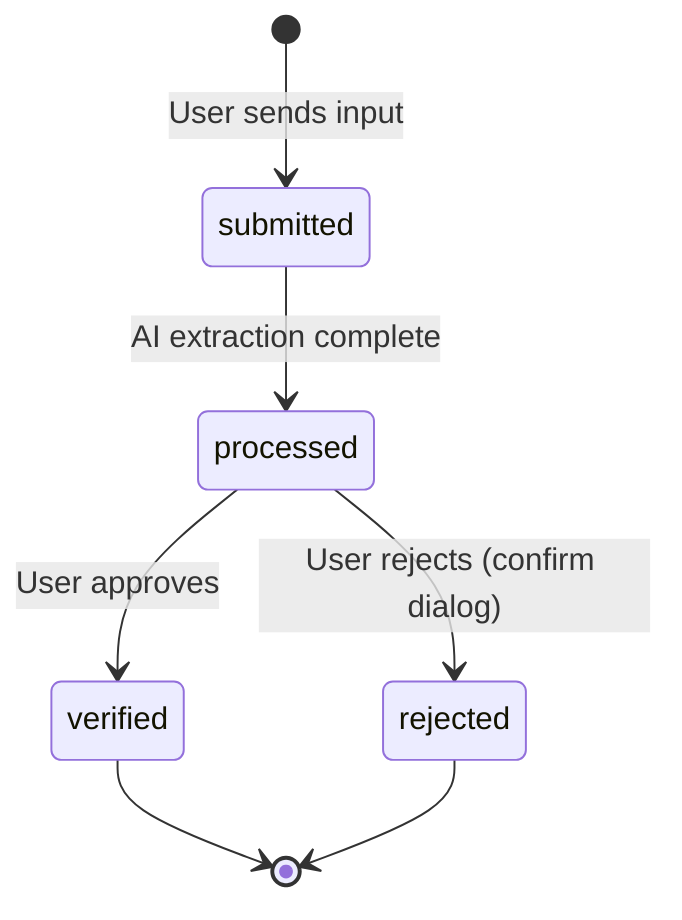

# Business Rules -- "말해 뭐해"

> Version: v1.0
> Date: 2026-04-22
> Stage: INCEPTION / Application Design
> Source: user-stories.md, application-design-questions.md, requirement-verification-questions.md

---

## BR-001: Requirement Status Transitions

**Description**: Every requirement follows a strict three-step lifecycle. Status can only move forward (no backward transitions).

**Rules**:

| Transition | From | To | Trigger | Related Stories |
|-----------|------|-----|---------|-----------------|
| T-001 | `submitted` | `processed` | AI completes extraction, classification, and story generation for the requirement | US-005, US-006, US-007 |
| T-002 | `processed` | `verified` | Field staff clicks "승인" (approve) on the extracted item | US-010 |
| T-003 | `processed` | (removed) | Field staff clicks "거부" (reject) and confirms in the dialog | US-011 |

**Constraints**:
- A requirement cannot skip a status (e.g., cannot go directly from `submitted` to `verified`)
- A requirement cannot move backward (e.g., cannot go from `verified` to `processed`)
- Rejected items are not saved to the persistent entity store; they are only marked as `"rejected"` in the conversation's `extracted_items[].verification_status` for display purposes
- The `updated_at` timestamp is set on every status change

**State Diagram**:

**Text alternative**: New requirement starts as "submitted". After AI processing, it becomes "processed". From processed, it either becomes "verified" (user approves) or is "rejected" (user rejects after confirmation). Both verified and rejected are terminal states.

---

## BR-002: Verification Flow

**Description**: Field staff must explicitly approve or reject each AI-extracted item before it is considered final. This ensures human oversight of AI output.

**Rules**:

1. **Approve action** (US-010):
   - Clicking "승인" immediately saves the requirement (status: `"verified"`), theme, and user story to localStorage
   - The conversation UI updates the extracted item's `verification_status` to `"verified"`
   - The approve button is replaced by a static "승인됨" label with a green checkmark
   - No confirmation dialog is required for approval (it is a non-destructive action)

2. **Reject action** (US-011):
   - Clicking "거부" opens a ConfirmDialog: "이 항목을 거부하시겠습니까?"
   - On "확인" (confirm): the item's `verification_status` in the conversation is set to `"rejected"`, the card is dimmed, and no requirement/theme/user_story records are persisted
   - On "취소" (cancel): no action, the item remains in `"pending"` state

3. **Pending state**:
   - All extracted items start in `"pending"` verification status
   - Pending items show both "승인" and "거부" buttons
   - Pending items are not saved to the entity stores (requirements, themes, user_stories) in localStorage
   - Only when approved do they become persisted entities

**Constraints**:
- Each extracted item can only be approved or rejected once (irreversible after action)
- Multiple items from the same AI response can be independently approved or rejected
- The overall requirement status tracks the source input; individual extracted items track their own verification status

---

## BR-003: AI Requirement Extraction Rules

**Description**: When field staff submits free-form text, the AI processes it to extract structured requirements, classify themes, and generate user stories.

**Rules**:

1. **Input**:
   - The full text of the user's message (typed or voice-transcribed) is sent to the AI
   - Input may be informal, contain multiple requirements, use colloquial language, or be partially ambiguous
   - No minimum or maximum length is enforced on input text

2. **AI Processing**:
   - The AI must extract one or more distinct requirement items from the input
   - Each extracted item must include: summary, theme (name + description), user story sentence, purpose, and acceptance criteria (minimum 1)
   - The AI uses a system prompt that specifies the exact JSON response format (see application-design.md Section 7.2)
   - Temperature is set to 0.3 for consistent, reproducible outputs

3. **Output Display**:
   - Each extracted item is displayed as a separate card within the AI response bubble
   - If the AI extracts zero items (input too vague), the AI response should say so and ask the user to provide more specific input
   - If the AI response does not match the expected JSON format, the system shows an error message with a retry option

4. **Requirement Record Creation**:
   - A requirement record with status `"submitted"` is created when the user sends the message
   - The status changes to `"processed"` when the AI response is received and parsed
   - The requirement record's `input_type` reflects how it was entered: `"text"` or `"voice"`

**Constraints**:
- The AI system prompt is fixed and not user-modifiable
- The AI model, API URL, and API key are configured via environment variables
- AI responses must be valid JSON matching the expected schema; invalid responses trigger error handling

---

## BR-004: Theme Classification Rules

**Description**: The AI automatically assigns a theme (topic category) to each extracted requirement. Themes are created dynamically based on AI output.

**Rules**:

1. **Theme Assignment**:
   - The AI determines the theme name and description for each extracted requirement
   - Themes are not predefined; they are generated by the AI based on the content of the requirement
   - The AI may assign different themes to different items extracted from the same input

2. **Theme Deduplication**:
   - Before creating a new theme record, the system checks if a theme with the same `name` already exists in `mhm_themes`
   - If a matching theme exists, the existing theme's `id` is used (no duplicate created)
   - Matching is exact string match on `name` (case-sensitive)

3. **Theme Display**:
   - Themes are displayed as colored pill badges on both the user page (extraction results) and admin page (story list, detail modal)
   - On the admin page, themes populate the ThemeFilter dropdown dynamically

**Constraints**:
- Themes cannot be manually created, edited, or deleted by users (AI-generated only)
- Theme records are saved to localStorage only when their associated requirement is approved (not on creation by AI)
- If two AI responses generate themes with the same name, they share a single theme record

---

## BR-005: System Support Analysis Rules

**Description**: The PO uploads a reference file describing existing system capabilities. The AI compares each user story against this reference to determine whether the system already supports it or new development is needed.

**Rules**:

1. **Reference File Upload**:
   - Only one reference file can be active at a time
   - Uploading a new file replaces the previous one
   - Accepted formats: `.txt`, `.md`, `.json` (text-based files only)
   - The file is read as text and stored in localStorage under `mhm_reference_file`
   - Maximum file size is limited only by localStorage capacity (typically ~5MB)

2. **Analysis Trigger**:
   - Analysis is triggered manually by the PO clicking "분석 시작"
   - The system sends all verified user stories plus the reference file content to the AI
   - Analysis is not automatic on file upload (PO controls when to run it)

3. **Analysis Results**:
   - Each user story receives one of three statuses:
     - `"supported"` -- The reference file indicates existing system support
     - `"needs_development"` -- The reference file does not indicate support; new development is required
     - `"not_analyzed"` -- No analysis has been performed yet (default)
   - Results are stored in the `system_support` field of each user story record
   - Results are persistent (saved to localStorage)
   - Running analysis again overwrites previous results

4. **Display**:
   - SystemSupportBadge shows the status on each StoryRow and in StoryDetailModal
   - Three visual states: green ("시스템 지원"), orange ("개발 필요"), gray ("미분석")

**Constraints**:
- Analysis requires both a reference file and at least one verified user story
- If no reference file is uploaded, "분석 시작" button is not shown
- If the AI API fails during analysis, existing `system_support` values are not changed
- New stories added after analysis default to `"not_analyzed"` until the PO runs analysis again

---

## BR-006: Export Rules

**Description**: The PO selects user stories and exports them as a Markdown file.

**Rules**:

1. **Selection**:
   - Only checked (selected) stories are included in the export
   - At least one story must be selected to enable export
   - "전체 선택" checkbox selects all currently visible (filtered) stories
   - Previously selected stories outside the current filter remain selected and are included in export

2. **Markdown Format**:
   - File extension: `.md`
   - File name: `user-stories-YYYY-MM-DD.md` (date of export)
   - Stories are grouped by theme (theme name as H2 heading)
   - Within each theme, stories are numbered sequentially
   - Each story includes:
     - Story summary as H3 heading
     - Full user story sentence under "유저스토리" heading
     - Purpose under "목적" heading
     - Acceptance criteria as bullet list under "인수 조건" heading
     - System support status under "시스템 지원 상태"
     - Original requirement text under "원본 요구사항" as blockquote
   - Stories within each theme are ordered by `created_at` ascending
   - Themes are ordered alphabetically by name

3. **Preview**:
   - PreviewModal shows the exact same Markdown content rendered as formatted HTML
   - PO can download from within the preview (same file as direct export)

4. **Download Mechanism**:
   - A Blob is created from the Markdown string with MIME type `text/markdown; charset=utf-8`
   - A temporary `<a>` element is created with `URL.createObjectURL(blob)` as the href
   - The download attribute is set to the file name
   - The link is programmatically clicked and then revoked

**Constraints**:
- Export does not modify any stored data (read-only operation)
- The same stories can be exported multiple times
- Export includes only the latest `system_support` status at the time of export

---

## BR-007: Conversation Management Rules

**Description**: Conversations are persisted to localStorage and can be cleared via a "새 대화" button.

**Rules**:

1. **Conversation Creation**:
   - A new conversation is created automatically when the user first sends a message (if no current conversation exists)
   - Each conversation has a unique ID (prefix `conv_`) and a `created_at` timestamp
   - The current conversation ID is tracked in component state

2. **Message Storage**:
   - Every message (user input, AI response, system error) is appended to the current conversation's `messages` array
   - Messages include: `id`, `role` (user/assistant/system), `content`, `extracted_items`, `created_at`
   - AI response messages include `extracted_items` with `verification_status` for each item

3. **Persistence**:
   - The entire `mhm_conversations` array is saved to localStorage after every message addition or status update
   - On page load, the most recent conversation is restored and displayed
   - Conversation history survives browser refresh

4. **"새 대화" (New Conversation)**:
   - Clicking "새 대화" opens a ConfirmDialog: "새 대화를 시작하시겠습니까? 현재 대화는 저장됩니다."
   - On confirm: the current conversation is preserved in `mhm_conversations`, a new empty conversation is created and set as current, the conversation area resets to WelcomeMessage
   - On cancel: no action
   - Previous conversations remain in localStorage but are not displayed (no conversation sidebar/history UI in this version)

5. **Verification Status Updates**:
   - When a field staff approves or rejects an extracted item, the corresponding `extracted_items[].verification_status` in the conversation message is updated
   - This allows the conversation to accurately reflect the current state of each item when re-displayed after refresh

**Constraints**:
- Conversations are append-only; messages cannot be edited or deleted
- There is no conversation list/sidebar UI (out of scope for workshop)
- localStorage size limits apply; extremely long conversations may eventually hit the limit (unlikely for workshop use)

---

## BR-008: Data Validation Rules

**Description**: Input validation rules to prevent invalid data from entering the system.

**Rules**:

| Rule ID | Scope | Rule | Error Message | Related Stories |
|---------|-------|------|---------------|-----------------|
| V-001 | ChatInput | Empty text submission is prevented | (Button disabled, no message needed) | US-002 AC-4 |
| V-002 | ChatInput | Whitespace-only text submission is prevented (trim and check) | (Button disabled, no message needed) | US-002 AC-4 |
| V-003 | AI Response | AI response must be valid JSON matching expected schema | "AI 응답을 처리할 수 없습니다. 다시 시도해주세요." | US-008 |
| V-004 | AI Response | Each extracted item must have non-empty summary, theme.name, story, purpose, and at least 1 acceptance criterion | Items missing required fields are excluded from display with a warning | US-005, US-007 |
| V-005 | Reference File Upload | File must be .txt, .md, or .json | "지원하지 않는 파일 형식입니다. .txt, .md, .json 파일만 업로드할 수 있습니다." | US-016 |
| V-006 | Reference File Upload | File must contain non-empty text content | "파일이 비어 있습니다." | US-016 |
| V-007 | Export | At least one story must be selected to export | Export button disabled when 0 selected | US-019 AC-3 |
| V-008 | localStorage Write | JSON serialization must succeed | Console warning logged; operation retried once | US-023, US-024 |
| V-009 | localStorage Write | Storage quota must not be exceeded | "저장 공간이 부족합니다. 브라우저 데이터를 정리해주세요." | US-024 AC-3 |

**Constraints**:
- Validation is performed on the client side only (no backend)
- Error messages are always in Korean
- Validation errors do not cause the application to crash; they are handled gracefully with user-facing messages

---

## BR-009: Voice Input Rules

**Description**: Voice input uses the browser's Web Speech API for speech-to-text transcription.

**Rules**:

1. **Browser Support Check**:
   - On component mount, check for `window.SpeechRecognition` or `window.webkitSpeechRecognition`
   - If supported: microphone button is enabled and functional
   - If not supported: microphone button is visible but disabled, clicking it shows the message "이 브라우저에서는 음성 입력이 지원되지 않습니다"

2. **Recording Start**:
   - Click microphone button to start recording
   - Visual indicator: button changes to red/pulsing state, text "듣고 있습니다..." may appear
   - Speech recognition language is set to `"ko-KR"` (Korean)
   - `continuous` is set to `false` (single utterance mode)
   - `interimResults` is set to `true` (show partial transcription as user speaks)

3. **Recording Stop**:
   - Click microphone button again to stop recording manually
   - Recording also stops automatically when the user finishes speaking (speech recognition `onend` event)
   - Transcribed text is placed into the ChatInput text field

4. **Post-Transcription**:
   - The transcribed text appears in the ChatInput field
   - The user can review and edit the text before submitting
   - The text is NOT auto-submitted (user must press Enter or click 전송)
   - When submitted, the requirement's `input_type` is set to `"voice"`

5. **Error Handling**:
   - If microphone permission is denied: show "마이크 사용 권한이 필요합니다"
   - If recognition error occurs: show "음성을 인식할 수 없습니다. 다시 시도해주세요."
   - All error messages are displayed inline near the microphone button or as a toast

**Constraints**:
- Web Speech API availability varies by browser (best support: Chrome, Edge; limited: Firefox, Safari)
- No audio recording is stored; only the transcribed text is used
- Voice input is a convenience feature; all functionality remains accessible via text input
