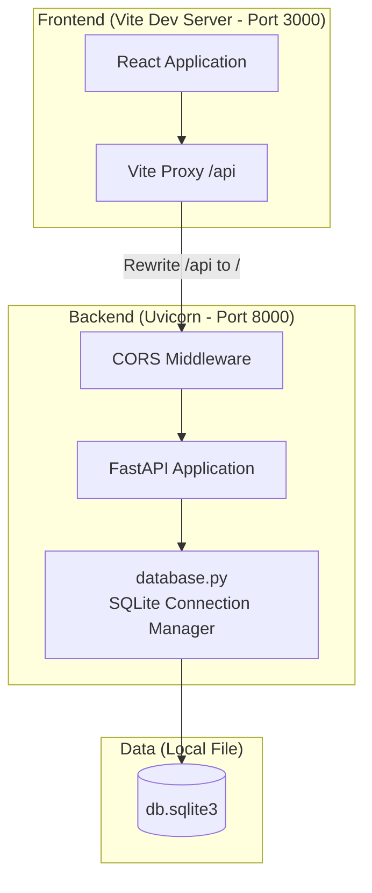
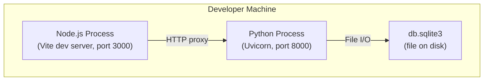

# Architecture

## System Overview

**Architectural Style**: Client-Server Monolith (two-tier)

The system follows a simple two-tier architecture:
- **Presentation tier**: React SPA bundled by Vite, served on port 3000 in development
- **Application + Data tier**: FastAPI server on port 8000, directly connected to a local SQLite file database

There is no separate data tier service; SQLite runs embedded within the Python process.

## Component Diagram

**Text alternative**: The React application sends requests through the Vite proxy (which rewrites `/api` prefix). Requests pass through CORS middleware into the FastAPI application. The FastAPI app uses database.py to manage SQLite connections to the local db.sqlite3 file.

## Deployment Diagram

**Text alternative**: Both the Node.js process (Vite dev server) and the Python process (Uvicorn) run on the same developer machine. The Python process reads/writes to the SQLite file on disk.

## Data Flow

There is no meaningful data flow implemented. The only path is:

1. Browser sends `GET /api/health`
2. Vite proxy rewrites to `GET /health` and forwards to `localhost:8000`
3. FastAPI CORS middleware validates the origin (`http://localhost:3000`)
4. FastAPI handler returns `{"status": "ok"}`
5. Response flows back through proxy to the browser

The `database.py` module is present but is **not imported or used** by `main.py`. It exists as pre-wired infrastructure for future use.

## Integration Points

No external system integrations exist. The system is entirely self-contained on a single machine.

## Key Architectural Decisions (Inferred)

| ID | Decision | Rationale (Inferred) |
|----|----------|---------------------|
| AD-001 | FastAPI as backend framework | Modern async Python framework with automatic OpenAPI documentation and Pydantic validation |
| AD-002 | SQLite as database | Lightweight, zero-configuration local database suitable for development and small-scale applications |
| AD-003 | Vite as frontend bundler | Fast HMR (Hot Module Replacement), modern ESM-based development experience |
| AD-004 | Proxy-based API communication | `/api` prefix proxy avoids CORS issues in production while CORS middleware handles development flexibility |
| AD-005 | WAL mode + foreign keys enabled | SQLite configured with Write-Ahead Logging for better concurrent read performance and foreign key enforcement for data integrity |
| AD-006 | React with vanilla JSX (no TypeScript) | Despite having `@types/react` in devDependencies, no TypeScript configuration exists; the project uses plain JSX |
