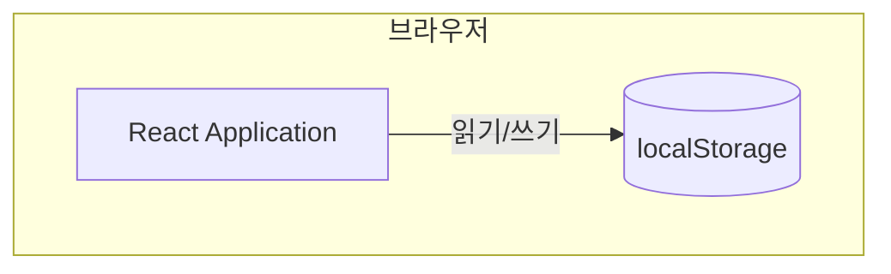

# Architecture

## System Overview

**Architectural Style**: Single-Page Application (프론트엔드 전용)

단일 계층 아키텍처로, React SPA가 브라우저에서 모든 로직을 처리합니다.
데이터는 localStorage에 저장하며, 별도의 백엔드 서버나 데이터베이스는 없습니다.

## Component Diagram

**텍스트 대안**: React 애플리케이션이 브라우저의 localStorage에 직접 데이터를 읽고 씁니다. 외부 서버 통신 없음.

## Data Flow

현재 구현된 데이터 흐름은 없습니다. `App.jsx`는 빈 플레이스홀더입니다.

향후 데이터 흐름:
1. 사용자가 UI에서 액션 수행
2. 커스텀 훅(`useLocalStorage` 등)을 통해 storage 계층 호출
3. storage 계층이 localStorage에 JSON 직렬화하여 저장/조회
4. React 상태 갱신 → UI 리렌더링

## Key Architectural Decisions

| ID | Decision | Rationale |
|----|----------|-----------|
| AD-001 | 프론트엔드 전용 (백엔드 없음) | 빠른 프로토타이핑, 인프라 비용 없음 |
| AD-002 | localStorage 기반 데이터 저장 | 서버 없이 브라우저에서 데이터 영속화 |
| AD-003 | storage 추상화 계층 도입 예정 | 향후 백엔드/IndexedDB 전환 시 수정 범위 최소화 |
| AD-004 | Vite 번들러 | 빠른 HMR, ESM 기반 개발 환경 |
| AD-005 | React with JSX (TypeScript 미사용) | 간결한 설정, 빠른 시작 |
