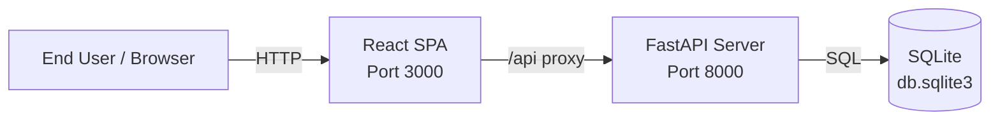

# Business Overview

## Context Diagram

**Text alternative**: End User accesses the React SPA (port 3000) via browser. The SPA proxies API calls under `/api` to the FastAPI backend (port 8000). The backend connects to a local SQLite database file (db.sqlite3).

## Business Description

This codebase is an **empty application scaffold** with no business logic implemented yet. The system provides the foundational wiring for a web application:

- A **React single-page application** serving as the frontend
- A **FastAPI REST API** serving as the backend
- A **SQLite database** for local data persistence

**Who uses it**: No end users yet. The scaffold is a starting point for developers.

**Why it exists**: To provide a pre-configured project structure with frontend-backend communication already wired up (CORS, Vite proxy), ready for business features to be built on top.

**Notable observation**: The HTML document sets `lang="ko"` (Korean), suggesting the target audience or development team may be Korean-speaking.

## Core Business Transactions

No business transactions exist. The only functional endpoint is:

| Transaction | Endpoint | Description |
|-------------|----------|-------------|
| Health Check | `GET /health` | Returns `{"status": "ok"}` to verify the backend is running |

## Business Dictionary

No domain-specific terms are present in the codebase. The project has not yet defined a business domain.
