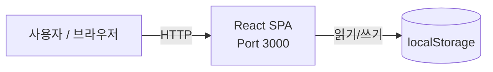

# Business Overview

## Context Diagram

**텍스트 대안**: 사용자가 브라우저에서 React SPA에 접근합니다. 앱은 localStorage에 데이터를 읽고 씁니다. 외부 서버 통신 없음.

## Business Description

이 코드베이스는 **비즈니스 로직이 없는 빈 애플리케이션 스캐폴드**입니다.

- **React SPA**: 프론트엔드 전용 애플리케이션
- **localStorage**: 브라우저 로컬 데이터 저장 (백엔드/DB 없음)

**대상 사용자**: 아직 없음. 개발 시작점으로서의 스캐폴드.

**HTML `lang="ko"`**: 한국어 대상 프로젝트.

## Core Business Transactions

비즈니스 트랜잭션 없음. 기능 구현 전 상태입니다.

## Business Dictionary

도메인 용어 없음. `aidlc-docs/db/schema.md`에서 요구사항 확정 후 용어를 정의합니다.
