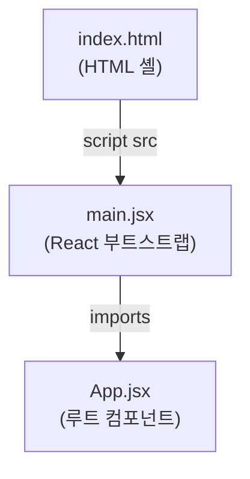

# Code Structure

## Build System Analysis

### Frontend: npm + Vite
- **Configuration files**: `frontend/package.json`, `frontend/vite.config.js`
- **Scripts**: `dev` (vite), `build` (vite build), `preview` (vite preview)
- **개발 도구 미설정**: ESLint, Prettier, 테스트 프레임워크 없음

### Directory Structure

```
/workshop/AI-DLC-Workshop3/
+-- frontend/              (Node.js package)
|   +-- package.json        (npm 설정)
|   +-- vite.config.js      (Vite 번들러 설정)
|   +-- index.html          (HTML 진입점)
|   +-- public/             (정적 파일)
|   +-- src/
|       +-- main.jsx        (React DOM 렌더링)
|       +-- App.jsx         (루트 컴포넌트 - 빈 상태)
+-- .gitignore             (Git ignore 규칙)
+-- aidlc-docs/            (AIDLC 문서 - 앱 코드 아님)
+-- .claude/               (Claude Code 설정 - 앱 코드 아님)
```

## Module Diagram



**텍스트 대안**: index.html이 main.jsx를 로드하고, main.jsx가 App.jsx를 import합니다.

## Design Patterns

| Pattern | Location | Notes |
|---------|----------|-------|
| Component Tree | `main.jsx` / `App.jsx` | React StrictMode 래퍼 포함 표준 컴포넌트 계층 |
| ESM Modules | `package.json` | `"type": "module"` — import/export 사용 |

## File Inventory

| File Type | Count | Files |
|-----------|-------|-------|
| JavaScript/JSX (.jsx) | 2 | main.jsx, App.jsx |
| JavaScript (.js) | 1 | vite.config.js |
| HTML (.html) | 1 | index.html |
| JSON (.json) | 1 | package.json |
| Git config | 1 | .gitignore |
| **Total** | **6** | -- |

## Entry Point

- **File**: `frontend/index.html` (→ `frontend/src/main.jsx`)
- **Command**: `npm run dev` (Vite 개발 서버)
- **Bootstrap**: HTML → main.jsx → `<App />` 렌더링 (React StrictMode)
