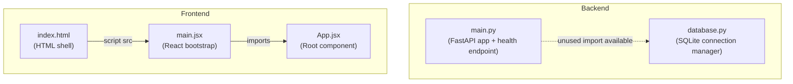

# Code Structure

## Build System Analysis

The project uses **two separate build systems** in a monorepo-style layout (without a monorepo tool):

### Backend: pip
- **Configuration file**: `backend/requirements.txt`
- **No virtual environment setup script**: Developers must manually create and activate a venv
- **No build/start scripts**: Must run `uvicorn main:app` manually
- **No development tools**: No linting (ruff, flake8), no formatting (black), no type checking (mypy)

### Frontend: npm + Vite
- **Configuration files**: `frontend/package.json`, `frontend/vite.config.js`
- **Scripts defined**: `dev` (vite), `build` (vite build), `preview` (vite preview)
- **No development tools**: No ESLint configuration, no Prettier, no test framework
- **TypeScript types installed but unused**: `@types/react` and `@types/react-dom` in devDependencies but no `tsconfig.json`

### Multi-Module Structure

```
/workshop/AI-DLC-Workshop3/
+-- backend/               (Python package - no __init__.py)
|   +-- main.py            (FastAPI application entry point)
|   +-- database.py         (SQLite connection management)
|   +-- requirements.txt    (Python dependencies)
+-- frontend/              (Node.js package)
|   +-- package.json        (npm configuration)
|   +-- vite.config.js      (Vite bundler configuration)
|   +-- index.html          (HTML entry point)
|   +-- src/
|       +-- main.jsx        (React DOM rendering)
|       +-- App.jsx         (Root component - empty)
+-- .gitignore             (Git ignore rules)
+-- aidlc-docs/            (AIDLC documentation - not application code)
+-- .claude/               (Claude Code configuration - not application code)
```

## Module Diagram



**Text alternative**: In the backend, main.py defines the FastAPI app but does not import database.py (shown as a dashed line). In the frontend, index.html loads main.jsx which imports App.jsx.

## Design Patterns Identified

| Pattern | Location | Notes |
|---------|----------|-------|
| Context Manager | `database.py` | `get_db()` uses Python's `@contextmanager` for safe connection lifecycle (open, commit/rollback, close) |
| Middleware Chain | `main.py` | CORS middleware added to FastAPI's middleware stack |
| Proxy Pattern | `vite.config.js` | Vite dev server proxies `/api` to the backend, abstracting the backend URL from frontend code |
| Component Tree | `main.jsx` / `App.jsx` | Standard React component hierarchy with StrictMode wrapper |

## File Inventory

| File Type | Count | Files |
|-----------|-------|-------|
| Python (.py) | 2 | main.py, database.py |
| JavaScript/JSX (.jsx) | 2 | main.jsx, App.jsx |
| JavaScript (.js) | 1 | vite.config.js |
| HTML (.html) | 1 | index.html |
| JSON (.json) | 1 | package.json |
| Text (.txt) | 1 | requirements.txt |
| Git config | 1 | .gitignore |
| **Total application files** | **9** | -- |

## Entry Points and Bootstrapping

### Backend Entry Point
- **File**: `backend/main.py`
- **Command**: `uvicorn main:app --reload` (implied, not scripted)
- **Bootstrap sequence**: Import FastAPI, create app instance, add CORS middleware, register `/health` route

### Frontend Entry Point
- **File**: `frontend/index.html` (loads `frontend/src/main.jsx`)
- **Command**: `npm run dev` (runs Vite dev server)
- **Bootstrap sequence**: HTML loads main.jsx, which renders `<App />` into the `#root` div with React StrictMode
