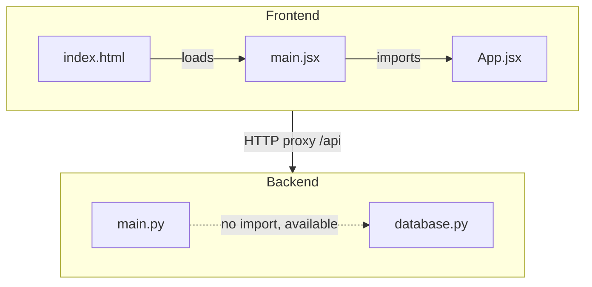

# Dependencies

## Internal Dependency Diagram

**Text alternative**: In the frontend, index.html loads main.jsx which imports App.jsx. In the backend, main.py and database.py are independent files (main.py does not import database.py). The frontend communicates with the backend via HTTP proxy.

**Key observation**: `database.py` is **orphaned** -- it is not imported by any other module. It exists as scaffolding for future use.

## External Dependencies

### Python (backend/requirements.txt)

| Package | Version | Purpose | Category |
|---------|---------|---------|----------|
| fastapi | 0.115.12 | REST API framework with automatic validation and OpenAPI docs | Framework |
| uvicorn[standard] | 0.34.2 | ASGI server with lifespan, HTTP/1.1 and WebSocket support | Server |
| pydantic | 2.11.3 | Data validation using Python type annotations | Validation |

**Transitive dependencies** (installed automatically by pip, not listed in requirements.txt):
- `starlette` (via fastapi) -- ASGI framework
- `anyio` (via starlette) -- Async I/O compatibility
- `typing-extensions` (via pydantic/fastapi) -- Backported type hints
- `httptools`, `watchfiles`, `websockets` (via uvicorn[standard]) -- Performance extras

### JavaScript (frontend/package.json)

#### Runtime Dependencies

| Package | Version | Purpose |
|---------|---------|---------|
| react | ^18.3.1 | UI component library |
| react-dom | ^18.3.1 | React DOM renderer |

#### Development Dependencies

| Package | Version | Purpose |
|---------|---------|---------|
| @types/react | ^18.3.12 | TypeScript type definitions for React (unused) |
| @types/react-dom | ^18.3.1 | TypeScript type definitions for React DOM (unused) |
| @vitejs/plugin-react | ^4.3.4 | Vite plugin for React Fast Refresh and JSX |
| vite | ^6.0.0 | Frontend build tool and dev server |

## Dependency Health

### Issues Identified

| Severity | Issue | Package | Details |
|----------|-------|---------|---------|
| Low | Unused dependency | `@types/react`, `@types/react-dom` | TypeScript type packages installed but no TypeScript configuration exists |
| Low | Unused runtime dependency | `pydantic` | Installed but not imported anywhere in the codebase |
| Medium | No lockfile (Python) | pip | No `requirements.lock`, `pip.lock`, or `pip-tools` constraints file. Transitive dependency versions are not pinned |
| Medium | No lockfile (JavaScript) | npm | No `package-lock.json` checked in. Builds are not reproducible |
| Low | No security scanning | All | No `pip-audit`, `npm audit`, or Dependabot/Renovate configured |

### Outdated Package Assessment

Without version pinning and lockfiles, it is not possible to determine exact installed versions of transitive dependencies. The direct dependencies appear to be recent versions as of the project creation.

## Circular Dependencies

**None identified.** The codebase is too small for circular dependencies to exist. There are only two backend modules and they do not import each other. The frontend has a simple linear import chain.

## Dependency Graph Complexity

| Metric | Value |
|--------|-------|
| Direct Python dependencies | 3 |
| Direct JavaScript runtime dependencies | 2 |
| Direct JavaScript dev dependencies | 4 |
| Internal module dependencies | 2 (main.jsx imports App.jsx) |
| Orphaned modules | 1 (database.py) |
| Cross-boundary dependencies | 1 (HTTP proxy from frontend to backend) |
