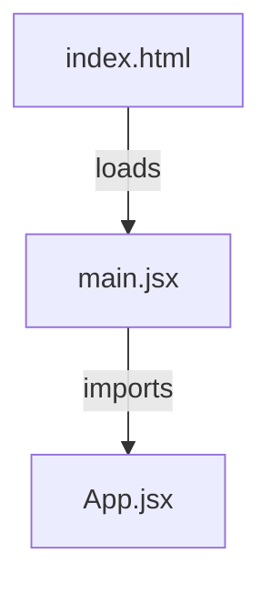

# Dependencies

## Internal Dependency Diagram

**텍스트 대안**: index.html이 main.jsx를 로드하고, main.jsx가 App.jsx를 import합니다. 단순 선형 의존 체인.

## External Dependencies

### JavaScript (frontend/package.json)

#### Runtime Dependencies

| Package | Version | Purpose |
|---------|---------|---------|
| react | ^18.3.1 | UI 컴포넌트 라이브러리 |
| react-dom | ^18.3.1 | React DOM 렌더러 |

#### Development Dependencies

| Package | Version | Purpose |
|---------|---------|---------|
| @vitejs/plugin-react | ^4.3.4 | Vite React Fast Refresh 및 JSX 플러그인 |
| vite | ^6.0.0 | 프론트엔드 빌드 도구 및 개발 서버 |

## Dependency Health

| Severity | Issue | Details |
|----------|-------|---------|
| Medium | lockfile 없음 | `package-lock.json` 미존재. 빌드 재현성 보장 불가 |
| Low | 보안 스캐닝 없음 | `npm audit`, Dependabot 등 미설정 |

## Dependency Graph Complexity

| Metric | Value |
|--------|-------|
| Direct runtime dependencies | 2 |
| Direct dev dependencies | 2 |
| Internal module dependencies | 2 (main.jsx → App.jsx) |
| Orphaned modules | 0 |
