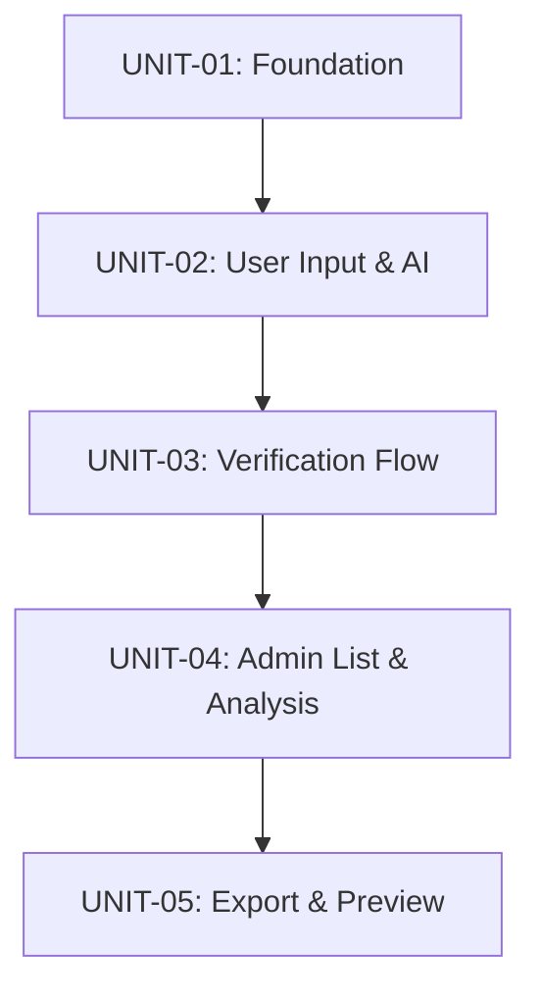

# Development Units -- "말해 뭐해"

> Version: v1.0
> Date: 2026-04-22
> Stage: INCEPTION / Units Generation
> Source: application-design.md, user-stories.md, business-rules.md

---

## Unit Decomposition Strategy

5개 유닛으로 분해. 순차적 의존 관계 체인.

**원칙**:
1. 의존성 순서: 인프라 → 사용자 페이지 → 관리자 페이지
2. 데이터 흐름 방향: 사용자가 데이터 생성 → 관리자가 데이터 조회
3. 기능 응집도: 도메인별 그룹핑
4. 독립 테스트 가능: 각 유닛 완료 시 데모 가능
5. 관리 가능한 규모: 워크샵 프로토타입에 적합한 3~5개

---

## Dependency Diagram



**Text alternative**: UNIT-01 (Foundation) → UNIT-02 (User Input & AI) → UNIT-03 (Verification Flow) → UNIT-04 (Admin List & Analysis) → UNIT-05 (Export & Preview). All units are strictly sequential.

---

## UNIT-01: Foundation (프로젝트 기반)

| 항목 | 값 |
|------|-----|
| **Unit ID** | UNIT-01 |
| **Name** | Foundation |
| **Complexity** | M (Medium) |
| **Dependencies** | None |
| **Stories** | US-021, US-022, US-023, US-024, US-025, US-026, US-027 (7건) |

### Description

프로젝트 설정, Tailwind CSS 구성, React Router 라우팅, 공유 레이아웃(Header/Layout), AppContext/AppProvider 스켈레톤, useStorage 훅, 유틸리티 함수, 공통 컴포넌트(ConfirmDialog, LoadingIndicator, EmptyState), NotFoundPage, 스텁 페이지를 구현한다.

### Files

| Action | File Path | Description |
|--------|-----------|-------------|
| NEW | `frontend/.env` | VITE_AI_API_URL, VITE_AI_API_KEY, VITE_AI_MODEL |
| NEW | `frontend/tailwind.config.js` | Tailwind v4 configuration |
| NEW | `frontend/postcss.config.js` | PostCSS configuration |
| MODIFY | `frontend/vite.config.js` | Add Tailwind plugin |
| MODIFY | `frontend/package.json` | Add react-router-dom, tailwindcss, @tailwindcss/vite |
| NEW | `frontend/src/index.css` | Tailwind directives (@tailwind base/components/utilities) |
| MODIFY | `frontend/src/main.jsx` | Add BrowserRouter wrapper |
| REWRITE | `frontend/src/App.jsx` | AppProvider + Layout + Routes setup |
| NEW | `frontend/src/context/AppContext.js` | createContext definition |
| NEW | `frontend/src/context/AppProvider.jsx` | Global state provider skeleton (localStorage init) |
| NEW | `frontend/src/components/Layout.jsx` | Header + main content (Outlet) |
| NEW | `frontend/src/components/Header.jsx` | Top nav: "말해 뭐해" title + "사용자"/"관리자" links |
| NEW | `frontend/src/pages/UserPage.jsx` | Stub placeholder |
| NEW | `frontend/src/pages/AdminPage.jsx` | Stub placeholder |
| NEW | `frontend/src/pages/NotFoundPage.jsx` | 404 page with Korean text |
| NEW | `frontend/src/hooks/useStorage.js` | Generic localStorage read/write with JSON serialization |
| NEW | `frontend/src/utils/idGenerator.js` | Generate prefixed IDs (req_, theme_, us_, conv_, msg_) |
| NEW | `frontend/src/utils/dateFormatter.js` | Format ISO dates to Korean display |
| NEW | `frontend/src/components/common/ConfirmDialog.jsx` | Korean confirm/cancel modal |
| NEW | `frontend/src/components/common/LoadingIndicator.jsx` | AI typing animation (bouncing dots) |
| NEW | `frontend/src/components/common/EmptyState.jsx` | Generic empty state with icon, message, action |

**Total: 21 files (3 modify, 1 rewrite, 17 new)**

### Definition of Done

- [ ] `npm run dev` starts without errors on http://localhost:3000
- [ ] `/` redirects to `/user` (stub page renders)
- [ ] `/admin` shows stub admin page
- [ ] `/invalid-path` shows NotFoundPage with Korean text and navigation links
- [ ] Header shows "말해 뭐해" title with "사용자"/"관리자" nav links; active link highlighted
- [ ] useStorage hook reads/writes JSON to localStorage with `mhm_` prefix keys
- [ ] idGenerator generates unique prefixed IDs (req_, theme_, us_, conv_, msg_)
- [ ] dateFormatter formats ISO dates to Korean display format
- [ ] ConfirmDialog renders modal with "확인"/"취소" buttons
- [ ] LoadingIndicator shows animated dots
- [ ] EmptyState shows message with optional action button
- [ ] All UI text is in Korean; `html lang="ko"` is set
- [ ] Tailwind CSS utility classes render correctly

---

## UNIT-02: User Page -- Conversational Input & AI (사용자 입력 & AI)

| 항목 | 값 |
|------|-----|
| **Unit ID** | UNIT-02 |
| **Name** | User Input & AI |
| **Complexity** | L (Large) |
| **Dependencies** | UNIT-01 |
| **Stories** | US-001, US-002, US-003, US-004, US-005, US-006, US-007, US-008, US-012 (9건) |

### Description

ChatGPT 스타일 대화형 인터페이스 전체 구현. 텍스트/음성 입력, AI 요구사항 추출/분류/유저스토리 생성, 대화 관리, 데이터 훅(requirements, themes, user_stories) 기본 CRUD. 이 유닛이 가장 복잡하며 AI API 연동을 포함한다.

### Files

| Action | File Path | Description |
|--------|-----------|-------------|
| IMPLEMENT | `frontend/src/pages/UserPage.jsx` | Full ChatGPT-style page implementation |
| NEW | `frontend/src/components/user/WelcomeMessage.jsx` | Empty conversation guidance message |
| NEW | `frontend/src/components/user/MessageList.jsx` | Scrollable message container, auto-scroll |
| NEW | `frontend/src/components/user/MessageBubble.jsx` | User (right/blue) and AI (left/gray) message bubbles |
| NEW | `frontend/src/components/user/ChatInput.jsx` | Multi-line input + send button + voice button |
| NEW | `frontend/src/components/user/VoiceInput.jsx` | Microphone button, Web Speech API, recording indicator |
| NEW | `frontend/src/hooks/useConversation.js` | Conversation/message management, persistence |
| NEW | `frontend/src/hooks/useAIService.js` | OpenAI-compatible API calls (extractRequirements) |
| NEW | `frontend/src/hooks/useRequirements.js` | Requirements CRUD (addRequirement, basic status) |
| NEW | `frontend/src/hooks/useThemes.js` | Themes read/write (addTheme) |
| NEW | `frontend/src/hooks/useUserStories.js` | User stories CRUD (addUserStory) |

**Total: 11 files (1 implement, 10 new)**

### Definition of Done

- [ ] User page shows WelcomeMessage when no conversation exists
- [ ] User types text and presses Enter; message appears as right-aligned blue bubble
- [ ] LoadingIndicator (bouncing dots) appears while AI processes
- [ ] AI response appears as left-aligned gray bubble with extracted item cards (summary, theme, user story, purpose, AC)
- [ ] Voice input: clicking microphone starts recording with visual indicator; transcribed text fills input field
- [ ] Unsupported browser shows Korean fallback message for voice input
- [ ] AI API errors display Korean error message with retry button
- [ ] Empty/whitespace-only submissions are prevented
- [ ] Conversation persists across page refresh (localStorage)
- [ ] "새 대화" button starts fresh conversation after ConfirmDialog confirmation
- [ ] Responsive layout works on desktop and mobile

---

## UNIT-03: User Page -- Verification Flow (검증 흐름)

| 항목 | 값 |
|------|-----|
| **Unit ID** | UNIT-03 |
| **Name** | Verification Flow |
| **Complexity** | S (Small) |
| **Dependencies** | UNIT-02 |
| **Stories** | US-009, US-010, US-011 (3건) |

### Description

AI 추출 결과에 대한 승인/거부 검증 컨트롤 구현. 승인 시 requirements, themes, user_stories를 localStorage에 영구 저장. 거부 시 확인 다이얼로그 후 제거. 기존 훅과 컴포넌트를 확장한다.

### Files

| Action | File Path | Description |
|--------|-----------|-------------|
| NEW | `frontend/src/components/user/VerificationControls.jsx` | Approve/reject buttons per extracted item |
| ENHANCE | `frontend/src/context/AppProvider.jsx` | Wire CRUD actions for requirements, themes, user_stories |
| ENHANCE | `frontend/src/hooks/useRequirements.js` | Add updateStatus (processed → verified) |
| ENHANCE | `frontend/src/hooks/useThemes.js` | Add deduplication by name logic |
| ENHANCE | `frontend/src/hooks/useUserStories.js` | Add addUserStory with full fields |
| ENHANCE | `frontend/src/hooks/useConversation.js` | Add updateExtractedItemStatus |
| ENHANCE | `frontend/src/components/user/MessageBubble.jsx` | Render VerificationControls per extracted item |

**Total: 7 files (1 new, 6 enhance)**

### Definition of Done

- [ ] Each extracted item card shows "승인" and "거부" buttons when pending
- [ ] Clicking "승인": requirement status → "verified", theme saved (dedup check), user story saved, conversation item status → "verified", buttons replaced with green "승인됨" badge
- [ ] Clicking "거부": ConfirmDialog appears; confirm → item marked "rejected", card dims; cancel → no change
- [ ] Approved items visible in `mhm_requirements`, `mhm_themes`, `mhm_user_stories` localStorage keys
- [ ] Verification status persists after page refresh
- [ ] Multiple items from same AI response can be independently approved/rejected
- [ ] updated_at timestamp set on every status change

---

## UNIT-04: Admin Page -- List, Filter & Detail (관리자 목록/필터/상세)

| 항목 | 값 |
|------|-----|
| **Unit ID** | UNIT-04 |
| **Name** | Admin List & Analysis |
| **Complexity** | M (Medium) |
| **Dependencies** | UNIT-01, UNIT-03 |
| **Stories** | US-013, US-014, US-015, US-016, US-017 (5건) |

### Description

관리자 페이지 핵심 기능: 검증된 유저스토리 목록 조회, 테마별 필터링, 상세보기 모달, 참조 파일 업로드, AI 기반 시스템 지원 분석, 시스템 지원 뱃지. 사용자 페이지에서 생성된 데이터를 조회한다.

### Files

| Action | File Path | Description |
|--------|-----------|-------------|
| IMPLEMENT | `frontend/src/pages/AdminPage.jsx` | Full admin page with list, filter, modals |
| NEW | `frontend/src/components/admin/ThemeFilter.jsx` | Theme filter dropdown/buttons |
| NEW | `frontend/src/components/admin/StoryList.jsx` | Story list container (table/card layout) |
| NEW | `frontend/src/components/admin/StoryRow.jsx` | Individual story row with summary, badges, date |
| NEW | `frontend/src/components/admin/SystemSupportBadge.jsx` | "시스템 지원" / "개발 필요" / "미분석" badge |
| NEW | `frontend/src/components/admin/StoryDetailModal.jsx` | Full detail modal (story, purpose, AC, source, theme) |
| NEW | `frontend/src/components/admin/ReferenceFileUpload.jsx` | File upload (.txt/.md/.json) for system analysis |
| ENHANCE | `frontend/src/hooks/useUserStories.js` | Add getStoriesByTheme, updateSystemSupport, bulkUpdateSystemSupport |
| ENHANCE | `frontend/src/hooks/useAIService.js` | Add analyzeSystemSupport function |

**Total: 9 files (1 implement, 7 new, 1 enhance from UNIT-02, 1 enhance from existing)**

### Definition of Done

- [ ] `/admin` shows list of all verified user stories sorted newest-first
- [ ] EmptyState shown when no stories exist with Korean message
- [ ] Each StoryRow shows: story summary (truncated), theme badge, SystemSupportBadge, date
- [ ] ThemeFilter populated dynamically from stored themes; selecting filters the list; "전체" clears filter
- [ ] Clicking a row opens StoryDetailModal with full detail (story, purpose, ACs, source requirement, theme, system support, timestamps)
- [ ] Modal closes on X button, backdrop click, or Escape key
- [ ] Reference file upload: accepts .txt/.md/.json; shows file name after upload
- [ ] "분석 시작" triggers AI analysis; after completion SystemSupportBadge updates
- [ ] Responsive layout adapts to desktop/tablet/mobile
- [ ] Data reads from same localStorage keys that user page writes to

---

## UNIT-05: Admin Page -- Selection, Preview & Export (선택/미리보기/내보내기)

| 항목 | 값 |
|------|-----|
| **Unit ID** | UNIT-05 |
| **Name** | Export & Preview |
| **Complexity** | S (Small) |
| **Dependencies** | UNIT-04 |
| **Stories** | US-018, US-019, US-020 (3건) |

### Description

체크박스 다건 선택, 선택 카운터, 내보내기 컨트롤, 풀스크린 미리보기 모달, Markdown 파일 다운로드. 관리자 페이지의 최종 기능으로 애플리케이션을 완성한다.

### Files

| Action | File Path | Description |
|--------|-----------|-------------|
| NEW | `frontend/src/components/admin/ExportControls.jsx` | Selection counter, preview/export buttons |
| NEW | `frontend/src/components/admin/PreviewModal.jsx` | Full-screen Markdown preview with download |
| NEW | `frontend/src/hooks/useExport.js` | Markdown generation + file download |
| NEW | `frontend/src/utils/markdownGenerator.js` | Export markdown content formatting |
| ENHANCE | `frontend/src/components/admin/StoryList.jsx` | Add checkbox column, select-all |
| ENHANCE | `frontend/src/components/admin/StoryRow.jsx` | Add checkbox |
| ENHANCE | `frontend/src/pages/AdminPage.jsx` | Wire selection state, export/preview controls |

**Total: 7 files (4 new, 3 enhance)**

### Definition of Done

- [ ] Each StoryRow has a checkbox; "전체 선택" checkbox in header toggles all visible rows
- [ ] Selection counter shows "N건 선택됨"
- [ ] Theme filter active → "전체 선택" only affects visible rows; hidden selected rows preserved
- [ ] "미리보기" button disabled when 0 selected; opens full-screen PreviewModal when clicked
- [ ] PreviewModal renders Markdown content grouped by theme with story/purpose/AC/system support/source
- [ ] "다운로드" button triggers browser download of `user-stories-YYYY-MM-DD.md`
- [ ] "내보내기" button in ExportControls also triggers download
- [ ] Download uses Blob + URL.createObjectURL mechanism
- [ ] Exported Markdown matches BR-006 format specification

---

## Story-to-Unit Traceability Matrix

| Story | Title | Priority | Unit |
|-------|-------|----------|------|
| US-001 | ChatGPT-style Conversational Interface | Must | UNIT-02 |
| US-002 | Text-based Requirement Input | Must | UNIT-02 |
| US-003 | Voice-based Requirement Input | Must | UNIT-02 |
| US-004 | Responsive Input Interface | Should | UNIT-02 |
| US-005 | AI Requirement Extraction | Must | UNIT-02 |
| US-006 | AI Theme Classification | Must | UNIT-02 |
| US-007 | AI User Story Generation | Must | UNIT-02 |
| US-008 | AI Processing Error Handling | Must | UNIT-02 |
| US-009 | Review AI Extraction Results | Must | UNIT-03 |
| US-010 | Approve AI Extraction Result | Must | UNIT-03 |
| US-011 | Reject AI Extraction Result | Must | UNIT-03 |
| US-012 | Conversation History Display | Should | UNIT-02 |
| US-013 | Admin Story List View | Must | UNIT-04 |
| US-014 | Theme-based Filtering | Must | UNIT-04 |
| US-015 | User Story Detail View | Must | UNIT-04 |
| US-016 | System Support Analysis | Must | UNIT-04 |
| US-017 | Admin Page Responsive Layout | Should | UNIT-04 |
| US-018 | Checkbox Multi-select | Must | UNIT-05 |
| US-019 | Bulk Export with Purpose and AC | Must | UNIT-05 |
| US-020 | On-screen Preview of Selected Stories | Should | UNIT-05 |
| US-021 | SPA Routing Setup | Must | UNIT-01 |
| US-022 | Page Navigation | Must | UNIT-01 |
| US-023 | localStorage Data Persistence | Must | UNIT-01 |
| US-024 | localStorage Data Access Abstraction | Should | UNIT-01 |
| US-025 | Basic Accessibility | Should | UNIT-01 |
| US-026 | Korean-only UI Language | Must | UNIT-01 |
| US-027 | Delete Confirmation Dialog | Must | UNIT-01 |

**Coverage: 27/27 stories (100%)**

---

## Unit Summary

| Unit | Name | Files | Stories | Must | Should | Complexity | Deps |
|------|------|-------|---------|------|--------|------------|------|
| UNIT-01 | Foundation | 21 | 7 | 5 | 2 | M | None |
| UNIT-02 | User Input & AI | 11 | 9 | 7 | 2 | L | UNIT-01 |
| UNIT-03 | Verification Flow | 7 | 3 | 3 | 0 | S | UNIT-02 |
| UNIT-04 | Admin List & Analysis | 9 | 5 | 4 | 1 | M | UNIT-01, UNIT-03 |
| UNIT-05 | Export & Preview | 7 | 3 | 2 | 1 | S | UNIT-04 |
| **Total** | | **55** | **27** | **21** | **6** | | |

---

## Build Order

```
Phase 1: UNIT-01 (Foundation)          → 앱 실행, 라우팅, 공통 컴포넌트
Phase 2: UNIT-02 (User Input & AI)     → 대화형 입력, AI 연동
Phase 3: UNIT-03 (Verification Flow)   → 승인/거부 검증
Phase 4: UNIT-04 (Admin List & Detail) → 관리자 목록, 필터, 상세보기
Phase 5: UNIT-05 (Export & Preview)    → 선택, 미리보기, 내보내기
```

각 Phase 완료 후 데모 가능. Phase 3 완료 시 사용자 페이지 전체 기능 동작. Phase 5 완료 시 전체 애플리케이션 완성.
